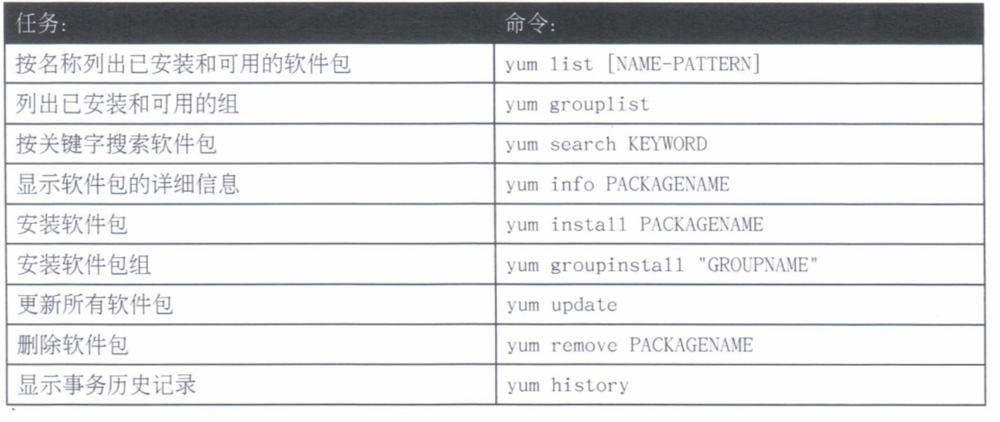

# 13.安装和更新软件包

## 将系统关联至软件更新订阅

* 红帽订阅管理
* 自动注册和订阅
* 授权证书

## RPM 软件包和 yum

* 软件包和 RPM
* yum 软件包管理器

### 软件包和 RPM

`RPM`软件包管理器, 该程序提供一种标准的方式来打包软件进行分发.

`RPM`软件包文件采用软件包名称组合`name-version-release.architecture`的方式进行命名.


* `NAME`是描述其内容的一个或多个词语(`httpd-tools`)
* `VERSION`是原始软件的版本号
* `RELEASE`是基于该版本的软件包的发行账号
* `ARCH`是编译的软件包可以运行在这种处理器架构下.
	* `noarch`代表此软件包的内容不限定架构

`RPM`软件包的组成:

* 软件包安装的文件
* 与软件包(元数据)有关的信息
* 安装, 更新或删除此软件包时可能运行的脚本. 或者在安装, 更新或删除其他软件包时触发的脚本.

数字签名用于验证完整性.

`kernel`软件包可以安装多个版本, 由于新的内核只有通过启动着该内核才能进行测试, 该软件包进行了特殊设计. 如果新内核启动失败, 则依然可以使用旧的内核.

### yum 软件包管理器

`RPM`不能自动解析依赖关系. `yum`可以缓和依赖性问题.

`yum`的主要配置文件为`/etc/yum.conf`, 其他存储库配置文件在`/etc/yum.repos.d`目录中. 存储库至少包含:

* 一个存储库`ID`(方括号中)
* 一个名称以及软件包存储库的`URL`位置
	* 远程网络共享`http`或`ftp`
	* 本地目录(文件)

## 使用 yum 管理软件更新

* 通过 yum 执行操作

### 通过 yum 执行操作

#### 使用 yum 查找软件

* `yum help` 显示用法信息
* `yum list` 列出已安装的和可用的软件包
* `yum search KEYWORD` 根据仅在名称和摘要字段中找到的关键字列出软件包
* `yum search all KEYWORD` 根据在名称, 摘要和描述字段中搜索软件包
* `yum info PACKAGENAME` 提供与软件包相关的详细信息，包括安装所需的磁盘空间
* `yum provides PATHNAME` 显示与指定的路径名(通常包含通配符)匹配的软件包

#### 使用 yum 安装和删除软件

* `yum install PACKAGENAME` 获取并安装软件包, 包括所有依赖项.
* `yum update PACKAGENAME` 获取并安装更新版本的软件包, 包括所有依赖项.
	* `yum update kernel` 实际上会安装新的内核. **不是更新**.
* `yum remove PACKAGENAME` 删除已装的软件包, 包括所有支持软件包.

`yum list kernel`列出所有已按组和那个和可用的内核.

`uname -r` 显示当前运行内核的版本和发行版本. `uname -a`显示详细信息.

#### 使用 yum 安装和删除各组软件

`yum group list`可列出软件的组.

`yum grroup install`安装一个组.

#### 查看事务历史记录

所有安装和删除事务的日志记录在`/var/log/yum.log`中.

可以通过`yum history`查看安装和删除事务的摘要.

可通过`history undo NUMBER`选项撤销事务.

### yum 命令摘要



## 启用 yum 软件存储库

* 启用红帽软件存储库
* 启用第三方软件存储库
* 使用 yum 安装本地软件包文件
* 从 RPM 软件包提取文件

### 启用红帽软件存储库

`yum-config-manager` 启用或禁用存储库. 这将更改`/etc/yum.repos.d/redhat.repo`文件的`enabled`参数.

* `--enablerepo=PATHERN` 启用
* `--disablerepo=PATTERN` 禁用

### 启用第三方软件存储库

将配置文件放到`/etc/yum.repos.d`目录中, 以启用对新第三方内容的支持. 内容库配置文件必须以`.repo`结尾.

## 检查 RPM 软件包文件

* 使用 rpm 检查下载的软件包

### 使用 rpm 检查下载的软件包

`rpm`是一个低级工具, 可以获取软件包文件和已安装软件包的内容的相关信息. 他从**本地数据库**或**包文件本身**获取信息.

一般查询格式是:

* `rpm -q [select-options] [query-options]`
* `rpm --query [select-options] [query-options]`

#### RPM 查询: 选择选项

* `-q -a`: 已安装的所有软件包
* `-q -p PACKAGENAME`: 当前安装的`PACKAGENAME`
* `-q -p PACKAGEFILE.rpm`: 名为`PACKAGEFILE.rpm`的软件包文件
* `-q -f FILENAME`: 哪个软件包提供`FILENAME`

#### RPM 查询: 关于软件包内容的信息

* `-q`: 列出软件包的名称和版本. 与`yum list`比较.
* `-q -i`: 软件包信息. 与`yum info`比较.
* `-q -l`: 列出指定软件包安装的文件.
* `-q -c`: 仅列出配置文件.
* `-q -d`: 仅列出文档文件.
* `-q --scripts`: 列出可能在安装或删除软件包之前或之后运行的`shell`脚本
* `-q --changelog`: 列出软件包的更改信息.

### 使用 yum 安装本地软件包文件

`yum localinstall PACKAGEFILE.rpm`可用于直接安装软件包文件. 它从任何配置的`yum`存储库自动下载软件包的所有依赖项.

`--nogpgpcheck`选项来禁用签名查询.

`rpm -ivh PACKAGEFILE.rpm`也用用于安装软件包文件. 使用`yum`可以保留事务历史记录.

### 从 RPM 软件包提取文件 

可以通过`cpio`从`RPM`软件包提取文件而不安装该软件包, 它是一款类似于`zip`或`tar`的存档工具.

将`rpm2cpio PACKAGEFILE.rpm`的输出传送到`cpio -id`, 它会提取`RPM`汇总存储的所有文件.

也可通过孩子定文件的路径提取选型的文件.

```
rpm2cpio xxx.rpm | cpio -id "*txt"
```