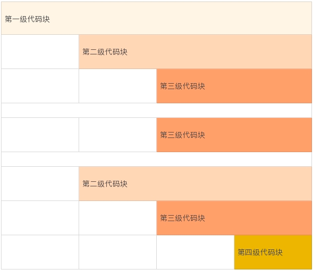

# 06 | 代码整理的关键逻辑和最佳案例

## 笔记

干净整洁的代码带给我们的, 远远不止格式上的赏心悦目. 可以

* 减少错误
* 提高编程速度与效率

代码的层次结构, 格式部署, 是我们对自己思维的整理, 也是我们思考逻辑的展现.

### 给代码分块

大脑接收信息是按照分块的模式记性的. 一块就是一个可识别的信息.

约简单, 越具体的信息块越容器记住和理解. 

让大脑有时间停留下来接受每个信息块.

需要注意一下三点:

* 保持代码块的第一性, 一个代码块只能有一个目标
* 注意代码块的完整性
* 代码块数量要适当, 一个基础的代码块最好不要超过25行

### 使用空白空间

代码靠的越近, 代码之间的关系越紧密.

空白区域, 不仅仅可以用来分割代码, 还展示了代码之间的关系.

* **空格**: 进行逻辑区隔, 同一行代码内部的信息分块.
* **缩进**: 用于水平分割, 用于表示代码块的级别.
* **空行**: 用于垂直分割, 用于分开同级别的不同代码块.



```java
package coding;

public class CodingFormat {
    public static void main(String[] args) {
        System.out.println(
                "German say hello with "
                + Greeting.GERMAN.getGreeting());
    }

    private static enum Greeting {
        ENGLISH     ("English",  "Hello"),
        SPANISH     ("Spanish",  "Hola"),
        GERMAN      ("German",   "Hallo"),
        MANDARIN    ("Mandarin", "Ni Hao");

        private final String language;
        private final String greeting;

        private Greeting(String language, String greeting) {
            this.language = language;
            this.greeting = greeting;
        }

        private String getGreeting() {
            return greeting;
        }
        
        private String getLanguage() {
            return language;
        }
    }
}
```

#### 1. 同级别代码块靠左对齐

阅读顺序是从左到右, 因此代码需要靠左对齐.

#### 2. 同级别代码块空行分割

阅读顺序从上往下, 不同行的同级别的代码块之间, 需要使用空行分隔.

一个逻辑一个块.

#### 3. 下一级别代码块向右缩进

区分不同行的不同级别的代码可以使用缩进. 更直观地看到缩进线, 从而意识到代码之间的关系.

* 四个空格缩进最为常见
* 二个空格缩进次之

#### 4. 同行内代码块空格区隔

同一行内的代码块, 使用空格区分开不同的逻辑单元.

```java
firstName != null

(firstName != null) && (lastName != null)
```

### 一行一个行为

两个行为在一行

```
if (variable != null) variable.doSomething();
```

区分开

```
if (variable != null) {
    variable.doSomething();
}
```

#### 基本的换行原则

1. 每行字符的限制
2. 如果一行不足以容纳一个表达式, 需要换行

##### 1. 在逗号后换行

```
String variable = anObject.getSomething(longExpressionOne,
        longExpressionTwo, longExpressionThree);
```

##### 2. 在操作符前换行

```
String varibale = longStringOne + longStringTwo
        + longStringThree;
```

##### 3. 高级别的换行优先

```
anObject.methodOne(parameterForMethodOne,
        anObject.methodTwo(parameterForMethodTwo));

/ conventional indentation
int runningMiles = runningSpeedOne * runningTimeOne
                 + runningSpeedTwo * runningTimeTwo;

// confusing indentation                           
int runningMiles = runningSpeedOne
       * runningTimeOne + runningSpeedTwo
       * runningTimeTwo;

```

##### 4. 新的换行与上一行同级别表达式的开头对齐

```
anObject.methodOne(parameterOne,
                   parameterTwo,
                   parameterTwo);
```

##### 5. 如果上述规则导致代码混乱或者代码太靠右, 使用8个空格作为缩进

```
anObject.methodOne(parameterForMethodOne,
        anObject.methodTwo(parameterOneForMethodTwo,
                parameterTwoForMethodTwo,
                parameterThreeForMethodTwo));

// bad indentation
if ((conditionOne && conditionTwo)
    || (conditionThree && conditionFour)) {
    doSomething();  
}

// a better indentation, using 8 spaces for the indentation
if ((conditionOne && conditionTwo)
        || (conditionThree && conditionFour)) {
    doSomething();  
}
```

### 小结

清晰的代码结构, 可以帮助我们理顺编码的思路, 高编码的效率, 减少编码的错误, 高代码的可读性, 降低代码的维护成本.

## 扩展