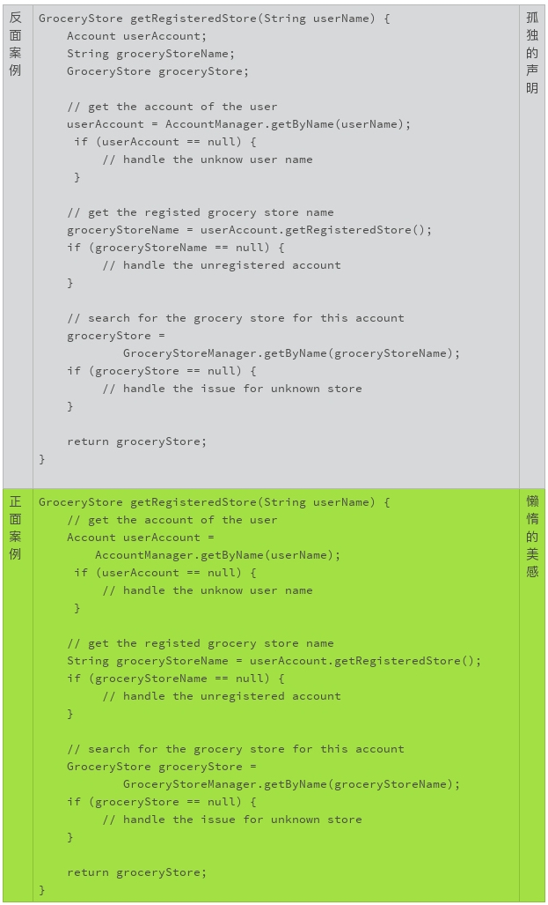
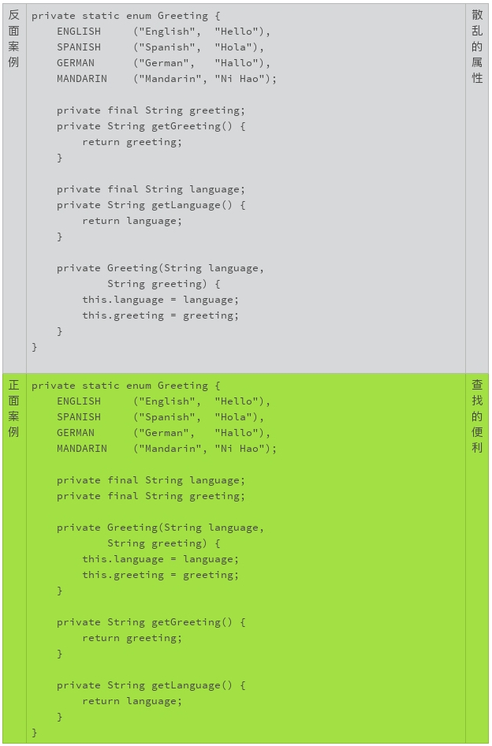
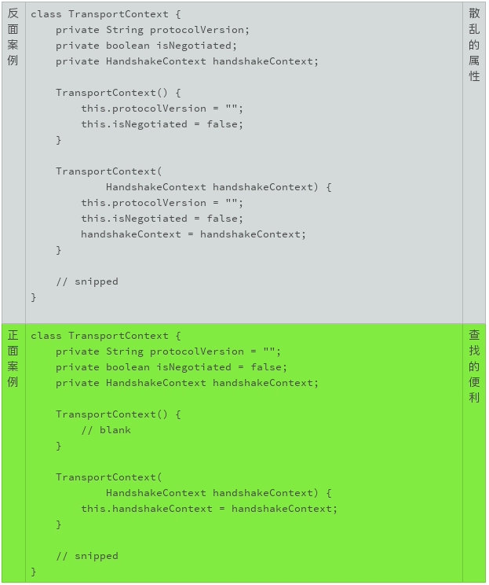
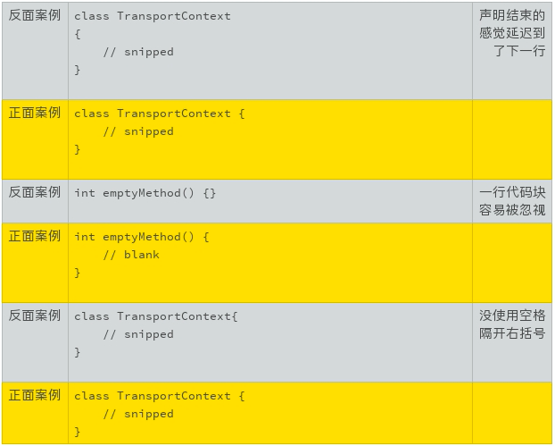
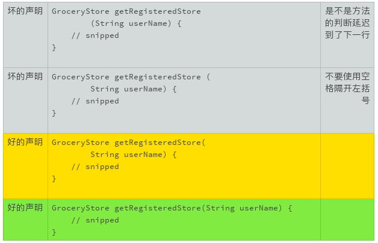
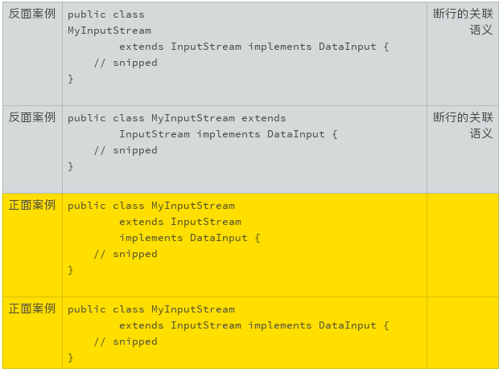

# 08 | 写好声明的“八项纪律”

## 笔记

声明

* 标识符的名字
* 标识符的类型
* 修饰符

```
private int size;
```

### 1. 取一个好名字

### 2. 一行一个声明


**格式一**

```
- int size;
+ int size, length;
```

**格式二**

```
  int size;
+ int length;
```

第二种格式更容易发现大意的错误


不要在同一行声明不同类型的标识符


数组符号放在类型该在的地方


### 3. 局部变量需要时再声明

标识符的声明应该和它的使用尽可能地靠近



### 4. 类属性要集中声明

类变量的声明要集中



### 5. 声明时就初始化

除非变量的初始值依赖于更多的条件, 或者涉及到一定的计算, 否则, 声明时就应该完成初始化. 声明时初始化, 可以防止初始化的遗漏或者不必要的代码重复.



### 6. 尾随的花括号

* 左括号不要单独成行, 要进损在语句尾部, 以一个空格隔开
* 右括号单独一行



### 7. 靠近的小括号

小括号要靠近着标识符, 中间不要有空格.



### 8. 搜索优化的换行

常见的搜索模式有

* `public class`
* `abstract class`
* `class TheClassName`
* `extends TheClassName`
* `implements TheInterfaceName`
* `theMethodName(`

语义相关的词语, 常见的搜索模式， 要尽量放在用一行



## 扩展