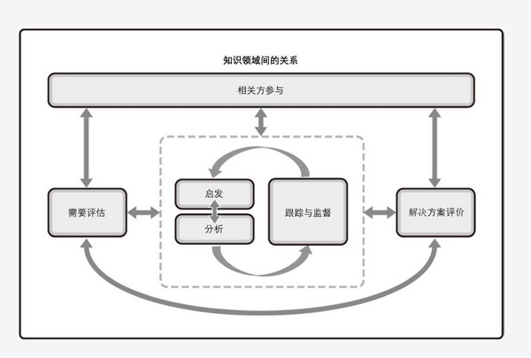

# README

## 前言

### 六个过程组

* 定义和匹配
* 启动
* 规划
* 执行
* 监控
* 发布

### 六个知识领域

* 需要评估
* 相关方参与
* 启发
* 分析
* 跟踪和监督
* 解决方案评价

## 1. 引论

### 1.1 本指南概述和目的

组织希望了解:

* 战略上利用商业分析以确保将投资分配给最高价值的项目
* 足够资金, 使产品团队拥有需要的资源来正确识别和解决恰当的问题
* 交付可测量的商业价值和满足相关方期望的解决方案.

目的是交付**最有价值**的解决方案.

组织需要关注以下三个关键领域, 改进其商业分析能力的有效性:

* 人员, 正确运用商业分析的人力资源.
* 过程, 标准化过程.
* 文化, 高层的合理支持和承诺.

**商业分析**是指应用知识, 技能, 工具和技术于

* 确定问题和机会.
* 识别商业**需要**并提出可行的**解决方案**, 以满足这些需要并**支持战略决策**.
* 启发, 分析, 明确, 沟通和管理需求和其他产品信息.
* 定义测量和实现价值的效益和方法, 并对结果进行分析.

**产品**, 制造出来, 可量化的构件. 可以是有形的或无形的. 产品是为了满足商业需要, 而作为解决方案的一部分被创建或更新. 产品提供商业价值.

**产品需求**, 定义为在产品, 服务或成果中需要满足商业需要的条件或能力.

#### 产品需求类型

* 商业需求: 组织高层级的需要.
* 相关方需求: 相关方需要.
* 解决方案需求: 满足商业需求和相关方需求的产品特性, 服务功能和成果特征.
	* 功能需求: 产品的行为.
	* 非功能需求: 产品正常运行所需的环境条件和质量要求. 也被称为产品质量要求或服务质量要求.
* 过度需求: 从"当前状态"过度到"将来状态"所需的临时能力和运营变更.
* 项目需求(不是商业分析工作的一部分, 侧重于项目执行): 项目需要满足的行动, 过程或其他条件. 包括里程碑日期, 合同责任和制约因素.
* 质量需求(不是商业分析工作的一部分, 侧重于项目执行): 用于确认项目可交付成果的成功完成或其他项目需求的实现的任何条件和标准. 包括测试, 认证和确认.

##### 非功能需求 和 质量需求

* 商业分析的重点是通过开发**非功能需求**确保**产品具有足够高的质量**.
* 项目管理的重点是通过开发**质量需求**确保交付**解决方案的实施过程是高质量的**.

当解决方案符合非功能需求, 交付解决方案的过程遵守质量需求时, 能使解决方案满足商业需要的概率最大化.

#### 解决方案

解决方案是为满足相关方的商业需要和期望而交付的可测量的商业价值所产生的成果.

#### 相关方

* 项目经理识别和分析相关方是为了在最大限度上管理好项目.
* 商业分析专业人士识别和分析相关方是为了最大限度地管理好商业分析活动.

在商业分析中, **相关方识别开始于定义商业需要和情景说明的商业分析执行活动, 并贯穿商业论证和章程的开发过程**.

### 1.2 基本要素

商业分析侧重于产品, 项目管理侧重于交付项目来创建或演变产品.

产品**生命周期**

* 概念
* 交付
* 成长
* 成熟
* 维护
* 退市

产品生命周期可能由多个项目生命周期组成. 商业分析侧重于整个产品生命周期.

商业价值以定义为效益, 效益可以是有形的, 无形的, 或者两者兼有之.

项目的成功应该取决于项目是否交付了预期的商业价值.

测量项目组合, 项目集或项目成功时, 可以分析和记录的信息类型包括:

* 商业目标. 可测量的目标, 包括测量的时间点.
* 战略一致性. 商业目标和组织整体战略的一致性.
* 效益所有者.  在整个计划中, 对已实现效益进行监督, 记录和报告的负责人.
* 测量计划. 描述测量什么, 如何测量, 以及何时测量商业目标是否达成的计划.
* 风险. 影响商业目标实现的不确定事件或条件.
* 假设条件. 在定义商业目标及如何实现这些目标所做出的假设.

### 1.3 指南的组成部分

组织过程资产, 事业环境因素, 专家判断和商业分析计划 通常都被用作所有的商业分析过程输入.

#### 商业分析过程组

过程组**不是**项目生命周期阶段, 没有规定的顺序和时序.

* **定义和匹配** 调查和评估发起产品的**可行性**, **定义范围**并将产品, 项目组合, 项目集和项目与整体**组织战略相匹配**所实施的过程.
* **启动** **定义项目目标**, 将资源应用于项目阶段所实施的过程.
* **规划** 确定执行商业分析活动的最佳**方法**及所**实施**的过程, 如何适应项目所选择的项目生命周期.
* **执行** 为启发, 分析, 建模, 定义, 核实, 确认, 排序和批准所有类型的产品信息所实施的过程.
* **监控** **持续进行的过程**, 用来评估项目所建议的产品变更的影响, 以评估商业分析绩效, 并且促进与相关方的持续沟通和参与.
* **发布** 确定是否应发布所有或部分解决方案, 并且获得所有或部分解决方案准备好过度给对接解决方案负责的运营团队验收的过程.

#### 商业分析知识领域

* **需要评估**. 分析**当前的商业问题或机会**, 了解什么是实现未来期望状态所必须的.
* **相关方参与**. 识别和分析那些和解决方案的结果有利益相关的人, 以确定如何与他们协作和沟通.
* **启发**. 规划和准备启发, 实施启发, 确认启发结果, 以**从来源处获取信息**.
* **分析**. 检查, 分解, 综合和澄清信息, 理解, 完成并改进它.
* **跟踪与监督**. **跟踪, 批准和评估产品信息的变更**, 以在整个商业分析工作中对其进行管理.
* **解决方案评价**. 确认将被执行, 或已经被实时的完整解决方案或部分解决方案, 以**确定解决方案如何满足商业需要并向组织交付价值**.

#### 商业分析

商业分析包括选择适当的商业分析过程, 工具, 技术, 输入和输出, 以用于特定的项目组合, 项目集或项目.

## 2. 商业分析实时环境

### 2.1 概述

* **事业环境因素(EEFs)**. 项目团队不能直接控制的, 并且将对项目组合, 项目集或项目产生影响, 限制或指导作用的各种条件. 限制或指导商业分析如何实施, 而不受商业分析专业人士的控制. 来自企业外部和内部.
* **组织过程资产(OPAs)**. 执行组织所特庸的并没其使用的计划, 过程, 正常, 程序和知识库. 来自企业内部.

事业环境因素(EEFs) 和 组织过程资产(OPAs) **都是所有商业分析过程的默认输入**.

### 2.2 事业环境因素(EEFs)

* 组织外部 
	* 影响商业分析的执行方式
		* 市场条件
		* 社会和文化的影响与问题
		* 相关方期望和风险偏好
		* 法律和合同限制
		* 外部专业商业分析标准
	* 额外信息源以支持产品开发和改进
		* 商业数据库
			* 表单对照结果
			* 标准化的成本估算数据
			* 行业风险研究信息
			* 风险数据库
		* 学术研究
		* 政府或行业标准
		* 财务因素的考虑
		* 物理环境因素
* 组织内部
	* 组织文化, 结构和治理
	* 相关方期望和风险偏好
	* 设施和资源的地理分布
	* 市场研究与实验
	* 架构和基础设施
	* 信息技术软件
	* 对复用商业分析结果的兴趣和承诺等级
	* 人力资源管理政策和程序
	* 资源政策, 过程和可用性
	* 员工的能力
	* 保密策略, 过程和协议

### 2.3 组织过程资产(OPAs)
	
	