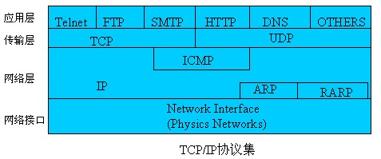
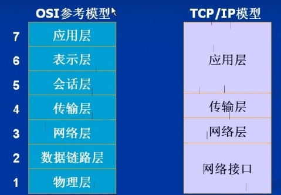
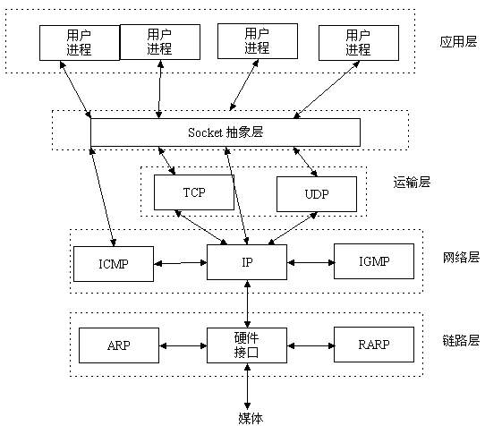
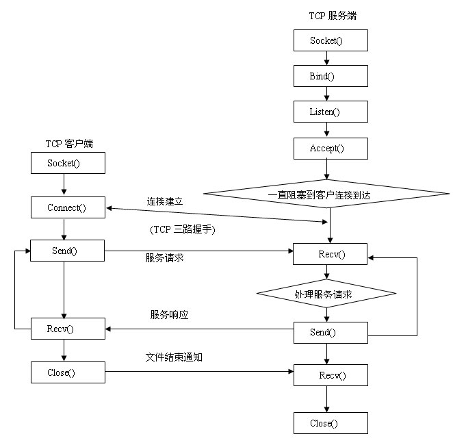
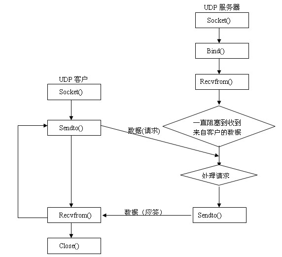

#网络HTTP、TCP、UDP、Socket 知识总结

---

###OSI 七层模型

####各层功能简介

**物理层(`Physical Layer`)**

`物理传输 bit`

物理层位于 OSI 参考模型的最低层,它直接面向原始比特流的传输.为了实现原始比特流的物理传输,物理层必须解决好包括传

1. 输介质
2. 信道类型
3. 数据与信号之间的转换
4. 信号传输中的衰减
5. 噪声

等在内的一系列问题.另外,物理层标准要给出关于物理接口的机械,电气,功能和规程特性,以便于不同的制造厂家既能够根据公认的标准各自独立地制造设备,又能使各个厂家的产品能够相互兼容.

**数据链路层(`Data Link Layer`)**

`如何在不可靠的物理线路上进行数据的可靠传递`

在物理层发送和接收数据的过程中,会出现一些物理层自己不能解决的问题.例如,当两个节点同时试图在一条线路上发送数据时该如何处理?节点如何知道它所接收的数据是否正确?如果噪声改变了一个分组的目标地址,节点如何察觉它丢失了本应收到的分组呢?这些都是数据链路层所必须负责的工作.

数据链路层涉及相邻节点之间的可靠数据传输,数据链路层通过加强物理层传输原始比特的功能,使之对网络层表现为一条无错线路.为了能够实现相邻节点之间无差错的数据传送,数据链路层在数据传输过程中提供了确认,差错控制和流量控制等机制.

**网络层(`Network Layer`)**

`将网络地址翻译成对应的物理地址,并决定如何将数据从发送方路由到接收方`.

网络中的两台计算机进行通信时,中间可能要经过许多中间结点甚至不同的通信子网.网络层的任务就是在通信子网中选择一条合适的路径,使发送端传输层所传下来的数据能够通过所选择的路径到达目的端.

为了实现路径选择,网络层必须使用寻址方案来确定存在哪些网络以及设备在这些网络中所处的位置,不同网络层协议所采用的寻址方案是不同的.在确定了目标结点的位置后,网络层还要负责引导数据包正确地通过网络,找到通过网络的最优路径,即路由选择.如果子网中同时出现过多的分组,它们将相互阻塞通路并可能形成网络瓶颈,所以网络层还需要提供拥塞控制机制以避免此类现象的出现.另外,网络层还要解决异构网络互连问题.

**传输层(`Transport Layer`)**

`传输层的作用是向高层屏蔽下层数据通信的细节,即向用户透明地传送报文`.

传输层是 OSI 七层模型中唯一负责端到端节点间数据传输和控制功能的层.传输层是 OSI 七层模型中承上启下的层,它下面的三层主要面向网络通信,以确保信息被准确有效地传输;它上面的三个层次则面向用户主机,为用户提供各种服务.

传输层通过弥补网络层服务质量的不足,为会话层提供端到端的可靠数据传输服务.它为会话层屏蔽了传输层以下的数据通信的细节,使会话层不会受到下三层技术变化的影响.但同时,它又依靠下面的三个层次控制实际的网络通信操作,来完成数据从源到目标的传输.传输层为了向会话层提供可靠的端到端传输服务,也使用了差错控制和流量控制等机制.

**会话层(`Session Layer`)**

`用户应用程序和网络之间的接口`.

会话层的功能是在两个节点间建立,维护和释放面向用户的连接.它是在传输连接的基础上建立会话连接,并进行数据交换管理,允许数据进行:

1. 单工
2. 双工
3. 全双工

的传送.会话层提供了`令牌管理`和`同步`两种服务功能.

**表示层(`Presentation Layer`)**

`处理用户信息的表示问题,如编码,数据格式转换和加密解密`

表示层以下的各层只关心可靠的数据传输,而表示层关心的是所传输数据的语法和语义.它主要涉及处理在两个通信系统之间所交换信息的表示方式,包括:

1. 数据格式变换
2. 数据加密与解密
3. 数据压缩与恢复等功能.

**应用层(`Application Layer`)**

应用层是 OSI 参考模型的最高层,负责为用户的应用程序提供网络服务.与 OSI 其他层不同的是,它`不为任何其他 OSI 层提供服务,而只是为 OSI 模型以外的应用程序提供服务`.包括为相互通信的应用程序或进行之间建立连接,进行同步,建立关于错误纠正和控制数据完整性过程的协商等.应用层还包含大量的应用协议,如分布式数据库的访问,文件的交换,电子邮件,虚拟终端等.

其中物理层,数据链路层和网络层通常被称作`媒体层`,是网络工程师所研究的对象.

传输层,会话层,表示层和应用层则被称作`主机层`,是用户所面向和关心的内容.

* `http`协议对应于`应用层`.
* `tcp`协议对应于`传输层`.
* `ip`协议对应于`网络层`.

三者本质上没有可比性.何况`HTTP协议是基于TCP连接的`.

我们在传输数据时,可以只使用传输层(TCP/IP),但是那样的话,由于`没有应用层,便无法识别数据内容`,`如果想要使传输的数据有意义,则必须使用应用层协议`,应用层协议很多,有`HTTP`,`FTP`,`TELNET`等等,也可以自己定义应用层协议.

		WEB使用HTTP作传输层协议,以封装HTTP文本信息,然后使用 TCP/IP 做传输层协议将它发送到网络上.
		
		Socket是对 TCP/IP 协议的封装,Socket 本身并不是协议,而是一个调用接口(API),通过Socket,我们才能使用TCP/IP 协议.
		
### TCPI/IP模型

TCP/IP 模型是由美国国防部创建的,所以有时又称 DoD(Department of Defense)模型.TCP/IP 模型分为四层,由下而上分别为

* 网络访问层
* 网际层
* 传输层
* 应用层

应该指出,TCP/IP 是 OSI 模型之前的产物,所以两者间不存在严格的层对应关系.在 TCP/IP 模型中并不存在与 OSI 中的物理层与数据链路层相对应的部分,相反,由于 TCP/IP 的主要目标是致力于异构网络的互连,所以在 OSI 中的物理层与数据链路层相对应的部分没有作任何限定.

在 TCP/IP 模型中,网络访问层是 TCP/IP 模型的最低层,负责接收从`网际层`交来的 IP 数据报并将 IP 数据报通过底层物理网络发送出去,或者从底层物理网络上接收物理帧,抽出 IP 数据报,交给互联网层.网络访问层使采用不同技术和网络硬件的网络之间能够互联,它包括属于操作系统的设备驱动器和计算机网络接口卡,以处理具体的硬件物理接口.

网际层负责独立地将分组从源主机送往目标主机,涉及为分组提供最佳路径的选择和交换功能,并使这一过程与它们所经过的路径和网络无关.这好比你寄信时,你并不需要知道它是如何到达目的地的,而只关心它是否到达了.TCP/IP 模型的互联网层在功能上非常类似于 OSI 参考模型中的网络层.

传输层的作用与 OSI 参考模型中传输层的作用是类似的,即在源结点和目的结点的两个对等实体间提供可靠的端到端的数据通信.为保证数据传输的可靠性,传输层协议也提供了确认,差错控制和流量控制等机制.另外,由在一般的计算机中,常常是多个应用程序同时访问网络,所以传输层还要提供不同应用程序的标识.

应用层涉及为用户提供网络应用,并为这些应用提供网络支撑服务.由于 TCP/IP 将所有与应用相关的内容都有归为一层,所以在应用层要处理高层协议,数据表达和对话控制等任务.

**OSI模型和TCP/IP模型的区别**

OSI 模型包括了七层,而 TCP/IP 模型只有四层.然它们具有功能相当的网络层,传输层和应用层,但其它层并不相同.

TCP/IP 模型中没有专门的表示层和会话层,它将与这两层相关的表达,编码和会话控制等功能包含到了应用层中去完成.另外,TCP/IP 模型还将 OSI 的数据链路层和物理层包括到了一个网络访问层中.

OSI 模型在网络层支持无连接和面向连接的两种服务,而在传输层仅支持面向连接的服务.TCP/IP 模型在互联网层则只支持无连接的一种服务,但在传输层支持面向连接和无连接两种服务.

TCP/IP 由于有较少的层次,因而显得更简单,并且作为从因特网(INTERNET)上发展起来的协议,已经成了网络互连的事实标准.但是,目前还没有实际网络是建立在 OSI 七层模型基础上的,`OSI 仅仅作为理论的参考模型被广泛使用`.

### Http和Socket连接区别

#### 短连接

`连接->传输数据->关闭连接`.

HTTP是无状态的,浏览器和服务器每进行一次HTTP操作,就建立一次连接,但任务结束就中断连接.

`短连接是指Socket连接后发送后接收完数据后马上断开连接`.

#### 长连接

`连接->传输数据->保持连接 -> 传输数据-> ... ->关闭连接`.

连接指建立Socket连接后不管是否使用都保持连接,但安全性较差.

#### http的长连接　

HTTP也可以建立长连接的,使用Connection:keep-alive,HTTP 1.1默认进行持久连接。HTTP1.1和HTTP1.0相比较而言,最大的区别就是增加了持久连接支持(貌似最新的 http1.0 可以显示的指定 keep-alive),但还是无状态的,或者说是不可以信任的.

#### 什么时候用长连接,短连接?

长连接多用于操作频繁,点对点的通讯,而且连接数不能太多情况.每个TCP连接都需要三步握手,这需要时间,如果每个操作都是先连接,再操作的话那么处理速度会降低很多,所以每个操作完后都不断开,次处理时直接发送数据包就OK了,不用建立TCP连接.例如:数据库的连接用长连接,如果用短连接频繁的通信会造成Socket错误,而且频繁的Socket创建也是对资源的浪费.

而像WEB网站的http服务一般都用短链接,因为长连接对于服务端来说会耗费一定的资源,而像WEB网站这么频繁的成千上万甚至上亿客户端的连接用短连接会更省一些资源,如果用长连接，而且同时有成千上万的用户,如果每个用户都占用一个连接的话,如果每个用户都占用一个连接的话.所以并发量大,但每个用户无需频繁操作情况下需用短连好.

####http连接

HTTP协议即超文本传送协议(HypertextTransfer Protocol ),是Web联网的基础,也是手机联网常用的协议之一,HTTP协议是建立在TCP协议之上的一种应用.

HTTP连接最显著的特点是客户端发送的每次请求都需要服务器回送响应,在请求结束后,会主动释放连接.从建立连接到关闭连接的过程称为"一次连接".

* 在HTTP 1.0中,客户端的每次请求都要求建立一次单独的连接,在处理完本次请求后,就自动释放连接.
* 在HTTP 1.1中则可以在一次连接中处理多个请求,并且多个请求可以重叠进行,不需要等待一个请求结束后再发送下一个请求.

由于HTTP在每次请求结束后都会主动释放连接,因此HTTP连接是一种"短连接",要保持客户端程序的在线状态,需要不断地向服务器发起连接请求.通常的做法是即时不需要获得任何数据,客户端也保持每隔一段固定的时间向服务器发送一次"保持连接"的请求,服务器在收到该请求后对客户端进行回复,表明知道客户端"在线".若服务器长时间无法收到客户端的请求,则认为客户端"下线",若客户端长时间无法收到服务器的回复,则认为网络已经断开.

#### socket

Socket 是应用层与TCP/IP协议族通信的中间软件抽象层,它是一组接口.

**套接字(`socket`)概念**

套接字(Socket)是通信的基石,是支持TCP/IP协议的网络通信的基本操作单元.它是网络通信过程中端点的抽象表示,包含进行网络通信必须的五种信息:

1. 连接使用的协议
2. 本地主机的IP地址
3. 本地进程的协议端口
4. 远地主机的IP地址
5. 远地进程的协议端口

应用层通过传输层进行数据通信时,TCP会遇到同时为多个应用程序进程提供并发服务的问题.多个TCP连接或多个应用程序进程可能需要通过同一个TCP协议端口传输数据.为了区别不同的应用程序进程和连接,许多计算机操作系统为应用程序与TCP／IP协议交互提供了套接字(socket)接口.应用层可以和传输层通过Socket接口,区分来自不同应用程序进程或网络连接的通信,实现数据传输的并发服务.

**建立Socket连接**

建立 Socket 连接至少需要一对套接字,其中一个运行于客户端,称为`ClientSocket`,另一个运行于服务器端,称为`ServerSocket`.

套接字之间的连接过程分为三个步骤:

1. 服务器监听
2. 客户端请求
3. 连接确认

`服务器监听`: 服务器端套接字并不定位具体的客户端套接字,而是处于`等待连接`的状态,时监控网络状态,等待客户端的连接请求.

`客户端请求`: 指客户端的套接字提出连接请求,要连接的目标是服务器端的套接字.为此,客户端的套接字必须首先描述它要连接的服务器的套接字,指出服务器端套接字的地址和端口号,然后就向服务器端套接字提出连接请求.

`连接确认`: 当服务器端套接字监听到或者说接收到客户端套接字的连接请求时,就响应客户端套接字的请求,建立一个新的线程,把服务器端套接字的描述发给客户端,一旦客户端确认了此描述,双方就正式建立连接.而服务器端套接字继续处于监听状态,继续接收其他客户端套接字的连接请求.

**Socket连接与TCP连接**

创建Socket连接时,可以指定使用的传输层协议,Socket可以支持不同的传输层协议(TCP或UDP),当使用TCP协议进行连接时,该Socket连接就是一个TCP连接.

**Socket连接与HTTP连接**

由于通常情况下 Socket 连接就是TCP连接,因此 Socket 连接一旦建立,通信双方即可开始相互发送数据内容,直到双方连接断开.但在实际网络应用中,客户端到服务器之间的通信往往需要穿越多个中间节点,例如路由器,网关,防火墙等,大部分防火墙默认会关闭长时间处于非活跃状态的连接而导致 Socket 连接断连,因此需要通过`轮询告诉网络`,该连接处于活跃状态.

而HTTP连接使用的是"`请求—响应`"的方式,不仅在请求时需要先建立连接,而且需要客户端向服务器发出请求后,服务器端才能回复数据.

很多情况下,需要服务器端主动向客户端推送数据,保持客户端与服务器数据的实时与同步.此时若双方建立的是Socket连接,服务器就可以直接将数据传送给 客户端;若双方建立的是HTTP连接,则服务器需要等到客户端发送一次请求后才能将数据传回给客户端,因此,客户端定时向服务器端发送连接请求,不仅可以保持在线,同时也是在"询问"服务器是否有新的数据,如果有就将数据传给客户端.

####tcp与udp的区别

TCP是面向连接的,传输可靠(保证数据正确性且保证数据顺序),用于传输大量数据(流模式`SOCK_STREAM`),速度慢,建立连接需要开销较多(时间,系统资源).

TCP是一种流模式的协议,是面向连接的,也就是说,在连接持续的过程中,Socket 中收到的数据都是由同一台主机发出的(劫持什么的不考虑),因此,知道保证数据是有序的到达就行了,至于每次读取多少数据不关心.

UDP: 面向非连接,传输不可靠,用于传输少量数据(数据包模式`SOCK_DGRAM`),速度快.

关于TCP是一种流模式的协议,UDP是一种数据报模式的协议,这里要说明一下,TCP是面向连接的,也就是说,在连接持续的过程中,socket 中收到的数据都是由同一台主机发出的,因此,知道保证数据是有序的到达就行了,至于每次读取多少数据自己看着办.而UDP是无连接的协议,也就是说,只要知道接收端的IP和端口,且网络是可达的,任何主机都可以向接收端发送数据.这时候,如果一次能读取超过一个报文的数据,则会乱套.比如,主机A发送了报文P1,主机B发送了报文P2,如果能够读取超过一个报文的数据,那么就会将P1和P2的数据合并在了一 起,这样的数据是没有意义的.

**基本TCP客户—服务器程序设计基本框架**

**基本UDP客户—服务器程序设计基本框架流程图**

 