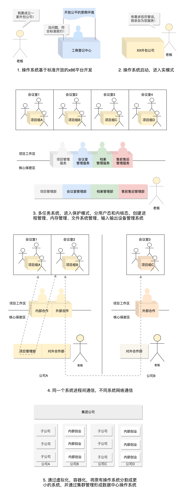
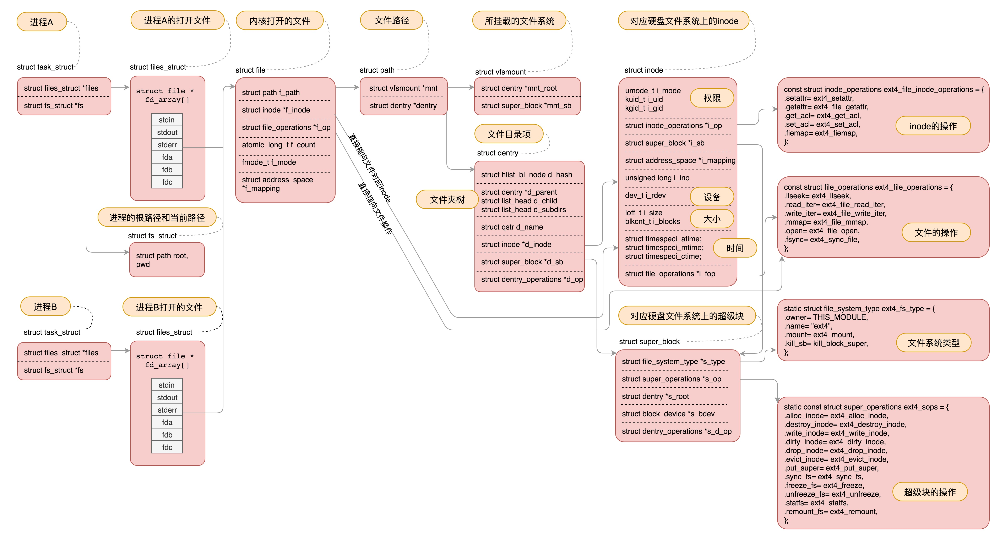

# 开篇词 | 为什么要学习Linux操作系统

---

## 笔记

**研究`Linux`内核代码, 你能学到数据结构与设计模式的落地实践**

### 初创期

老板基于开放的营商环境(**x86 体系结构**), 创办了一家外包公司(**系统的启动**). 因为一开始没有其他员工, 老板需要亲自接项目(**实模式**)

### 发展期

公司慢慢做大, 项目越接越多(**保护模式, 多进程**), 为了管理各个外包项目, 建立了项目管理体系(**进程管理**), 会议室管理体系(**内存管理**), 文档资料管理体系(**文件系统**), 售前售后体系(**输入输出设备管理**)

### 壮大期

公司越来越牛, 开始促进内部项目的合作(**进程间通信**)和外部公司合作(**网络通信**)

### 集团化

公司的业务越来越多, 会成立多家子公司(**虚拟化**), 或者鼓励内部创业(**容器化**), 这个时候公司辩称了集团. 大管家的调度能力不再局限与一家公司, 而是集团公司(**Linux 集群**), 从而成功上市(**从单机操作系统到数据中心操作系统**).

### 图解

## 扩展