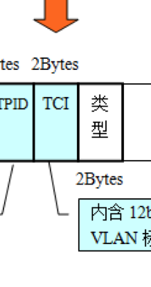

# 第24讲 | 云中网络：自己拿地成本高，购买公寓更灵活

## 笔记

### 从物理机到虚拟机

`qemu-kvm`, 可以在数据中心的物理机里面创建虚拟机.

**物理机是盖房子, 虚拟机相当于购买公寓, 更加灵活方便, 随时可买可卖**

用**软件模拟硬件**的方式, 让虚拟机感觉自己在使用独立的设备, 真正使用的时候, 还是使用物理设备.

如:

* 多个虚拟机轮流使用物理`CPU`
* 内存也是使用虚拟内存映射的方式, 最终映射到物理内存上
* 硬盘在一块大的文件系统上创建一个`N`个`G`的文件, 作为虚拟机硬盘

### 虚拟网卡的原理


* 虚拟机要有一张网卡. `qemu-kvm`通过`Linux`上的一种`TUN/TAP`技术来实现的.
* 虚拟机是物理机上跑的一个软件. 这个软件可以像其他应用打开文件一样, 打开一个`TUN/TAP`的`Char Dev`(字符设备文件). 打开这个字符设备文件之后, 物理机上就能看到一张虚拟的`TAP`网卡.
* 虚拟化软件会将打开的这个文件, 在虚拟机里面虚拟出一个网卡, **让虚拟机里面的应用觉得它们真有一张网卡**, 于是, **所有的网络包都往这里发**.
* 网络包回到虚拟化软件这里. 
	* 他会将**网络包转换称为文件流, 写入字符设备**, 就像写一个文件一样. 
	* 内核中`TUN/TAP`字符设备驱动会收到这个写入的文件流, 交给`TUN/TAP`的虚拟网卡驱动. 
	* 虚拟网卡驱动**将文件流再次转成网络包**, 交给`TCP/IP`协议栈, 最终从虚拟`TAP`网卡发出来, 成为标准的网络包.

**网络包->文件流->网络包**

### 虚拟网卡连接到云中

云计算网络

* 共享: 物理机上只有有限的网卡. 多个虚拟网卡如何共享同一个出口.
* 隔离:
	* 安全隔离, 两个虚拟机可能属于两个用户, 需要保证用户隔离.
	* 流量隔离, 一个虚拟机疯狂使用网络, 会不会导致另外一个上不了网.
* 互通:
	* 同一台机器上的两个虚拟机属于同一个用户, 这两个虚拟机如何相互通信.
	* 不同物理机上的两个虚拟机, 属于同一个用户的, 如何通信.
* 灵活: 虚拟机经常会被创建, 删除, 从一台机器漂移到另外一台机器, 有的互通, 有的不通, 需要能够灵活配置.

#### 共享与互通问题

多个虚拟网卡如何连在一起, 进行相互访问, 并且还可以访问外网.

如同大学宿舍电脑连接起来需要**交换机**.

在物理机上, 有一个**虚拟交换机**, `Linux`上有一个命令叫做`brctl`, 可以创建虚拟网桥.`brctl addbr br0`. 

创建出来后, 将两个虚拟机的虚拟网卡, 都连接到虚拟网桥`brctl addif br0 tap0`上, 这两将**两个虚拟机配置相同子网网段, 两台虚拟机就能够相互通信了**.


虚拟机如何连外网.


`host-only`的网络对应的, 就是上面两个虚拟机连到一个`br0`虚拟网桥上, 不考虑访问外部的场景, **只要虚拟机之间能够相互访问就可以了**.

#### 访问外网 - 桥接

如果选择桥接网络


每个虚拟机都会有虚拟网卡, 在你的笔记本电脑上, 会发现多了几个网卡, 就是**虚拟交换机**. 这个虚拟交换机将虚拟机连接在一起. 

在桥接模式下, **物理网卡也连接到这个虚拟交换机上**

使用桥接网络, 虚拟机的`IP`会和物理机在一个网段内. 因为物理机和虚拟机放在同一个网桥上, 相当于这个网桥有三台机器, 是一个网段的, 全部打平了.


数据中心, 使用类似技术, 在每台机器上都创建网桥`br0`, 虚拟机的网卡都连到`br 0`上, 物理网卡也连到`br 0`上, 所有的`br 0`都通过物理网卡出来连接到物理交换机上.


如下图这样理解, 虚拟机会和物理网络具有相同的网段.


解决了跨物理机互通问题. 都在一个二层网络里面, 彼此用相同的网段访问就可以了. 规模很大的时候, 会存在问题**广播问题**.

数据中心的物理机通过`VLAN`进行划分, 解决刚播问题.

如果一台物理机里面创建10台虚拟机, 全都在一个二层网络里面, 那广播就会很严重, 除非规模很小, 才可以使用这种相对简单的方式.

#### 访问外网 - NAT

使用`NAT`模式:


虚拟机的`IP`和物理机的`IP`不在同一个网段.

虚拟机访问外部网络的时候, 需要将地址`NAT`称为物理机地址.

除此, 还会在笔记本电脑里配置一个`DHCP`服务器, 为笔记本电脑上的虚拟机动态分配`IP`地址, **因为虚拟机的网络自成体系, 需要进行`IP`管理**. 桥接方式是将网络**打平**了, **虚拟机的`IP`地址有物理网络的`DHCP`服务器分配**.

数据中心也是使用类似的方式.


类似宿舍:

* 虚拟机是你的电脑
* 路由器和`DHCP Server`相当于家用路由器
* 物理网卡相当于宿舍的外网网口, 用于访问互联网
* 所有电脑都通过内网网口连接到一个网桥`br 0`上, 虚拟机要想访问互联网, 需要通过`br 0`连到**路由器**(router)上, 然后通过路由器将请求`NAT`成为物理网络地址, 转发到物理网络.

简化操作:

* 虚拟机所在瓦罗的网关地址直接配置到`br0`上
* 不用`DHCP Server`, 手动配置每台虚拟机的`IP`
* 物理网卡`ethx`上进行`NAT`, 所有从这个网卡出去的包都`NAT`成这个网卡地址

		iptables -t nat -A POSTROUTING -o ethX -j MASQUERADE
		
* 设置物理机转发功能`net.ipv4.ip_forward=1`, 直接自己做路由器, 不用单独的路由器

**MASQUERADE**: 从服务器的网卡上, 自动获取当前ip地址来做NAT.


#### 隔离问题

`brctl`创建的网桥也是支持`VLAN`功能, 可以设置两个虚拟机的`tag`，虚拟网桥上这两个虚拟机是不互通的.

物理机互通(brctl 创建的网桥上面的`tag`是没办法在网桥之外的范围内起作用的).

`vconfig`, 可以基于物理网卡`etho0`创建带`VLAN`的虚拟网卡, 从这个虚拟网卡出去的包都带这个`VLAN`.


* 每个用户分配不同的`VLAN`
* 一台物理机上基于物理网卡, 为每个用户`vconfig`创建一个带`VLAN`的网卡
* 不同的用户使用不同的虚拟网桥, 带`VLAN`的虚拟网卡也连接到虚拟网桥上
* 出了网桥, `VLAN`不同也不会转发到另一个网桥上.
* 出了物理机, 带着`VLAN ID`, 这个包只会转发给相同`VLAN`的网阿卡和网桥

问题:

* `VLAN ID`只有`4096`个
* 配置不灵活, 不够用

##### VLAN ID 4096个



而实质上的VLAN ID, 是TCI中的12位元. 由于总共有12位, 因此最多可供识别4096个VLAN.

```
2^12 = 4096
```

## 扩展

### brctl

### vconfig