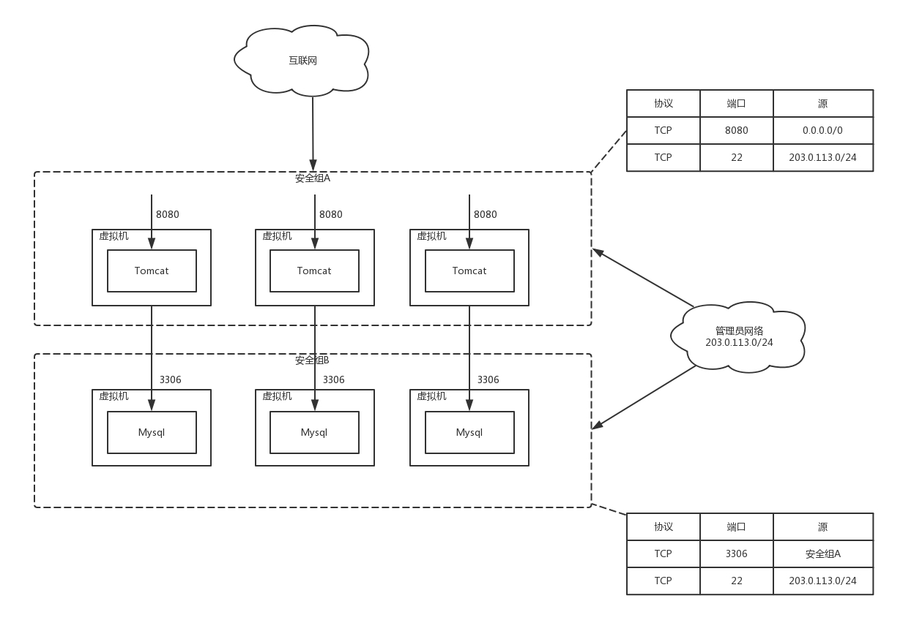
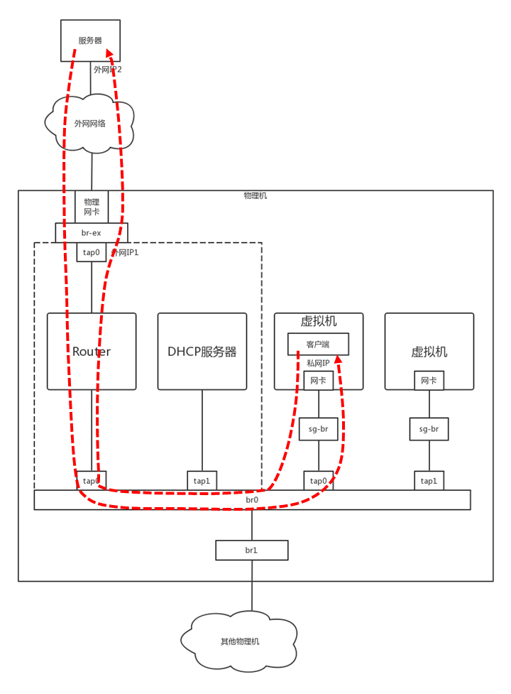

# 第26讲 | 云中的网络安全：虽然不是土豪，也需要基本安全和保障

## 笔记

公用云上的虚拟机, **仅仅开放需要的端口, 而将其他的端口一概关闭**, 常常采用`ACL`(Access Control List, 访问控制列表)来控制`IP`和端口.

### 当一个网络包进入一台机器的时候

* 首先检查`MAC`头, 看下是不是自己的.
* 如果是, 拿下`IP`头.
* 得到目标`IP`之后, 进行路由判断.
* **路由判断**之前称为**PREROUTING**
* 如果`IP`是我的, 包就应该是我的, 就发给上面的传输层. **INPUT**
* 如果`IP`不是我的, 就需要转发出去, 这个节点称为. **FORWARD**
* 上层处理完毕之后, 一般会返回一个处理结果, 这个处理结果会发出去. **OUTPUT**
* 无论是`FORWARD`还是`OUTPUT`, 都是路由判断之后发生的, 最后一个节点就是**POSTROUTING**

整个过程如图所示:


5个节点:

* PREROUTING
* INPUT
* FORWARD
* OUTPUT
* POSTROUTING

`Linux`内核中, 有一个框架叫`Netfilter`. 它可以在这些几点插入`hook`函数. 这些函数可以截获数据包, 对数据包进行干预.

* 做一定的修改, 然后决策是否接着交给`TCP/IP`协议栈, 交回给协议栈. **ACCEPT**
* 过滤掉, 不再传输. **DROP**
* 发送给某个用户态进程处理. **QUEUE**

经常用在内部负载均衡, 就是过来的数据一会传给目标地址1, 一会传给目标地址2, 而且目标地址的个数和权重都可能变. **协议栈往往处理不了这么复杂的逻辑, 需要写一个函数接管这个数据, 实现自己的逻辑**

可以在`IP`转发的过程中, 随时干预这个过程, 只要你能实现这些`hook`函数.

著名的实现, 内核模块`ip_tables`. 在这五个节点上埋下函数, 从而可以根据规则进行包的处理. 分为四大类:

* 链接跟踪(`conntrack`) **基础功能, 被下面三个功能依赖**
* 数据包的过滤(`filter`)
* 网络地址转换(`nat`)
* 数据包的修改(`mangle`)

`iptables`用命令来干预内核的规则, 内核的功能对应`iptables`来讲就是**表和链**的概念.


`iptables`的表分为四种:`raw->mangle->nat->filter`. 这四个优先级依次降低, `raw`不常用.

#### filter

`filter`表处理**过滤**功能, 主要包含三个链:

* `INPUT`链: 过滤所有**目标地址是本机**的数据报.
* `FORWARD`链: 过滤所有**路过本机**的数据报.
* `OUTPUT`链: 过滤所有**由本机产生**的数据包.

#### nat

`nat`表处理**网络地址转换**, 可以进行`SNAT`(改变数据报的源地址), `DNAT`(改变数据报的目标地址), 包含了三个链:

* `PREROUTING`链: 可以在数据包到达防火墙时改变目标地址.
* `OUPUT`链: 可以改变本地产生的数据包的目标地址.
* `POSTROUTING`链: 在数据包离开防火墙时改变数据报的源地址.

#### mangle

`mangle`表主要是修改数据包:

* `PREROUTING`链
* `INPUT`链
* `FORWARD`链
* `OUTPUT`链
* `POSTROUTING`链

#### iptables


1. 数据报进入的时候
	* 先进`mangle`表的`PREROUTING`链. 这里可以根据需要, 改变数据报头内容之后.
	* 进入`nat`表的`PREROUTING`链. 这里可以根据需要做`Dnat`, 也就是目标地址转换.
2. 进入路由判断, 要判断是进入本地还是转发的.
	* 如果进入本地, 进入`INPUT`链, 之后按条件过滤限制进入.
		* 之后进入本机, 再进入`OUTPUT`链, 按条件过滤限制出去, 离开本地.
	* 如果是转发就进入`FORWARD`链, 根据条件过滤限制转发.
3. 进入`POSTROUTING`链, 这里可以做`Snat`, 离开网络接口

**示例: 丢弃所有访问**

```
iptables -t filter -A INPUT -s 0.0.0.0/0.0.0.0 -d X.X.X.X -j DROP
```

* `-s`表示源`IP`地址
* `-d`表示目标地址段
* `DROP`表示丢弃, 无论从哪里来的, 要想访问我这台机器, 全部拒绝, 谁也黑不进来.

**示例: 打开22端口**

```
iptables -I INPUT -s 0.0.0.0/0.0.0.0 -d X.X.X.X -p tcp --dport 22 -j ACCEPT
```

**示例: 打开80端口**

```
iptables -A INPUT -s 0.0.0.0/0.0.0.0 -d X.X.X.X -p tcp --dport 80 -j ACCEPT
```

云平台, 一般允许一个或者多个虚拟机属于某个安全组, 而属于不同安全组虚拟机之间的访问以及外网访问虚拟机, 都需要通过安全组进行过滤.



##### 批量下发安全规则



两个`VM`通过`tap`网卡连接到一个网桥上, 网桥是二层的, 两个`VM`之间是可以随意互通的, 因而需要有一个地方统一配置这些`iptables`规则.

多加一个网桥, 在这个网桥上配置`iptables`规则, 将在用户在界面上配置的规则, 放到这个网桥上. 在每台机器上跑一个`Agent`, 将用户配置的安全组变成`iptables`规则, 配置在这个网桥上.

云平台, 虚拟机还是要通过物理网络和外界通信, 因为需要在出物理网的时候, 做一次网络地址转换, 也即`nat`, 这个就可以用`iptables`类做.

**SNAT**: 转换源`IP`地址.

**DNAT**: 转换目标`IP`地址.

#### 云平台虚拟机访问公网

云平台虚拟机只有私网`IP`地址:

* 到达外网网口要做一次`Snat`, 转换成机房网`IP`
* 然后出数据中心的时候, 在转换为公网`IP`


##### snat MASQUERADE(地址伪装)

##### 1. 虚拟机作为客户端访问外网

所有虚拟机共享一个机房网和公网的`IP`地址.

`Netfilter`的链接跟踪功能(`conntrack`). 对于`TCP`来讲: 建立一个链接可以用**源/目的 IP + 源/目的端口**唯一标示一条连接, 这个链接回复昂在`conntrack`表里面. 

当这台机器去请求外网的时候, 虽然源地址已经`Snat`成公网`IP`地址了, 但是`conntract`表里面还是有这个连接的记录的. 当公网返回数据的时候, 会找到记录, 从而找到正确的私网`IP`地址.

##### 2. 虚拟机作为服务端提供服务

需要给网站配置固定的物理的`IP`地址和公网`IP`地址. 需要显示的配置`Snat`和`Dnat`规则.

当外部访问进来的时候, 外网网口会通过`Dnat`规则将公网`IP`地址转换为私网`IP`地址, 到达虚拟机, 虚拟机里面是`163`网站, 返回结果, 外网网口会通过`Snat`规则, 将私网`IP`地址转换为那个分配给它的固定的公网`IP`地址.

规则如下:

* 源地址转换(Snat): iptables -t nat -A -s 私网IP -j Snat --to-source 外网IP
* 目的地址转换(Dnat): iptables -t nat -A -PREROUTING -d 外网IP -j Dnat --to-destionation 私网IP

### 总结

云中的安全测试的常用方式是使用`iptables`规则.

## 扩展