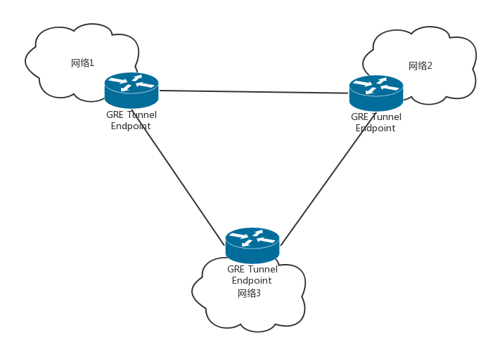
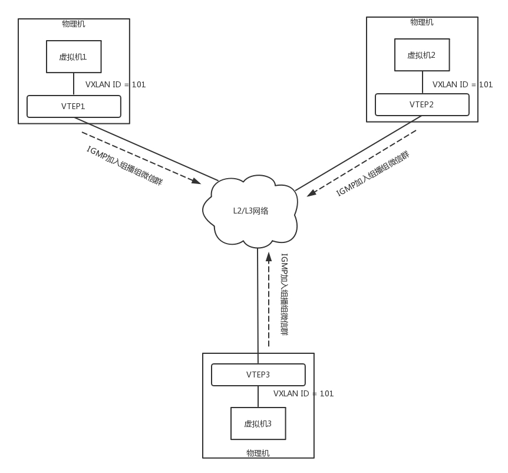

# 第28讲 | 云中网络的隔离GRE、VXLAN：虽然住一个小区，也要保护隐私

## 笔记

### 云平台隔离

`VLAN`只有`12`位, 共`4096`个. 现在不够用.

方案:

* 修改这个协议
* 扩展
	* 原来基础上扩展出一个头, 里面包含足够用于区分租户的`ID`, 外层的包的格式尽量和传统的一样, 依然兼容原来的格式. 一旦遇到需要区分用户的地方, 就用这个特殊的程序, 来处理这个特殊的包的格式.
	* 如隧道理论中的扩展头是用于加密的, 现在需要的包头是要能够区分用户的.

### Underlay 和 Overlay

* 底层的物理网络设备组成的网络我们称为`Underlay`网络.
* 虚拟机和云中的这些技术组成的网络称为`Overlay`网络, 这是一种基于物理网络的虚拟化网络实现.

### GRE

`Generic Routing Encapsulation`, 是一种`IP-over-IP`的隧道技术. 将`IP`包封装在`GRE`包里, 外面加上`IP`头, 在隧道的一端封装数据包, 并在通路上进行传输, 到另外一端的时候解封装. 可以认为`Tunnel`是一个虚拟的, 点对点的连接.

`key`字段是一个`32`位的字段, 里面存放的往往就是用于区分用户的`Tunnel ID`, `32`位.

下面的格式类型专门用于网络虚拟化的`GRE`包头格式, 称为**NVGRE**, 也给网络`ID`号`24`位, 也完全够用.

#### GRE隧道

* 2个网段
* 2个路由器
* 中间通过`GRE`隧道进行通信
	* 隧道建立之后, 会多出两个`Tunnel`端口, 用于封包, 解封包

#### GRE隧道访问流程

1. 主机`A`在左边的网络, `IP`地址为`192.168.1.102`, 它想访问主机`B`. 主机`B`在右边的网络, `IP`地址为`192.168.2.115`. 
	* 发送一个包, 源地址为`182.168.1.102`, 目标地址为`192.168.2.115`. 要跨网段访问, 于是根据默认的`default`路由表规则, 要发给默认的网关`192.168.1.1`(左边的路由器)
2. 根据路由表, 从左边的路由器, 去`192.168.2.0/24`这个网段, 应该走一条`GRE`隧道, 从隧道一端的网卡`Tunnel0`进入隧道.
3. 在`Tunnel`隧道的端点进行包的封装, 在内部的`IP`头之外加上`GRE`头. 对于`NVGRE`来讲, 是在`MAC`头之外加上`GRE`头, 然后加上外部的`IP`地址, 也即路由器的外网`IP`地址. 源`IP`地址为`172.17.10.10`, 目标`IP`地址为`172.16.11.10`, 然后从`E1`的物理网卡发送到公共网络.
4. 在公共网络里面, 沿着路由器一跳一跳地走, 全部都按照外部的公网`IP`地址进行.
5. 当网络包到达对端路由器的时候, 也要到达对端的`Tunnel0`, 然后开始解封装, 将外层的`IP`头取下来, 然后根据里面的网络包, 根据路由表, 从`E3`口转发出去到达服务器`B`.

`GRE`通过隧道的方式, 解决了`VLAN ID`不足的问题.

#### 不足之处

##### 1. `Tunnel`的数量问题

`GRE`是一种点对点隧道, 如果有三个网络, 就需要在每两个网络之间建立一个隧道. 如果网络数目增多, 这样隧道的数目会呈指数性增长.

##### 2. `GRE`不支持组播

一个网络中的虚拟机发出一个广播帧后, `GRE`会将其广播到所有与该节点有隧道连接的节点.

##### 3. 很多防火墙和三层网络设备无法解析`GRE`

无法对`GRE`封装包做合适地过滤和负载均衡.

### VXLAN

`VXLAN`是从二层外面就套了一个`VXLAN`的头, 这里面包含的`VXLAN`的`ID`为`24`位, 也够用了. 在`VXLAN`头外面还封装了`UDP, IP`以及外层的`MAC`头.

作为扩展性协议, 需要一个地方对`VXLAN`的包进行封装和解封装, 实现这个功能的点称为`VTEP`(VXLAN Tunnel Endpoint).

`VTEP`相当于虚拟机网络的管家. 每台物理机上都可以有一个`VTEP`. 每个虚拟机启动的时候, 都需要向这个`VTEP`管家注册, 每个`VTEP`都知道自己上面注册了多少个虚拟机. **当虚拟机要跨VTEP进行通信的时候, 需要通过VTEP代理进行, 由VTEP进行包的封装和解封装**.

`VXLAN`不是点对点的(和`GRE`端到端的隧道不同), 是支持通过组播的来定位目标机器的, 而非一定是这一端发出, 另一端接收.

当一个`VTEP`启动的时候, 都需要通过`IGMP`协议. 加入一个组播组, 就像加入一个邮件列表, 或者加入一个微信群, 所有发到这个邮件列表的邮件, 或者发送到微信群里面的消息, 大家都能收到. 而当每个物理机上的虚拟机启动之后, `VTEP`就知道, 有一个新的`VM`上线了, 它归我管.

* 虚拟机`1,2,3`属于云中同一个用户的虚拟机, 因而需要分配相同的`VXLAN ID=101`. 在云的界面上, 就可以知道它们的`IP`地址, 越是可以在虚拟机`1`上`ping`虚拟机`2`.
* 虚拟机`1`发现, 它不知道虚拟机`2`的`MAC`地址, 因为包没办法发出去, 于是要送`ARP`广播.

## 扩展