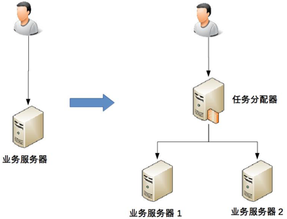
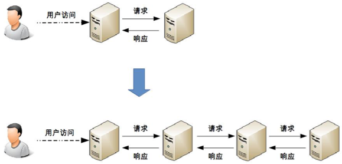

# 04 | 复杂度来源：高性能 

## 笔记

### 复杂度的6个来源之 - 高性能

* 高性能
	* 单台计算机内部为了高性能带来的复杂度
	* 多台计算机集群为了高性能带来的复杂度

### 单机复杂度

计算机性能的发展本质上是由硬件发展取得的. `CPU`的性能发展. **摩尔定律**.

将硬件性能充分发挥出来的关键就是操作系统, 所以操作系统本身其实也是跟随硬件的发展而发展的.

操作系统和性能最相关的就是**进程**和**线程**.

* 输入, 计算, 输出功能.
	* 用户输入, 计算机完成, 大部分时候计算机在等待用户输入. **人的输入速度比不上计算机运行速度**
* 批处理
	* 先把要执行的指令预先写下来, 形成一个指令清单**任务**, 将任务交给计算机去执行, 批处理操作系统负责读取**任务**中的指令清单并进行处理.
		* 缺点
			* 一次只能执行一个任务, 比如一个任务需要从`I/O`设备读取数据, 则`CPU`其实是空闲的
* 进程
	* **进程对应一个任务**
		* 每个任务都有自己独立的内存空间, 进程间互不相关, 由操作系统来进行调度.
	* 多进程并行运行
		* **分时** 把`CPU`的时间分成很多片段, 每个片段只能执行某个进程中的指令.
			* 虽然从操作系统和`CPU`角度来说还是串行处理, 但是**由于`CPU`的处理速度很快**, 从用户的角度来看, **感觉**是多进程在并行处理.
		* 多进程通信
			* 如果2个进程运行之间不能通信, 只能A把结果写到存储, B读取. **效率低**
				* 解决
					* 管道
					* 消息队列
					* 信号量
					* 共享存储
	* 多进程缺点, **单个进程内部只能串行处理**, 进程内部的子任务并不要求是严格按照时间顺序来执行的, 也需要并行处理.
		* **线程**是进程内部的子任务. 子任务**共享**同一份进程数据.
			* 操作系统**调度**的最小单位就变成了**线程**
			* **进程**变成了操作系统**分配资源**的最小单位. 
* 多个`CPU`同时执行计算任务, **分时, 不能做到时间上真正的并行**.
	* SMP(Symmetric Multi-Processor, 对称多处理器结构)
		* 目前多核处理器就是`SMP`方案
	* NUMA(Non-Uniform Memory Access, 非一致存储访问结构)
	* MPP(Massive Parallel Processing，海量并行处理结构)

### 集群的复杂度

多态机器配合起来达到高性能的目的, 是一个复杂的任务.

#### 任务分配

任务分配的意思是指每台机器都可以处理完整的业务任务, 不同的任务分配到不同的机器上执行.

随着性能要求继续提高, 任务分配器就需要多台.

* 任务分配器
	* DNS 轮询、智能 DNS、CDN(Content Delivery Network，内容分发网络)、GSLB 设备(Global Server Load Balance，全局负载均衡)

**任务分配器**不一定只能是物理机器或者一个独立运行程序, 可以是一个**嵌入在其他程序中的算法**(如`memcached`),

#### 任务分解

把原来大一统但复杂的业务系统, 拆分成小而简单但需要多个系统配合的业务系统.

如果任务复杂, 扩充机器提升的性能有限. 因为单台机器处理的性能会越来越低.

把业务拆分成更多的部分.

能够把原来大一统但复杂的业务系统，拆分成小而简单但需要多个系统配合的业务系统.

* 提升(不减少代码量, 代码量还会增加, 因为有内部之间调用)
	* 简单的系统更加容器做到高性能
		* 有针对性的优化
	* 针对单个任务进行扩展
		* 不能拆分太细, 这样调用次数会增多, 系统间调用通过网络传输性能不如系统内部函数调用.

可见拆分的越多, 网络间调用越多.

系统拆分能够让性能逼近这个极限，但无法突破这个极限. 任务分解带来的性能收益是有一个度的, 并不是任务分解越细越好.

### 总结

* 线程: 操作系统**调度**的最小单位
* 进程: 操作系统**分配资源**的最小单位
		
## 扩展