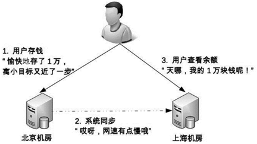
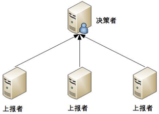
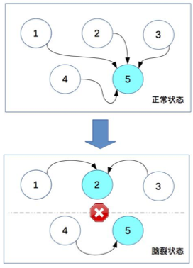

# 05 | 复杂度来源：高可用

## 笔记

### 高可用

本质上通过**"冗余"**来实现高可用.

### 高可用 和 高性能的区别

* 高性能增加机器目的在于**扩展**处理性能
* 高可用增加机器目的在于**冗余**处理单元

### 计算高可用

分配算法复杂

* 1 主 多 备
* 多 主 0 备

`ZooKeeper`采用的就是 1 主多备.

`Memcached`采用的就是全主 0 备.

### 存储高可用

**存储**, 将数据从一台机器搬到另一台机器, 需要经过线路进行传输.

#### 数据 + 逻辑 = 业务

除了物理上的传输速度限制, 传输线路本身也存在可用性问题, 传输线路可能中断, 可能拥塞, 可能异常(错包, 丢包), 并且传输线路的故障时间一般都特别长.

传输异常 -> 数据在某个时间点不一致 -> 导致业务问题.

**存储高可用的难点不在于如何备份数据, 而在于如何减少或者规避数据不一致对业务造成的影响.

#### CAP

存储高可用不可能同时满足

* 一致性
* 可用性
* 分区容错性

最多满足其中2个, 这就要求我们在做架构设计时结合业务进行取舍.

### 高可用状态决策

**状态决策**, 系统需要能够判断当前的状态是正常还是异常, 如果出现异常就要采取行动来保证高可用.

**通过冗余来实现的高可用系统, 状态决策本质上就不可能做到完全正确**.

#### 独裁式

独裁式决策指的是存在一个**独立的决策主体**, 称它为**决策者**, 负责收集信息后进行决策. 所有冗余的个体, 我们称它为**上报者**, 都将状态信息发送给决策者.

* 优点
	* 不会出现决策混乱的问题. 因为只有一个决策者.
* 缺点
	* 当决策者本身故障时, 整个系统就无法实现准确的状态决策. 如果决策者本身又做一套状态决策, 就陷入一个递归的死循环了.

#### 协商式

两个独立的个体通过交流信息, 然后根据规则进行决策. 最常用的就是**主备决策**.

* 2 台服务器启动时都是**备机**.
* 2 台服务器**建立连接**.
* 2 台服务器**交换状态信息**.
* 某 1 台服务器做出决策, 成为主机. 另一台服务器继续保持备机身份.

**难点**在于, 如果两者的信息交换出现问题(连接中断), 决策者应该怎么做?

如果备机在链接中断情况下**认为主机故障**, 那么备机升级为主机, 但实际上此时主机并没有故障, 就会出现 2 主情况, 和设计初衷( 1 主 1 备 )不符合.

如果备机在链接中断情况下**不认为主机故障**, 则此时**主机故障了**, 系统就没有主机了.

如果增加更多链接, 只是降低风险不能彻底解决, 但是如果不同链接传递的信息不同, **应该以哪个链接为准**?

#### 民主式

多个独立的个体通过投票的方式来进行决策. 如`ZooKeeper`

与协商式决策比较类似, 基础都是独立的个体之间交换信息, 每个个体做出自己的决策, 然后按照**多数取胜**的规则来确定最终的状态. 比协商式决策要复杂得多.

**缺陷**: 脑裂. 指人体左右大脑半球的连接被切断后, 左右脑无法交换信息, 导致各自做出决策. 原来统一的集群因为连接中断, 造成了两个独立分隔的子集群, 每个子集群单独进行选举, 于是选出了 2 个主机, 相当于人体有两个大脑了.

为了解决脑裂问题, 民主式决策系统一般都采用**"投票节点数必须超过系统总结点数一半"**规则来处理. 但是如果节点真发生故障(节点1,2,3 宕机), 此时系统也不会选出主节点, 整个系统就相当于宕机了, 尽管节点 4 和 5 是正常的.

## 扩展