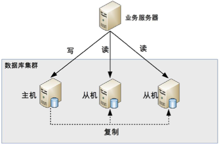
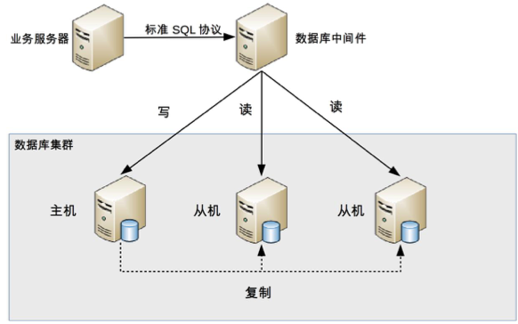

# 14 | 高性能数据库集群：读写分离 

## 笔记

### 高性能数据库集群

* 读写分离
	* 访问压力分散到集群中的多个节点
	* **没有分散**存储压力
* 分库分表
	* 分散访问压力
	* 分散存储压力

### 读写分离原理

* 数据库服务器搭建主从集群, 一主一从, 一主多从
* 数据库主机负责写操作, 从机只负责读操作
* 数据库主机通过复制将数据同步到从机, 每台数据库服务器都存储了所有业务数据
* 业务服务器将写操作发给数据库主机, 将读操作发给数据库从机

两个设计复杂度:

* 主从复制延迟
* 分配机制

#### 复制延迟

解决主从复制延迟的方法:

* 写操作后的读操作指定发给数据库主服务器
* 读从失败后再读一次主机(会导致很多二次读取)
* 关键业务读写操作全部指向主机, 非关键业务采用读写分离

#### 分配机制

将读写操作区分开来, 然后访问不同的数据库服务器.

* 程序代码封装
* 中间件封装
	* `MySQL Router`

## 扩展