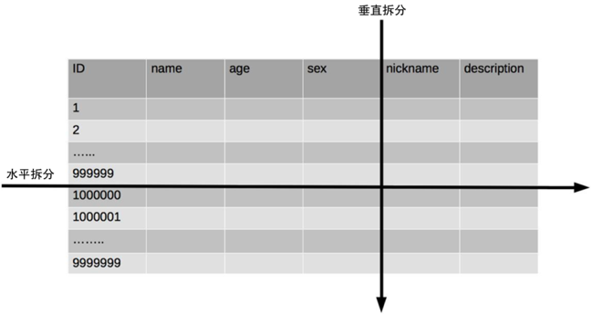

# 15 | 高性能数据库集群：分库分表

## 笔记

### 数据量大的缺点

* 读写的性能会下降
* 数据文件变得很大, 备份和恢复耗费时间长
* 数据文件越大, 极端情况下丢失数据的风险越高

### 业务分库

按照业务模块将数据分散到不同的数据库服务器.

### 分表



* 垂直分表
	* 记录数相同, 单包含不同的列
* 水平分表
	* 列相同, 包含不同的行数

#### 水平分表的路由

* 范围路由
	* 使用有序的数据进行拆分(比如`id`, 1-1000000 一张表, 1000001-1999999另外一张, 以此类推).
	* 但是可能数据分布不均. 一张表一百万, 另外一张表1000条数据
* `HASH`路由
	* 选取某个列进行`hash`, 根据`hash`结果分散到不同的数据库表中.
		* 优点: 数据分布均匀.
		* 缺点: 扩充新的表很麻烦.
* 配置路由
	* 路由表, 单独一张独立的表记录路由信息.
		
		```
		user_router
		user_id		table_id
		```
		
		* 需要多查询一次

## 扩展