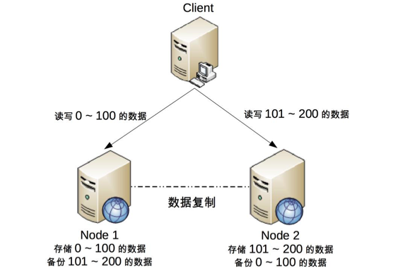

# 23 | 想成为架构师，你必须掌握的CAP细节 

**`CAP`不止针对整个系统, 而是针对数据本身. 有的数据必须选择`CP`, 有的数据必须选择`AP`**

## 笔记

### CAP 关键细节点

#### `CAP`关注的粒度是**数据**, 而不是整个系统.

```
C 与 A 之间的取舍可以在同一系统内以非常细小的粒度反复发生, 而每一次的决策可能因为具体的操作, 乃至因为牵涉到特定的数据或用户而有所不同.
```

* 用户账户数据(ID, 密码) **CP**
* 用户信息数据(昵称, 兴趣, 爱好, 性别, 自我介绍等) **AP**

所以`CAP`不是针对整个系统, 而是针对数据本身. 有的数据必须选择`CP`, 有的数据必须选择`AP`.

**需要将系统内的数据按照不同的应用场景和要求进行分类, 每类数据选择不同的策略(CP 还是 AP), 而不是直接限定整个系统所有数据都是同一策略**

#### `CAP`是忽略网络延迟的

`C`在实践中是不可能完美实现的, **在数据复制的过程中, 节点 A 和节点 B 的数据并不一致**.

技术上无法做到分布式场景下完美的一致性的. 业务上必须要求一致性. 只能选择**CA**.

单点写入, 其他节点做备份, 无法做到分布式情况下多点写入.

单个用户余额, 单个商品库存无法做到分布式, 但系统整体还是可以应用分布式架构的.



* 对于单个用户来说, 读写操作都只能在某个节点上进行.
* 对所有用户来说, 有一部分用户的读写操作在`Node 1`上, 有一部分用户读写操作在`Node 2`上.

出现问题影响一部分用户. 为什么挖掘机挖断光缆后, 支付宝只有一部分用户会出现业务异常.

#### 正常运行情况下, 不存在 CP 和 AP 的选择, 可以同时满足 CA

**既要考虑分区发生时选择 CP 还是 AP, 也要考虑分区没有发生时如何保证 CA**

实现 **CA**, **不同的数据实现方式也不一样**.

* 用户账号数据可以采用**消息队列**的方式来实现 CA, 消息队列可以比较好的控制实施性.
* 用户信息数据可以采用"数据库同步"的方式来实现 CA, 因为数据库的方式虽然在某些场景下延迟较高, 但使用起来简单.

#### 放弃并不等于什么都不做, 需要为分区恢复后做准备

在分区期间记录一些日志, 当分区故障解决后,系统根据日志进行数据恢复, 使得重新达到 CA 状态.

**CP**(一个节点可以正常访问, 一个节点不行)

用户账号数据, 选择 CP. 分区发生后, 节点 1 可以继续注册新用户, 节点 2 无法注册新用户(不符合 A, 节点 2 收到注册请求后会返回 error). 此时节点 1 的数据无法同步到节点 2, 可以将数据新注册的用户数据记录到日志中. 当分区恢复后, 节点 1 读取日志中的记录, 同步给节点 2, 当同步完成后, 节点 1 和节点 2 就达到了同时满足 CA 的状态.

**AP**(2个节点都可以正常访问)

节点 1 和节点 2 都可以修改用户信息, 但两遍可能修改不一样. 两个节点都记录了未同步的数据, 当分区恢复后, 系统按照某个规则来合并数据. 如"最后修改优先规则", 也可以将冲突的数据交由人工来处理.

### ACID

#### Atomicity(原子性)

一个事务中的所有操作, **要么全部完成, 要么全部不完成, 不会在中间某个环节结束**. 事务在执行过程中发生错误, 会被回滚到事务开始前的状态, 就像这个事务从来没有执行过一样.

#### Consistency(一致性)

在事务开始之前和结束以后, 数据库的**完整性没有被破坏**.

#### Isolation(隔离性)

数据库允许**多个并发事务同时**对数据进行读写和修改的能力, 隔离性可以防止多个事务并发执行时由于交叉执行而导致数据的不一致. 事务隔离分为不同级别, 包括

* 读未提交(Read uncommitted)
* 读提交(read committed)
* 可重复读
* 串行化

#### Durability(持久性)

事务处理结束后, 对数据的修改就是永久的. 即便系统故障也不会丢失.

### BASE

* 基本可用(Basically Available)
* 软状态(Soft State)
* 最终一致性(Eventual Consistency)

**即使无法做到强一致性(CAP的一致性就是强一致性), 但应用可以采用适合的方式达到最终一致性**.

#### 基本可用

分布式系统故障时, 允许损失部分可用性, 即保证核心可用.

* 登录: 核心功能(登录才能使用功能)
* 注册: 非核心功能(最多损失部分用户)

#### 软状态

允许系统存在中间状态, 而该**中间状态不会影响系统整体可用性**.

#### 最终一致性

系统中的所有数据副本经过一定时间后, 最终能够达到一致的状态.

#### BASE 和 CAP

**BASE 理论本质上是对 CAP 的延伸和补充**

* CAP 理论是**忽略**延时的, 而实际应用中延时是无法避免的.
* AP 方案中牺牲一致性只是指分区期间, 而不是永远放弃一致性
	* 分区期间牺牲一致性, 但是分区故障恢复后, 系统应该达到最终一致性.

## 扩展

* ACID 是数据库事务完整性的理论
* CAP 是分布式系统设计理论
* BASE 是 CAP 理论中 AP 方案的延伸

### 原子性 和 一致性

其实一致性和原子性在事务里是两个不太相关，但又很相关的逻辑来的.

* 原子性：这个侧重点是事务执行的完整，一套事务下来，如果有一个失败，那整体失败。也就是要么大家一起成功，要么全都回滚
* 一致性：这个讲的是事务是按照预期生效的，也就是你举例的那个转账的，一致性的核心一部分是靠原子性实现的，而另一部分是逻辑实现。

举个例子：

转账：张三给李四转账100元。那数据库假设需要 张三扣100，李四加100，记录一条流水。

**原子性**

如果流水没记录成功，那整体回滚，张三也没转账成功，李四也没多钱。这就是原子性的体现。

**一致性**

而张三必须扣100，李四必须加100，这个就是一致性了，如果因为某些逻辑原因，导致张三扣了100，流水记录100转账，而李四只加了60。然后这3条操作都成功了，那原子性就符合了，但是一致性就不符合了。