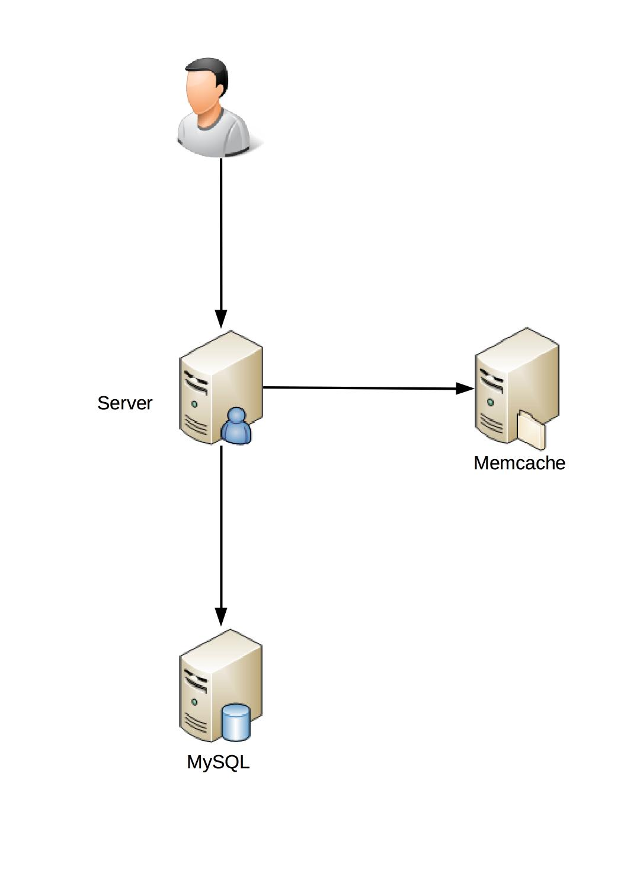
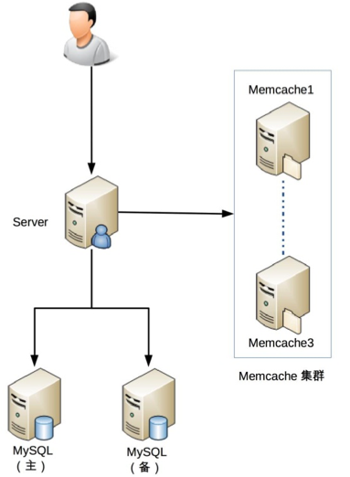

# 24 | FMEA方法，排除架构可用性隐患的利器

## 笔记

**高可用**更复杂. 因为异常的场景很多.

**墨菲定律:可能出错的事情最终都会出错**

### FEMA 介绍

**`FEMA`(Failure mode and effects analysis), 故障模式与影响分析**

通过对系统范围内潜在的故障模式加以分析, 并按照严重程度进行分类, 以确定失效对于系统的最终影响.

是在设计出一个架构后, 再使用`FEMA`对这个架构进行分析, 看看架构是否还存在某些可用性的隐患.

### FEMA 方法

* 给出初始的架构设计图
* 假设架构中某个部件发生故障
* 分析此故障对系统功能造成的影响
* 根据分析结构, 判断架构是否需要进行优化

### FEMA 表

#### 1. 功能点

是从**用户角度**来看的功能点.

* 注册, 登录 是功能点
* 数据库存储, Redis 缓存不是功能点

#### 2. 故障模式

系统会出现什么样的故障.

* 故障点
* 故障形式

**量化**描述.

```
Mysql 响应时间达到 3s.
```

这里是描述故障结果, 后续在罗列故障原因. 因为实际应用过程中, **不管哪种原因, 只要现象是一样的, 对业务影响就是一样的**.

#### 3. 故障影响

当故障发生时, 功能点具体会受到什么影响. 常见影响有:

* 功能点**偶尔**不可用
* 功能点**完全**不可用
* 部分用户功能点不可用
* 功能点响应缓慢
* 功能点出错

故障影响也需要尽量准确描述

#### 4. 严重程度

站在业务角度的故障的影响程度.

* 致命
* 高
* 中
* 低
* 无

公示: **严重程度 = 功能点重要程度 x 故障影响范围 x 功能点受损程度**

#### 5. 故障原因

* 不同的故障原因发生概率不相同, 不同的概率影响我们具体如何应对这个故障
* 不同的故障原因检测手段不一样
* 不同的故障原因的处理措施不一样

#### 6. 故障概率

某个具体故障原因发生的概率(如磁盘坏道的概率, MySQL bug的概率, 没有索引的概率). 一般分为:

* 高
* 中
* 低

##### 硬件

随着使用时间, 发生概率变大. 如磁盘坏道.

#### 开源系统

刚发布的开源系统`bug`率相比会高一些.

#### 自研系统

新开发的系统故障概率会高.

#### 7. 风险程度

综合严重程度和故障概率来一起判断某个故障的最终等级.

**风险程度 = 严重程度 x 故障概率**

#### 8. 已有措施

针对具体故障原因, 系统现在是否提供了某些措施来应对.

* 检测告警
* 容错
	* 备份
	* 主备
* 自恢复
	* "业务"上的恢复

#### 9. 规避措施

为了降低故障发生概率而做的一些事情.

* 技术手段
	* 冗余
	* 备份
	* ...
* 管理手段
	* 定期更换磁盘
	* ...

#### 10. 解决措施

能够解决问题而做的一些事情, 一般都是技术手段.

#### 11. 后续规划

结合风险程度排序, 优先将风险程度高的系统隐患解决.

### FMEA 实战

#### 初始架构



#### FMEA分析


#### 改进架构



## 扩展