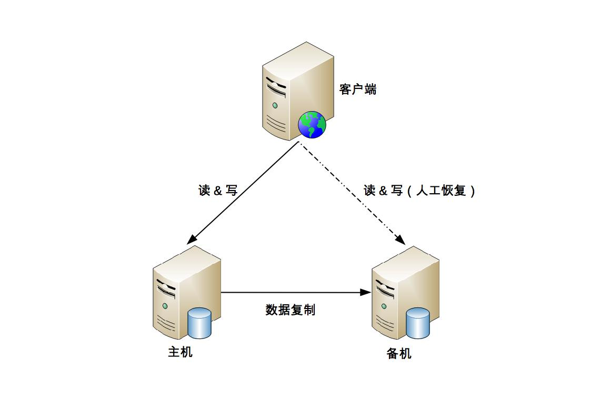
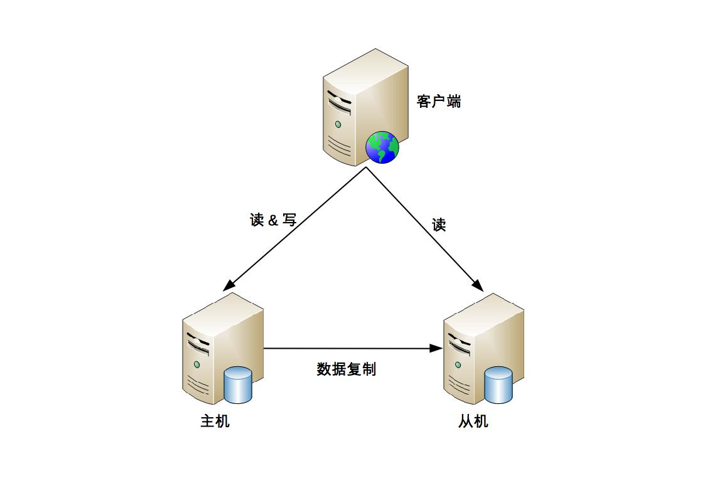
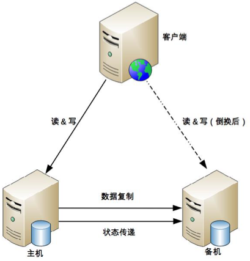
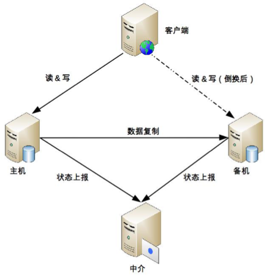
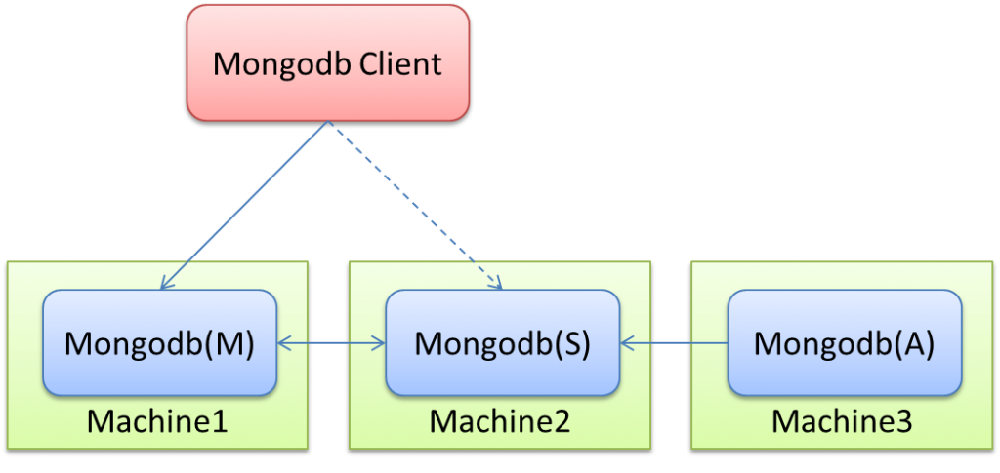
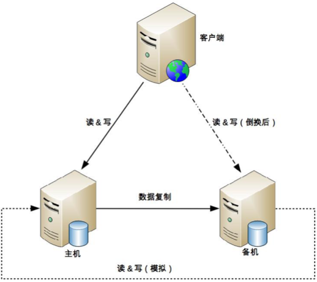
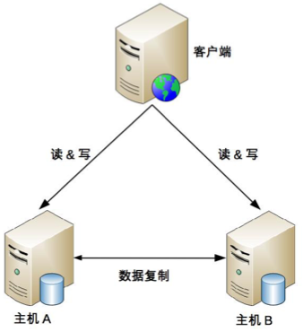

# 25 | 高可用存储架构：双机架构

## 笔记

存储高可用本质是通过**数据冗余**来实现高可用. 将数据复制到多个存储设备.

复杂性:

* 复制延迟
* 中断导致的数据不一致

任何一个高可用存储方案考虑点:

* 数据如何复制?
* 各个节点的职责是什么?
* 如何应对复制延迟?
* 如何应对复制中断

### 主备复制

* 优点
	* 简单
		* 客户端不需要感知备机存在
		* 主备只需要进行数据复制即可, 无须进行状态判断和主备切换
* 缺点
	* 备机仅仅只为备份, 无法提供读写操作.
	* 故障后需要人工干预, 无法自动切换

### 主从复制

**从**是要干活的, 从承担**读**的工作.

* 主: 读写
* 从: 读

* 优点
	* 主机故障时, 读操作相关的业务可以继续运行
	* 从机提供读操作, 发挥了硬件的性能
* 缺点:
	* 客户端要感知主从关系, 将不同的操作发给不同的机器进行处理, 复杂度高
	* 主从复制有延迟, 业务会因为数据不一致出现问题
	* 故障需要人工干预

**写少读多的业务适用**

### 双机切换

* 主备切换
* 主从切换

#### 关键设计点

* 主备间状态判断
	* 状态传递的渠道
		* 互相连接
		* 第三方仲裁
	* 状态监测的内容
		* 机器是否掉电
		* 进程是否存在
		* 响应是否缓慢
* 决策切换
	* 切换时机
		* 什么情况下备机升级为主机
	* 切换策略
		* 主机故障恢复后, 是还原为主机还是继续当备机
	* 自动程度
		* 全自动还是半自动(需要人工确认)
* 数据冲突解决
	
### 互连式

主备机直接建立状态传递的渠道.

主备多了一条**状态传递**的通道.

* 网络连接 或 非网络连接(串口线连接)
* 主机发送状态给备机, 备机到主机来获取状态信息
* 可以和数据复制通道公用, 也可以独立一条通道
* 状态传递通道可以是一条, 也可以使多条, 可以是不同类型的通道混合

客户端:

* 使用虚拟IP, 主机需要绑定这个虚拟的IP. 切换后不影响客户端的访问.
* 客户端同时记录主备机的地址, 哪个能访问就访问哪个.
	* 备机虽然能收到客户端的操作请求, 但是会直接拒绝, 备机不对外提供服务.

缺点:

* 如果状态传递的通道本身有故障, 备机会认为主机故障了从而将自己升级为主机, 而此时主机没有故障, 最终就可能出现两个主机.
* 增加多个通道来增强转改传递的可靠性, 只是降低了故障概率而已. 通道越多决策会更加复杂, 对备机来说可能从不同的通道收到了不同深圳矛盾的状态信息

### 中介式

主备机之间不直接连接, 都去连接中介, 通过中介来传递状态信息.

* 连接管理更简单
	* 连接到中介机即可, 降低了主备机的链接管理复杂度.
		* 把信息都发送给中介
		* 或者中介主动获取对方信息
* 状态决策更简单
	* 主备机初始都是备机, 只要与中介断开连接, 就将自己将为备机, 可能出现双备情况
	* 主机与中介断连后, 中介能够立刻告知备机, 备机将自己升为主机
	* 如果是网络中断导致主机与中介断连, 主机自己会将为备机, 网络恢复后, 旧的主机以新的备机身份向中介上报自己的状态
	* 如果是掉电重启或者进程重启, 旧的主机初始状态为备机, 与中介恢复连接后, 发现已有主机, 则保持自己备机状态不变
	* 主备机与中介连接都正常情况下, 按照实际的状态决定是否进行切换

#### MongoDB副本集 

* `M`表示主节点
* `S`表示备节点
* `A`表示仲裁节点

主备节点存储数据, 仲裁节点不存储数据.

### 模拟式

主备机之间不传递任何状态数据. 备机模拟成一个客户端, 向主机发起模拟的读写操作, 根据读写操作的响应情况来判断主机的状态.

缺点: 只能基于有限的状态来做状态决策, 可能会出现偏差.

* 只有响应式信息, 没有互联式获取的信息多(CPU, I/O负载...)

### 主主复制

两台机器都是主机, 互相将数据复制给对方. 客户端可以任意挑选其中一台机器进行读写操作.

特点

* 两主, 不存在切换的概念
* 客户端无须区分不同角色的主机, 随便将读写操作发送给哪台主机都可以

**需要保证数据能够双向复制**

* 用户ID
* 库存
* 余额

适用于 临时性, 可丢失性, 可覆盖的数据场景.

## 扩展