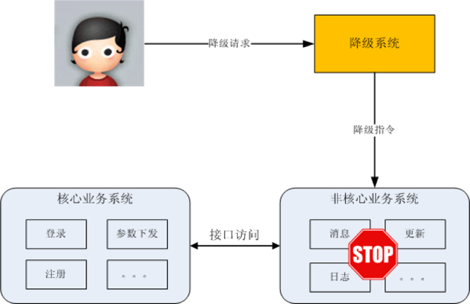
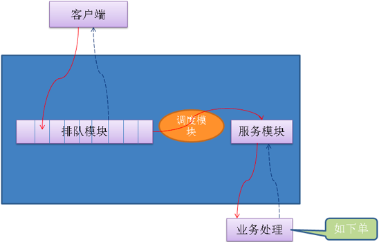

# 31 | 如何应对接口级的故障？

## 笔记

### 表现

系统没有宕机, 网络没有中断, 业务却出现问题了.

* 业务响应缓慢
* 大量访问超时
* 大量访问出现异常

### 故障原因

* 内部原因
	* 程序导致死循环
	* 数据库慢查询
	* 耗尽内存
* 外部原因
	* 攻击
	* 流量暴增
	* 第三方系统大量请求
	* 第三方系统响应缓慢

### 解决方案 - 1.降级(让某些非核心功能不可用)

只提供部分功能, 或者完全停掉所有功能. **优先保证核心业务**

* 论坛只能看帖子, 不能发帖子.
* APP不能上传日志.

#### 降级方式 - 系统后门降级

系统预留后门用于降级操作

#### 降级方式 - 独立降级系统

降级操作独立到一个单独的系统中.

### 解决方案 - 2.熔断(限制对外部接口依赖)

**降级的目的在于应对系统自身的故障** (系统自身)

**熔断的目的是应对依赖的外部系统故障** (外部系统)

A服务的X功能依赖B服务的某个接口, 当B服务响应很慢的时候, A服务的X功能响应肯定会被拖慢. **熔断机制**, A不在请求B服务的这个接口, A服务器内部只要发现是请求B服务的这个接口就立即返回错误, **表面A服务整个被拖慢甚至死亡**.

需要有一个统一的**API调用层**. 需要有一阈值的设计, 超过这个阈值进行熔断.

### 解决方案 - 3.限流(限制访问数量)

**降级**是从**系统功能优先级**的角度考虑如何应对故障.

**限流**是从**用户访问压力的角度**来考虑如何应对故障.

限流只允许系统能够承受的访问量进来, 超出系统访问能力的请求将被丢弃.

**保证一部分请求能够正常响应 > 全部请求都不能响应**

实现限流方式:

* 请求限流: 从**外部**访问的请求角度考虑
	* 限制总量: 限制某个指标的累积上线
	* 限制时间量: 限制一段时间内某个指标的上限
	* 困难:
		* 难以找见合适的阈值, 32核心的机器和64核的机器, 处理能力并不是2倍的关系, 可能是1.5倍, 或者1.1倍.
	* 场景:
		* 适用于业务功能比较简单的系统.
* 资源限流: 从系统**内部**考虑的. 找到系统内部影响性能的关键资源, 对其使用上限进行限制.
	* 限制资源:
		* 连接数
		* 文件句柄
		* 线程数
		* 请求队列
	* 困难:
		* 难以确定阈值, 需要逐步调优.

### 解决方案 - 4.排队

是**限流**的一个变种.

排队是让用户等待一段时间.

排队需要用独立的系统来缓存用户请求. 如`Kafaka`这类消息队列.

* 排队模块: 根据秒杀商品数量(加点余量)定义队列.
* 调度模块: 动态调度, 不断检查服务模块, 一旦处理能力有空闲, 就从排队队列头上把用户访问请求调入服务模块, 并负责向府库模块分发请求.
	* 传递请求
	* 调解系统处理能力, 根据系统处理能力动态调解想排队模块拉取请求的速度.
* 服务模块:
	* 调用真正业务来处理服务, 并返回处理结果, 调用排队模块的接口回写业务处理结果.

## 扩展