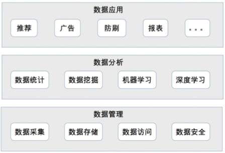
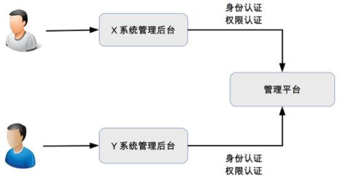

# 44 | 互联网架构模板：“平台”技术

## 笔记

### 运维平台

* 配置: 负责**资源**的管理
	* 机器管理
	* IP地址管理
	* 虚拟机管理
* 部署: 将系统**发布**到线上
	* 包管理
	* 灰度发布管理
	* 回滚
* 监控: 收集系统上线运行后的相关数据并进行监控
* 应急: 系统出故障后的处理
	* 停止程序
	* 下线故障机器
	* 切换`IP`

* 设计要素
	* 标准化
	* 平台化
	* 自动化
	* 可视化

#### 1. 标准化

标注化是运维平台的基础, **没有标准化就没有运维平台**

* 运维标准
* 规范配置管理
* 部署流程
* 监控指标
* 应急能力

可以编写一个统一的中间件适配旧的系统来满足运维标准.

#### 2. 平台化

将运维的相关操作都集成到运维平台上, 通过运维平台来完成域内工作.

好处

* 将运维标准固化到平台中
* 提供简单方便的操作, 减少人工操作
* 可复用

#### 3. 自动化

避免重复操作

#### 4. 可视化

**提升数据查看效率**

优点

* 直观看到数据的相关属性
* 将数据的含义展示出来
* 将关联数据整合一起展示

### 测试平台

* 单元测试
* 集成测试
* 接口测试
* 性能测试

测试平台核心目的:

* 提升测试效率
* 提升产品质量
* **自动化**

#### 1. 用例管理

* 单元测试： 代码
* 接口测试: 可以用`Python`编写用例
* 可靠性测试: 可以用`Shell`来写

为了能够重复执行这些测试用例, 测试平台需要将用例管理起来. 管理维度

* 业务
* 系统
* 测试类型
* 用例代码

#### 2. 资源管理

测试用例要放到具体运行环境中才能够真正执行. 包括:

* 硬件(服务器, 手机...)
* 软件(操作系统, 数据库, 虚拟机)
* 业务系统(被测试的系统)

可以使用虚拟化来充分利用硬件资源.

#### 3. 任务管理

将测试用例分配到具体的资源上执行, 跟踪任务执行情况.

**核心**: 将测试平台的各个部分串联起来从而完成自动化测试.

#### 4. 数据管理

记录相关数据:

* 执行时间
* 执行结果
* 用例执行期间的CPU, 内存占用情况

作用:

* 展现当前用例的执行情况
* 作为历史数据, 方便比对
* 数据挖掘

### 数据平台

* 数据管理
* 数据分析
* 数据应用

#### 1. 数据管理

* 数据采集: 从业务系统搜集各类数据.
* 数据存储: 从业务系统采集将采集的数据存储到数据平台, 用于后续数据分析.
* 数据访问: 提供各种协议用于读写数据.
* 数据安全: 对敏感数据保护.

#### 2. 数据分析

* 数据统计
* 数据完全
* 机器学习, 深度学习

#### 3. 数据应用

* 在线业务
	* 推荐
	* 广告
* 离线业务
	* 报表
	* 欺诈检测
	* 异常检测

### 管理平台

**权限管理**

* 身份认证
* 权限控制

## 扩展