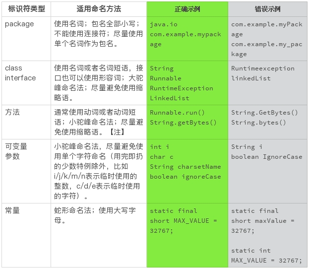

# 05 | 经验总结：如何给你的代码起好名字

## 笔记

### 为什么需要一个好名字?

我们通常使用布尔类型(boolean). 所以, 取名字的时候, 我们通常需要一个表达疑问的前缀, 比如是不是"is".

**名字就是沟通的方式, 错误的命名很难让我们清楚地理解代码真实的意图. 所以, 混淆的命名很难让我们阅读和理解代码.**

### 为什么需要命名规范?

* 帮助我们理解编码的逻辑, 减少阅读和理解代码的工作量.
* 是代码审核变得更有效率, 专注于更重要的问题, 提高开发效率.
* 提高代码的清晰度, 可读性以及美观程度.
* 避免不同产品之间的命名冲突.

### 有哪些常见的命名方法?

#### 1. 驼峰命名法(CamelCase)

使用大小写混合的格式, 单词之间不适用空格隔开或者连接字符连接的命名方式.

* 大驼峰(UpperCamelCase), 第一个单词以大写字母开始.
* 小驼峰(lowerCamelCase), 第一个单词以小写字母开始.

**Google 转换规则**

1. 从正常的表达形式开始, 把短语转换成ASCII码, 并且移除单引号.
2. 如果上述及结果还有其他标点符号, 比如连字符, 在该符号处, 把这个结果切分成单词形式.
	* AdWords -> ad words
	* non-current assets -> non current assets
3. 将所有字母转换为小写字母, 然后将每个单词的首字母大写, 这样就得到了大驼峰式命名的形式. 如果第一个单词的首字母小写, 就是最后的标识符命名.
4. 将所有的单词连在一起, 就是最后的标识符命名.

#### 2. 蛇形命名法(snake_case)

单词之间通过下划线"_"链接, 比如"out_of_range"

#### 3. 串式命名法(kebab-case)

单词之间通过连字符"-"连接, 比如"background-color"

#### 4. 匈牙利命名法

标识符由一个或者多个小写字母开始, 这些字母用来标识标识符的类型或者用途. 标识符的剩余部分, 可以采取其他形式命名法, 比如大驼峰命名法.

* 起始的小字母用来表示标识符的数据类型
	* `IAccountNum`标识一个长整数(首字母"l", long)
	* `szName`标识一个零字符结束的字符串("sz", zero-terminated string)
* 起始的小字母用来表示标识符的实际用途
	* `rwPosition`标识一个行("rw", row)
	* `usName`表示一个非安全字符串("us", unsafe string)

这种命名会带来不必要的记忆负担和阅读障碍, 导致命名规则的执行和名称的维护都很困难.

### Java 命名规范

### 怎么取好名字

#### 1. 要有准确的意义

#### 2. 严格遵守命名规范

#### 3. 可读性优先

* 可读性强的名字优先于剪短的名字, 尽量使用完整的词汇
* 不要使用缩写, 简写, 缩略词, 除非这些词被广泛使用
* 不要使用太短的名字, 比如一个字母
* 避免含糊, 混淆或者误导

### 小结

取名字要做到

* 信: 准确
* 达: 直观
* 雅: 优美

## 扩展