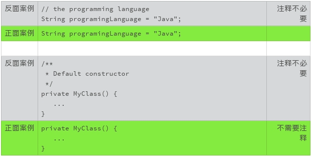
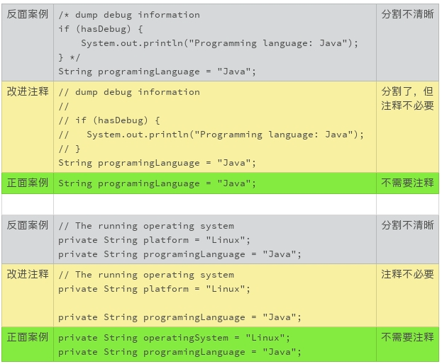
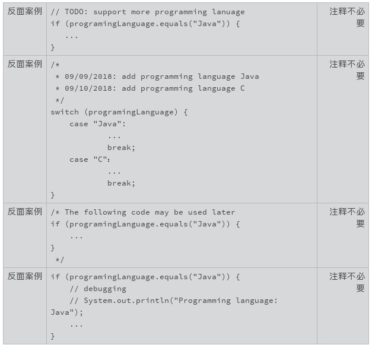

# 07 | 写好注释，真的是小菜一碟吗？

## 笔记

### 注释是无奈的妥协

理想状况下, 代码不需要注释. 理想的代码, 命名恰当, 逻辑顺畅, 含义显而易见.

#### 注释的麻烦

1. 注释不需要运行, 所以没有常规的办法来测试它
2. 注释难以维护, 没有随着代码变更
3. 注释为我们提供了一个借口, 过度依赖注释, 放弃了潜在的替代方案(更准确的命名, 更清晰的结构, 更顺畅的逻辑等等). 让代码更糟糕.
4. 避免注释滥用

**不好的代码和注释**

```
String name1;  // first name
String name2;  // last name
```

**好的代码**

```
String firstName;
String lastName;
```

注释是代码的一部分, 是需要阅读的内容, 目的是让其他人能更好地理解我们的代码, 写注释需要我们有"用户思维".

### 几种常见注释类型

#### 1. 记录源代码版权和授权

一般放在源代码开头

```
/*
 * Copyright (c) 2018, FirstName LastName. All rights reserved.
 */
```

#### 2. 生成用户文档的

如`Java Doc`, 主要面向软件的使用者

#### 3. 用来解释源代码的

帮助代码的阅读者理解代码

### 简化注释的风格

#### 1. 版权和授权信息

一般使用星号注释符

* 首行和尾行使用星号注释符
* 中间行以缩进一个空格的星号开始
* 文字和星号之间使用一个空格
* 注释的每行长度限制和代码块的每行长度限制保持一致

```
/*
 * Copyright (c) 2018, FirstName LastName. All rights reserved.
 */
```

#### 2. 生成用户文档

使用`*Doc`要求的格式

```
/**
 * A {@code Readable} is a source of characters. Characters from
 * a {@code Readable} are made available to callers of the read
 * method via a {@link java.nio.CharBuffer CharBuffer}.
 *
 * @since 1.5
 */
public interface Readable {
   ...
}
```

#### 3. 代码注释

使用**行注释(//)**

```
// Verify that the buffer has sufficient remaining
private static void verifyLength(
        ByteBuffer buffer, int requiredLength) {
    ...
}

String myString;  // using end-to-line comment

// This is a multiple line comment.  This is a multiple
// line comment. 
if (!myString.isEmpty()) {
   ...
}
```

**如果一段代码不再需要, 会清理掉代码, 而不会保留这个注释掉的代码块**

### 注释的三项原则

1. 准确, 错误的注释比没有注释更糟
2. 必要, 多余的注释浪费阅读者的时间
3. 清晰, 混乱的注释会把代码搞的更乱

**准确**


**必要**



**代码可读性**



**注释不必要**



### 注释用英文还是汉字呢?


## 扩展