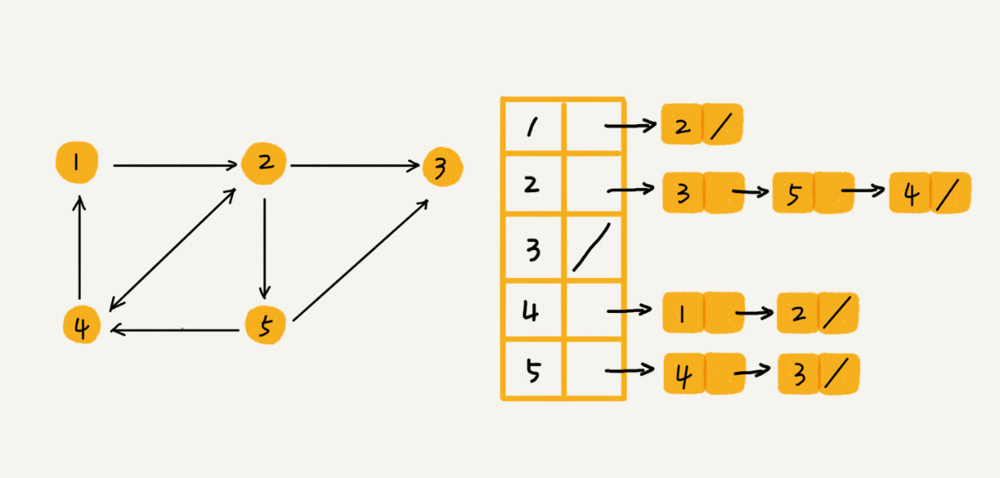

# 30 | 图的表示：如何存储微博、微信等社交网络中的好友关系？

## 笔记

### 如何理解"图"?

**图**, 非线性表结构.

图中的元素我们叫做**顶点**(`vertex`). 图中的任一顶点可以与任一其他顶点建立连接关系. 这种建立的关系叫做**边**(`edge`).

**度**, 跟顶点想连接的边的条数.

举例微信, 每个用户看做一个顶点, 两个用户之间互加好友就意味着在两者之间建立一条边. 该用户有多少好友, 就叫做**顶点的图(`degree`)**.

关注, A关注了B, B没有关注A.

**边有方向的图叫做"有向图"**, 没有方向的图叫做"无向图".

有向图把度分为**入度(`In-degree`)**和**出度(`Out-degree`)**

顶点的**入度**, 表示有多少条边指向这个顶点.(微博有多少粉丝)

顶点的**出度**, 表示有多少条边以这个顶点为起点指向其他顶点. (微博关注了多少人)

`QQ`有亲密好友, 不仅记录了用户之间的好友关系, 还记录了亲密度. 如果两个用户经常往来, 那就亲密度较高. 反之, 亲密度较低.

**带权图(`weighted graph`)**, 带权图中, 每条边都有一个权重(`weight`), 通过权重来表示亲密关系.

如何在内存中存储图?

### 邻接矩阵存储方法

最直观的存储方法, **邻接矩阵(`Adjacency Matrix`)**

底层依赖一个**二维数组**. 

* 无向图: 顶点`i`和顶点`j`之间有边, 我们就将`A[i][j]`和`A[j][i]`标记为`1`.
* 有向图: 有一条箭头从顶点`i`指向顶点`j`的边, 就将`A[i][j]`标记为`1`.
* 带权图: 数据组存储相应的权重.

 
对于无向图来说, `A[i][j]`等于`1`, 那么`A[j][i]`也肯定等于`1`. 无向图二维数组中, 我们将其用对角线划分为上下两部分, 只需要**一半空间**.
 
**稀疏图(`Spare Matrix`)**, 顶点很多, 每个顶点的边并不多. 邻接矩阵浪费空间. 如微信有很多用户(很多顶点), 但是每个用户的好友并不很多(边不会很多).

邻接矩阵, 简单, 基于数组. 获取两个顶点的关系非常高效. 方便计算, 可以把图的运算转换成矩阵之间的运算. 如最短路径的`Floyd-Warshall`算法.

### 邻接表存储方法

**邻接表**(`Adjacency List`).

邻接表有点像散列表, 每个顶点对应一条链表, 链表中存储的是与这个顶点相连接的其他顶点. 

* 有向图: 存储的是指向的顶点.
* 无向图: 存储的是跟这个定点有边相连的顶点.

邻接矩阵

* 浪费空间
* 使用节省时间

邻接表

* 节省空间
* 使用耗费时间

**邻接表**比如存在一条从顶点`2`到顶点`4`的边, 就需要遍历顶点`2`对应的那条链表, 看链表中是否存在顶点`4`. **在链接表中查询两个顶点之间的关系就没那么高效了**.

可以将链表改成平衡二叉树, 红黑树. 也可以换成跳表, 散列表. 通过二分查找来快速定位两个顶点之间是否存在边.

### 总结

* 微博: 有向图
* 微信: 无向图

微博

假设需要支持如下操作

* 判断用户 A 是否关注了用户 B；
* 判断用户 A 是否是用户 B 的粉丝；
* 用户 A 关注用户 B；
* 用户 A 取消关注用户 B；
* 根据用户名称的首字母排序，分页获取用户的粉丝列表；
* 根据用户名称的首字母排序，分页获取用户的关注列表。

* 邻接表: 查找关注
* 逆邻接表: 查找被关注关系

大量数据可以分散到不同机器上查找

存储在数据库

## 扩展