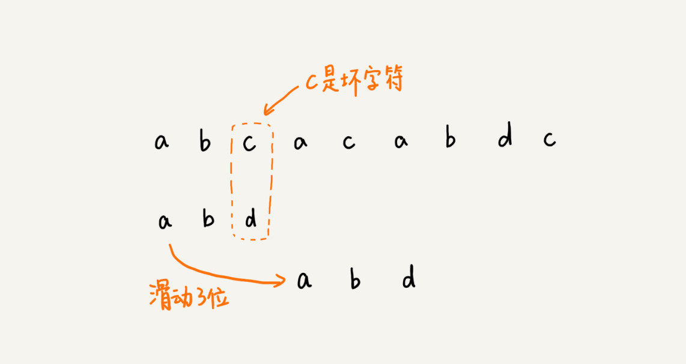

# 33 | 字符串匹配基础（中）：如何实现文本编辑器中的查找功能？

## 笔记

### BM 算法的核心思想

`BF`和`RK`在模式串和主串的匹配过程中, 模式串在主串中不停地往后滑动. 当遇到不匹配的字符时, `BF`算法和`RK`算法的做法是, 模式串往后滑动一位, 然后从模式串的第一个字符开始重新匹配.

但是因为主串的`c`, 在模式串中是不存在的, 所以, 模式串向后滑动的时候, 只要`c`与模式串与重合, 肯定无法匹配. 所以, 可以一次性把模式串往后滑动几位, 把模式串移动到`c`的后面.

### BM 算法原理分析

**BM算法**包含两部分, **坏字符规则**(`bad character rule`)和**好后缀规则**(`good suffix shift`).

#### 1. 坏字符规则

前面的匹配过程是按模式串中的下标**从小到大**的顺序, 依次与主串中的字符进行匹配.

**BM**算法的匹配顺序是按照模式串下标从大到小的顺序, 倒着匹配.

当我们发现某个字符没法匹配的时候. 我们把这个没有匹配的字符叫做**坏字符**(主串中的字符).

拿坏字符`c`在模式串中查找, 发现模式串中并不存在这个字符. 字符`c`与模式串中的任何字符都不可能匹配. 这时, 将模式串直接往后滑动三位, 将模式串滑动到`c`后面的位置, 再从模式串末尾字符开始比较.

这时, 模式串中最后一个字符`d`还是无法跟主串中的`a`匹配. 但是怀字符`a`在模式串中是存在的, 模式串中的小标是`0`的位置也是字符`a`. 这种情况下, 将模式串往后滑动两位, 让两个`a`上下对齐, 然后再从模式串的末尾字符开始, 重新匹配.

## 扩展