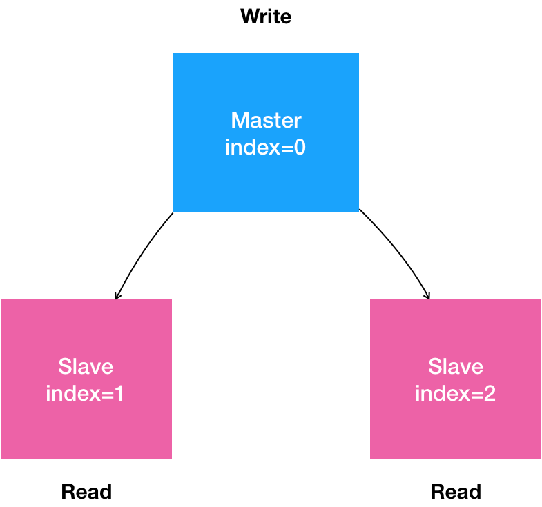
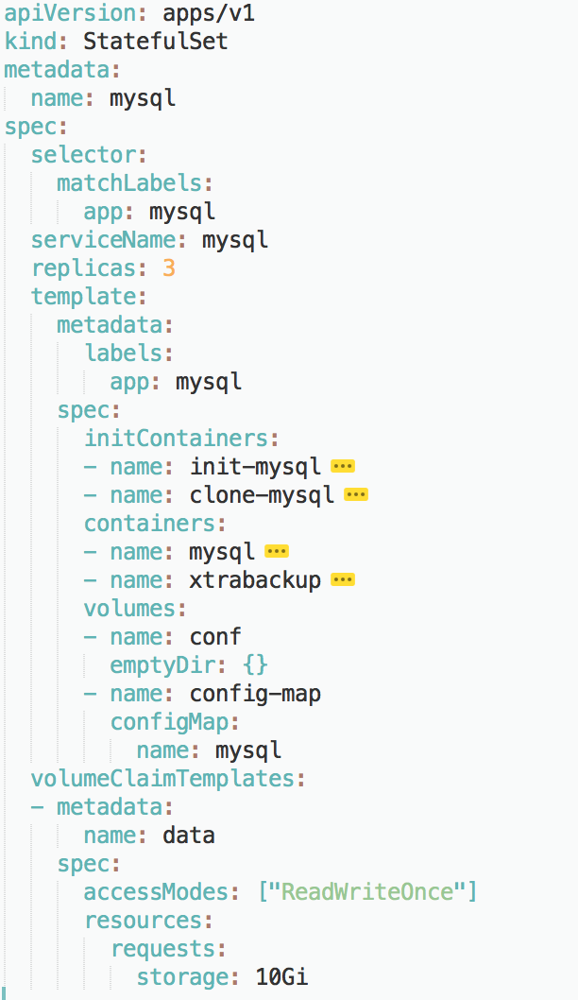

# 20 | 深入理解StatefulSet（三）：有状态应用实践

## 笔记

### 部署MySQL集群

1. 是一个"主从复制"(Master-Slave Replication)的`MySQL`集群
2. 有1个主节点(`Master`)
3. 有多个从节点(`Slave`)
4. 从节点需要能水平扩展
5. 所有的写才做, 只能在主节点上执行
6. 读操作可以在所有节点上执行



### 常规模式部署

**常规环境难点**: 配置主从节点的复制与同步.

#### 1. 通过`XtraBackup`将`Master`节点的数据备份到指定目录

```
$ cat xtrabackup_binlog_info
TheMaster-bin.000001     481
```

配置`Slave`节点的时候会用到

#### 2. 配置`Slave`节点

`Slave`节点在第一次启动前, 需要先把`Master`节点的备份数据, 连同备份信息文件, 一起拷贝到自己的数据目录(`/var/lib/mysql`)下, 然后执行:

```
TheSlave|mysql> CHANGE MASTER TO
                MASTER_HOST='$masterip',
                MASTER_USER='xxx',
                MASTER_PASSWORD='xxx',
                MASTER_LOG_FILE='TheMaster-bin.000001',
                MASTER_LOG_POS=481;
```

* `MASTER_LOG_FILE` 对应的二进制日志(`Binary Log`)文件的名称, 即`TheMaster-bin.000001`
* `MASTER_LOG_POS` 开始的位置(偏移量), 即`481`.

#### 3. 启动`Slave`节点

```
TheSlave|mysql> START SLAVE;
```

`Slave`使用备份信息文件中的二进制日志文件和偏移量, 与主节点进行数据同步.

#### 4. 添加更多的`Slave`节点

新添加的`Slave`节点的备份数据, 来自于已经存在的`Slave`节点.

将`Slave`节点的数据备份在指定目录. 这个备份操作会自动生成备份信息文件`xtrabackup_slave_info`. 同样这个文件也包含了`MASTER_LOG_FILE`和 `MASTER_LOG_POS`两个字段.

执行跟前面一样的"CHANGE MASTER TO"和"START SLAVE”"指令, 来初始化并启动这个新的 `Slave`节点了.

### Kubernetes 模式部署

#### 0. 迁移到 Kubernetes 的问题

1. `Master`和`Slave`节点需要有不同的配置文件(`my.cnf`)
2. `Master`和`Slave`节点需要能够传输备份信息文件
3. 在`Slave`节点的第一次启动前, 需要执行一些初始化`SQL`操作

使用`SatefuleSet`解决, 因为`MySQL`

* 本身拥有拓扑状态(主从节点区别)
* 存储状态(MySQL保存在本地的数据)

#### 1. `Master`和`Slave`需要不同的配置文件

给主从节点准备两份不同的`MySQL`配置文件, **根据`Pod`的序号(Index)挂载进去即可**.

保存在`Config`内供`Pod`使用.

```
apiVersion: v1
kind: ConfigMap
metadata:
  name: mysql
  labels:
    app: mysql
data:
  master.cnf: |
    # 主节点MySQL的配置文件
    [mysqld]
    log-bin
  slave.cnf: |
    # 从节点MySQL的配置文件
    [mysqld]
    super-read-only
```

* `master.cnf`, 开启了`log-bin`. 即: 使用二进制日志文件的方式进行主从复制.
* `slave.cnf`, 开启了`super-read-only`, 从节点会拒绝除了主节点的数据同步操作之外的所有写操作. 对用户是只读的.

`configmap`中的配置格式为`key | value`, `master.cnf`为`key`, 后面的配置文件信息为内容, 这份数据将来挂载进`master`节点对应的`pod`后, 会在`Volume`目录里生成一个叫做`master.cnf`的文件.

#### 2. 创建`Service`

```
apiVersion: v1
kind: Service
metadata:
  name: mysql
  labels:
    app: mysql
spec:
  ports:
  - name: mysql
    port: 3306
  clusterIP: None
  selector:
    app: mysql
---
apiVersion: v1
kind: Service
metadata:
  name: mysql-read
  labels:
    app: mysql
spec:
  ports:
  - name: mysql
    port: 3306
  selector:
    app: mysql
```

* 第一个`Service`是`Headless Service`. 其中, 编号为`0`的节点就是我们的主节点.
* 第一个名叫`mysql-read`的`Service`, 则是一个常规的`Service`. 

所有用户的读请求, 都必须访问第二个`Service`被自动分配的`DNS`记录, 即:"mysql-read". 请求会被转发到任意一个`MySQL`的主节点或者从节点上.

写请求必须直接以`DNS`记录的方式访问到`MySQL`的主节点, 也就是: "mysql-0.mysql"这条`DNS`记录.

#### 3. `Master`和`Slave`节点需要能够传输备份信息文件

`StatefulSet`对象框架



* `StatefulSet`要管理的`Pod`必须携带`app=mysql`标签.
* 声明要使用的`Headless Service`的名字是`mysql`
* `replicas`值为`3`, 表示`MySQL`集群有3个节点: 1主2从
* `volumeClaimTemplate`定义`PVC`.
	* 大小为10GiB
	* ReadWriteOnce:可读写
	* 一个`PV`只允许挂载在一个宿主机上, 这个`PV`对应的`Volume`会充当`MySQL Pod`的存储数据目录.

`StatefulSet`管理的"有状态应用"的多个实例, 通过同一份`Pod`模板创建, 使用的是同一个`Docker`镜像. 如果要求不同节点的镜像不一样, 可以使用`Operator`.


#### 4. 设计`Template`字段

需要考虑:

1. 如果这个`Pod`是`Master`节点, 要怎么做
2. 如果这个`Pod`是`Slave`节点, 要怎么做

##### 4.1 从`ConfigMap`中, 获取`MySQL`的`Pod`对应的配置文件

通过`InitContainer`来完成

* 根据节点角色(主, 从)分配对应的配置文件
* 每个节点都有一个唯一的`ID`文件, 叫`server-id.cnf`

```
      ...
      # template.spec
      initContainers:
      - name: init-mysql
        image: mysql:5.7
        command:
        - bash
        - "-c"
        - |
          set -ex
          # 从Pod的序号，生成server-id
          [[ `hostname` =~ -([0-9]+)$ ]] || exit 1
          ordinal=${BASH_REMATCH[1]}
          echo [mysqld] > /mnt/conf.d/server-id.cnf
          # 由于server-id=0有特殊含义，我们给ID加一个100来避开它
          echo server-id=$((100 + $ordinal)) >> /mnt/conf.d/server-id.cnf
          # 如果Pod序号是0，说明它是Master节点，从ConfigMap里把Master的配置文件拷贝到/mnt/conf.d/目录；
          # 否则，拷贝Slave的配置文件
          if [[ $ordinal -eq 0 ]]; then
            cp /mnt/config-map/master.cnf /mnt/conf.d/
          else
            cp /mnt/config-map/slave.cnf /mnt/conf.d/
          fi
        volumeMounts:
        - name: conf
          mountPath: /mnt/conf.d
        - name: config-map
          mountPath: /mnt/config-map
```

* 从`Pod`的`hostname`里, 读取到了`Pod`的序号, 以此作为`MySQL`节点的`server-id`.
* `init-mysql`通过这个序号, 判断当前`Pod`到底是`Master`节点(即: 序号0)还是`Slave`节点(即: 序号不为0), 从而**把对应的配置文件从`/mnt/config-map`目录拷贝到`/mnt/conf.d`目录下

#### 4.2 在`Slave Pod`启动前, 从`Master`或者其他`Slave Pod`里拷贝数据库数据到自己的目录下

定义第2个`InitContainer`

```
      ...
      # template.spec.initContainers
      - name: clone-mysql
        image: gcr.io/google-samples/xtrabackup:1.0
        command:
        - bash
        - "-c"
        - |
          set -ex
          # 拷贝操作只需要在第一次启动时进行，所以如果数据已经存在，跳过
          [[ -d /var/lib/mysql/mysql ]] && exit 0
          # Master节点(序号为0)不需要做这个操作
          [[ `hostname` =~ -([0-9]+)$ ]] || exit 1
          ordinal=${BASH_REMATCH[1]}
          [[ $ordinal -eq 0 ]] && exit 0
          # 使用ncat指令，远程地从前一个节点拷贝数据到本地
          ncat --recv-only mysql-$(($ordinal-1)).mysql 3307 | xbstream -x -C /var/lib/mysql
          # 执行--prepare，这样拷贝来的数据就可以用作恢复了
          xtrabackup --prepare --target-dir=/var/lib/mysql
        volumeMounts:
        - name: data
          mountPath: /var/lib/mysql
          subPath: mysql
        - name: conf
          mountPath: /etc/mysql/conf.d
```

* `clone-mysql`的`InitContainer`里, 使用的是`xtrabackup`镜像.
* 启动时判断当初始化所需的数据`(/var/lib/mysql/mysql 目录)`已经存在, 或者当前 `Pod`是`Master`节点的时候, 不需要做拷贝操作.
* 使用`ncat`指令, 向`DNS`记录为**mysql-(当前序号减一).mysql**的`Pod`(前一个`Pod`)发起数据传输请求, 直接用`xbstream`指令将受到的备份数据保存在`/var/lib/mysql`目录下(也可以用`scp`, `rsync`).
* `/var/lib/mysql`是一个名为`data`的`PVC`(在前面声明过),`subPath`特性可以用来指定卷中的一个子目录, 而不是直接使用卷的根目录.
* `Pod Volume`是被`Pod`里的容器共享的, 所以后面启动的`MySQL`容器, 就可以把这个 `Volume`挂载到自己的`/var/lib/mysql`目录下, 直接使用里面的备份数据进行恢复操作.
* `xtrabackup --prepare`, 让拷贝来的数据进入一致性状态, 这样, 这些数据才能被用作数据恢复.

#### 5. 在`Slave`节点的第一次启动前, 需要执行一些初始化`SQL`操作

使用`sidecar`容器.

```

      ...
      # template.spec.containers
      - name: xtrabackup
        image: gcr.io/google-samples/xtrabackup:1.0
        ports:
        - name: xtrabackup
          containerPort: 3307
        command:
        - bash
        - "-c"
        - |
          set -ex
          cd /var/lib/mysql
          
          # 从备份信息文件里读取MASTER_LOG_FILEM和MASTER_LOG_POS这两个字段的值，用来拼装集群初始化SQL
          if [[ -f xtrabackup_slave_info ]]; then
            # 如果xtrabackup_slave_info文件存在，说明这个备份数据来自于另一个Slave节点。这种情况下，XtraBackup工具在备份的时候，就已经在这个文件里自动生成了"CHANGE MASTER TO" SQL语句。所以，我们只需要把这个文件重命名为change_master_to.sql.in，后面直接使用即可
            mv xtrabackup_slave_info change_master_to.sql.in
            # 所以，也就用不着xtrabackup_binlog_info了
            rm -f xtrabackup_binlog_info
          elif [[ -f xtrabackup_binlog_info ]]; then
            # 如果只存在xtrabackup_binlog_inf文件，那说明备份来自于Master节点，我们就需要解析这个备份信息文件，读取所需的两个字段的值
            [[ `cat xtrabackup_binlog_info` =~ ^(.*?)[[:space:]]+(.*?)$ ]] || exit 1
            rm xtrabackup_binlog_info
            # 把两个字段的值拼装成SQL，写入change_master_to.sql.in文件
            echo "CHANGE MASTER TO MASTER_LOG_FILE='${BASH_REMATCH[1]}',\
                  MASTER_LOG_POS=${BASH_REMATCH[2]}" > change_master_to.sql.in
          fi
          
          # 如果change_master_to.sql.in，就意味着需要做集群初始化工作
          if [[ -f change_master_to.sql.in ]]; then
            # 但一定要先等MySQL容器启动之后才能进行下一步连接MySQL的操作
            echo "Waiting for mysqld to be ready (accepting connections)"
            until mysql -h 127.0.0.1 -e "SELECT 1"; do sleep 1; done
            
            echo "Initializing replication from clone position"
            # 将文件change_master_to.sql.in改个名字，防止这个Container重启的时候，因为又找到了change_master_to.sql.in，从而重复执行一遍这个初始化流程
            mv change_master_to.sql.in change_master_to.sql.orig
            # 使用change_master_to.sql.orig的内容，也是就是前面拼装的SQL，组成一个完整的初始化和启动Slave的SQL语句
            mysql -h 127.0.0.1 <<EOF
          $(<change_master_to.sql.orig),
            MASTER_HOST='mysql-0.mysql',
            MASTER_USER='root',
            MASTER_PASSWORD='',
            MASTER_CONNECT_RETRY=10;
          START SLAVE;
          EOF
          fi
          
          # 使用ncat监听3307端口。它的作用是，在收到传输请求的时候，直接执行"xtrabackup --backup"命令，备份MySQL的数据并发送给请求者
          exec ncat --listen --keep-open --send-only --max-conns=1 3307 -c \
            "xtrabackup --backup --slave-info --stream=xbstream --host=127.0.0.1 --user=root"
        volumeMounts:
        - name: data
          mountPath: /var/lib/mysql
          subPath: mysql
        - name: conf
          mountPath: /etc/mysql/conf.d
```

这个名叫`xtrabackup`的`sidecar`容器的启动命令里, 其实实现了两部分工作.

1. `MySQL`节点的初始化工作. `SQL`是`sidecar`容器拼装出来的, 保存在一个名为 `change_master_to.sql.in`的文件里的.
2. 在完成`MySQL`节点的初始化后, 这个`sidecar`容器的第二个工作, 启动一个数据传输服务.

#### 6. MySQL容器本身的定义

```
      ...
      # template.spec
      containers:
      - name: mysql
        image: mysql:5.7
        env:
        - name: MYSQL_ALLOW_EMPTY_PASSWORD
          value: "1"
        ports:
        - name: mysql
          containerPort: 3306
        volumeMounts:
        - name: data
          mountPath: /var/lib/mysql
          subPath: mysql
        - name: conf
          mountPath: /etc/mysql/conf.d
        resources:
          requests:
            cpu: 500m
            memory: 1Gi
        livenessProbe:
          exec:
            command: ["mysqladmin", "ping"]
          initialDelaySeconds: 30
          periodSeconds: 10
          timeoutSeconds: 5
        readinessProbe:
          exec:
            # 通过TCP连接的方式进行健康检查
            command: ["mysql", "-h", "127.0.0.1", "-e", "SELECT 1"]
          initialDelaySeconds: 5
          periodSeconds: 2
          timeoutSeconds: 1
```

## 扩展

### sidecar 容器

**13章**

`sidecar`指的就是我们可以在一个`Pod`中, 启动一个辅助容器, 来完成一些独立于主进程(主容器)之外的工作.

### BASH_REMATCH

`shell`捕获正则, 不能使用`$1`或`\1`这样的形式来捕获分组, 可以通过数组`${BASH_REMATCH}`来获得, 如`${BASH_REMATCH[1]}`, `${BASH_REMATCH[N]}`.

### ncat