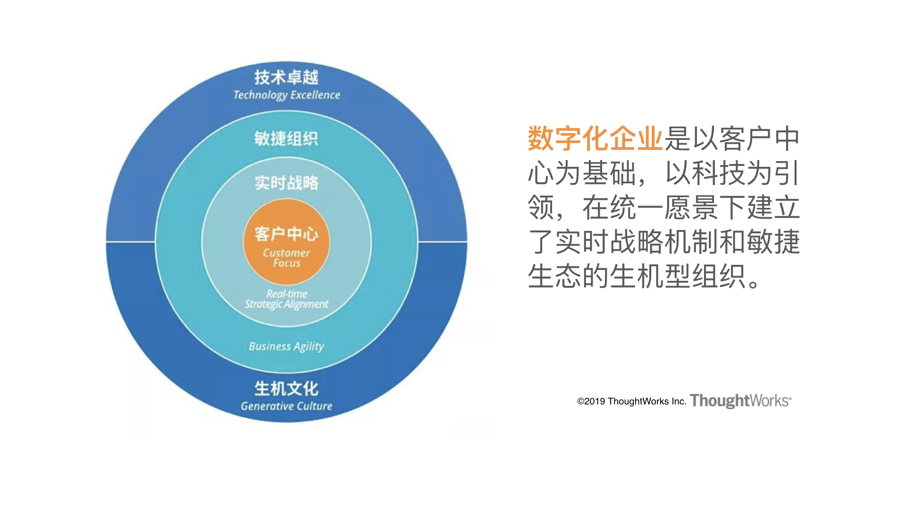

# 03 | 中台定义：当我们谈中台时到底在谈些什么？

## 笔记

### 企业为什么要建中台

**用户才是商业战场的中心, 为了快速响应用户的需求, 借助平台化的力量可以事半功倍.**不断地快速响应、探索、挖掘、引领用户的需求, 才是企业得以生存和持续发展的关键因素.

企业核心的能力: **用户响应力**. **平台化思想(Platform Thinking)**鼓励企业不断抽象沉淀自己核心的底层能力, 通过平台化包装, 得以更好地赋能前台业务, 用底层的确定性来帮助企业应对前台业务以及最终用于需求的不确定性.

**中台化是平台化的下一站, 是平台不断对于自身治理演讲, 打破技术边界, 逐渐拥抱业务, 容纳业务, 具备更强的业务属性的过程. 中台关注为前台业务赋能, 真正为前台而生**.

`SOR`(后台), `SOD`和`SOI`(前台). 每一类系统有着不同的变化速率, 因此也会有不同的生命周期.

将早已臃肿不堪的前台系统中稳定通用的业务能力"沉降"到中台层, 为前台减肥, 恢复前台的响应力; 又可以将后台系统中需要频繁变化或是需要被前台直接使用的业务能力"提取"到中台层, 赋予这些业务能力更强的灵活度和更低的变更成本; 或者干脆直接对于后台进行中台化改造, 通过配置化、自助化、白屏化等形式为后台加速, 从而为前台提供更强大、更迅捷、更易用的"能力炮火"支援.

### 给中台下个定义

**企业级能力复用平台**

企业全局视角, **如果一个中台只为了支持一条业务线或产品线, 那就不是中台**.

中台建设的事情并不是一个技术问题, 而是一个要上升到企业架构的问题, 站在企业整体视角来审视业务全景.

跨业务线的能力沉淀, 提到了前所未有的高度.

#### 企业级

中台处理的问题在企业级别. 定义中台的范围, 区分开了单系统和服务化与微服务.

#### 能力

定义了中台的主要承载对象，能力的抽象解释了各种各样中台的存在.

#### 复用

定义了中台的核心价值，传统的平台化对于易复用性和前台的用户体验并没有给予足够的关注，中台的提出和兴起，让人们通过可复用性将目光更多的从平台内部设计转换到平台对于前台业务的支撑上.

"去重"讲的更多是向后看, 是技术驱动的; "复用"讲的更多是向前看, 是业务驱动和用户驱动的.

* "复用"是中台更加关注的目标
* "可复用性" 和 "易复用性" 是衡量中台建设好坏的重要指标
* "业务响应力" 和 "业务满意度" 是考核中台建设进度的重要指标

#### 平台

定义了中台的主要形式, 区别于传统的应用系统拼凑的方式, 通过对于更细粒度能力的识别与平台化沉淀, 实现企业能力的柔性复用, 更好地支撑前台业务.

### 总结思考

**以用户为中心的持续规模化创新**, 是中台建设的核心目标. 企业的用户响应能力和规模化创新能力, 是互联网时代企业综合竞争力的核心体现. 平台化包括中台化只是帮助企业达到这个目标的手段, 并不是目标本身.

中台根本上是为了解决企业响应力困境, 弥补创新驱动需要快速变化的前台和稳定可靠驱动需要变化周期相对较慢的后台之间的矛盾, 提供⼀个中间层来适配前台与后台的配速问题, 打通并顺滑链接前台需求与后台资源, 帮助企业从整体上不断提升用户响应力.

**中台就是企业级能力复用平台**, "中台化"也就是"利用平台化的思维和手段梳理、识别、沉淀与复用企业级核心能力的过程".

## 扩展