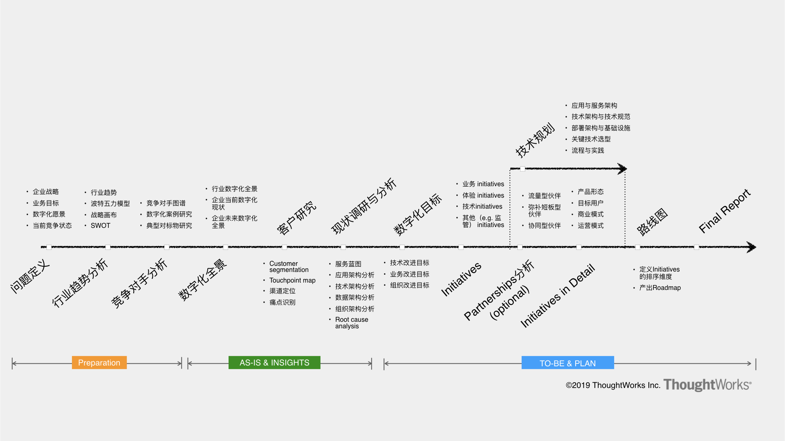
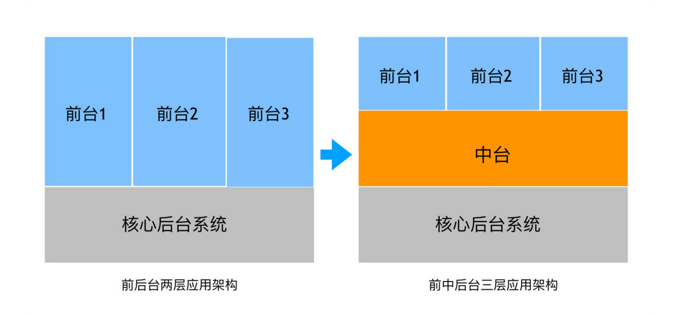
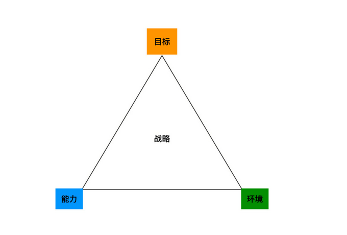
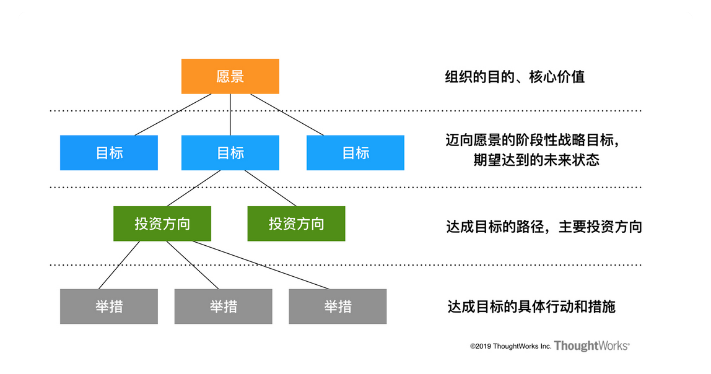

# 06 | 中台落地第一步：企业战略分解及现状调研（Discovery）

## 笔记

### PD

投资组合规划, 在企业里就相当于产品线规划. 本质上是资源分配的问题.

### 为什么PD这样的方式规划中台

`Discovery`分成由外到内, 自上而下和自下而上的三个不同方向的过程.

### 由外到内: 行业与竞争对手分析

竞争对手分析: **五力模型, SWOT, 商业模式画布, 竞争对手产品线分析, 竞争态势分析矩阵**.

### 自上而下: 企业战略分解

所谓战略, 就是如何达成目标与能力的平衡, 并根据环境变换做成合适的调整.

* 企业战略简化理解: 结合**企业自身**的能力与其所处的环境, 倒吸需要采取什么样的举措, 才能实现企业预订的愿景和目标.
* 企业战略分解可以简化理解: 结合**企业各部门自身**的能力与其所处的环境, 倒吸需要采取什么样的举措, 才能实现企业预订的愿景和目标.

**精益价值树(Lean Value Tree)**, 是一种以价值成效为导向, 用于分析和沟通业务愿景, 战略与投资的工具. 核心是建立从愿景, 目标到投资举措自上而下的对齐, 因此采用一种逐层分解的树型结构.

中台只是一个具体的举措而已, 向上还是要能追溯到对于企业愿景和目标的关联性和价值上, 匹配和对应企业的愿景目标.

### 自下而上: 现状调研与分析

**高层访谈, 干系人地图, 组织架构分析, 战略设计思维, 业务架构现状梳理, 用户旅程, 服务蓝图, 领域驱动设计, 应用系统现状梳理, 技术架构现状梳理**

## 扩展