# VLAN

## 概念

### VLAN是什么

虚拟局域网. `VLAN`所指的`LAN`特指使用路由器分割的网络 -- 也就是广播域.

广播域, 指的是广播帧(目标`MAC`地址全部为`1`)所能传递到的访问, 也就是能够直接通信的访问.

* 多播帧(Multicast Frame)
* 目标不明的单播帧(Unknown Unicast Frame)

也能够在同一个广播域畅行无阻.

**二层交换机只能构建单一的广播域, 不过使用`VLAN`功能后, 它能够将网络分割成多个广播域**.

### 不分割广播域的结果

如果仅有一个广播域, **有可能会影响到网络整体的传输性能**.

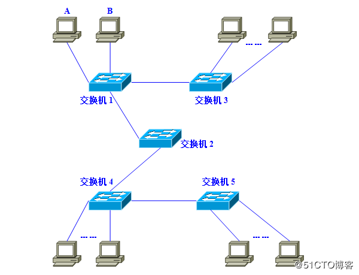

图中有5台交换机. 加入A和B需要通信.

A必须先广播ARP请求, 来尝试获取计算机B的MAC地址.

交换机1收到广播帧(ARP), 会将它**转发给除接收端口外其他所有端口**, 也就是`Flooding`了, 交换机2收到广播帧后也会`Flooding`. 同理交换机3,4,5. **最终ARP请求会被转发到同一网络中的所有客户机上**.

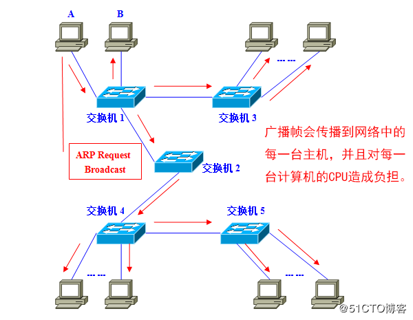

`ARP`请求原本是为了获得计算机B的MAC地址. 但是:

* 数据帧缺传遍整个网络, 导致所有计算机都收到它了.
* 广播信息消耗了网络整体的带宽.
* 收到广播信息的计算机还要消耗一部分CPU时间来对它进行处理. 

**网络带宽和CPU运算能力的大量无谓消耗**.

### 广播信息频发发出吗

多类广播信息

* ARP: 建立IP地址和MAC地址的映射关系.
* DHCP: 用于自动设定IP地址的协议.
* RIP: 一种路由协议.

### 广播域的分割与VLAN的必要性

用于在二层交换机上分割广播域的技术就是`VLAN`. 通过`VLAN`我们可以自由设计广播域的构成, 提高网络设计的自由度.

## 实现VLAN的机制

### 实现VLAN的机制

交换机如何使用`VLAN`分割广播域.

在一台未设置任何VLAN的二层交换机上，任何广播帧都会被转发给除接收端口外的所有其他端口(`Flooding`).

计算机A发送广播信息后, 会被转发给端口2,3,4.

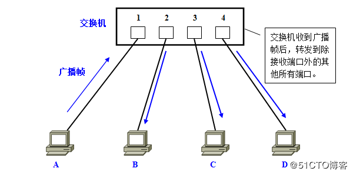

这时，如果在交换机上生成红、蓝两个VLAN；同时设置端口1、2属于红色VLAN、端口3、4属于蓝色VLAN。再从A发出广播帧的话, 交换机就只会把它转发给同属于一个VLAN的其他端口——也就是同属于红色VLAN的端口2, 不会再转发给属于蓝色VLAN的端口.

同样, C发送广播信息时, 只会被转发给其他属于蓝色VLAN的端口, 不会被转发给属于红色VLAN的端口.

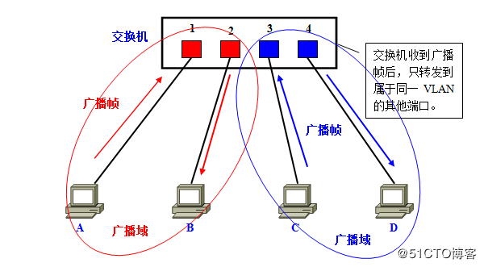

实际中使用**`VLAN ID`**来区分.

### 直观描述VLAN

**把它理解为将一台交换机在逻辑上分割成了数台交换机**

在一台交换机上生成红、蓝两个VLAN, 也可以看作是将一台交换机换做一红一蓝两台虚拟的交换机.

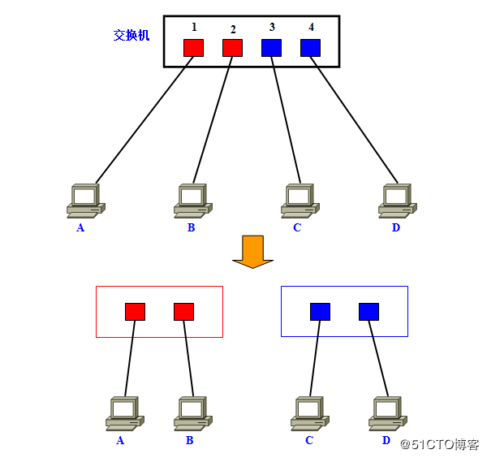

**VLAN生成的逻辑上的交换机是互不想通的. 因此, 在交换机上设置VLAN后, 如果未做其他处理, VLAN间是无法通信的**.

### VLAN间通信

通常两个广播域之间由路由器连接, 广播域之间来往的数据报都由路由器中继的.

**VLAN间的通信也需要路由器提供中继服务, 这被称作VLAN间路由**

VLAN间路由, 可以使用普通的路由器, 也可以使用三层交换机.

## VLAN的访问链接

### 交换机的端口

* 访问链接(Access Link)
* 回去链接(Trunk Link)

### 访问链接

**只属于一个`VLAN`, 且仅向该`VLAN`转发数据帧的端口**. 一般访问链接所连的是客户机.

设置`VLAN`的顺序是:

* 生成`VLAN`
* 设定访问链接(决定各端口属于哪个一个`VLAN`)

#### 静态VLAN

事先固定的

**静态VLAN又被称为基于端口的VLAN(Port Based VLAN)**, 就是明确指定各端口属于哪个VLAN的设定方法.

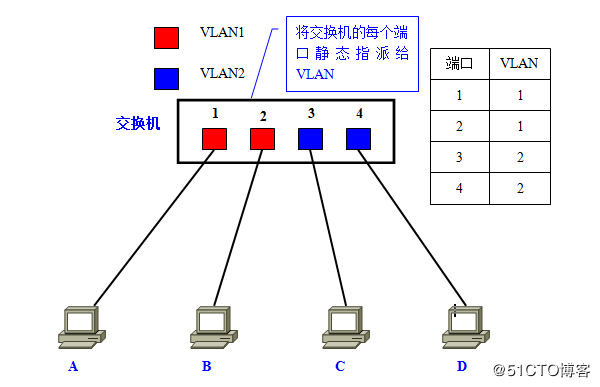

需要一个个端口地指定, 当网络中的计算机数目超过一定数字, 设计操作就变得复杂.

**静态VLAN不适合那些需要频繁改变拓补结构的网络**.

#### 动态VLAN

动态VLAN则是根据每个端口所连的计算机, 随时改变端口所属的VLAN.

* 基于MAC地址的VLAN(MAC Based VLAN)
* 基于子网的VLAN(Subnet Based VLAN)
* 基于用户的VLAN(User Based VLAN)

**基于MAC地址的VLAN**, 就是通过查询并记录端口所连计算机上网卡的MAC地址来决定端口的所属.假定有一个MAC地址“A”被交换机设定为属于VLAN“10”, 那么不论MAC地址为“A”的这台计算机连在交换机哪个端口, 该端口都会被划分到VLAN10中去. 计算机连在端口1时, 端口1属于VLAN10; 而计算机连在端口2时, 则是端口2属于VLAN10.

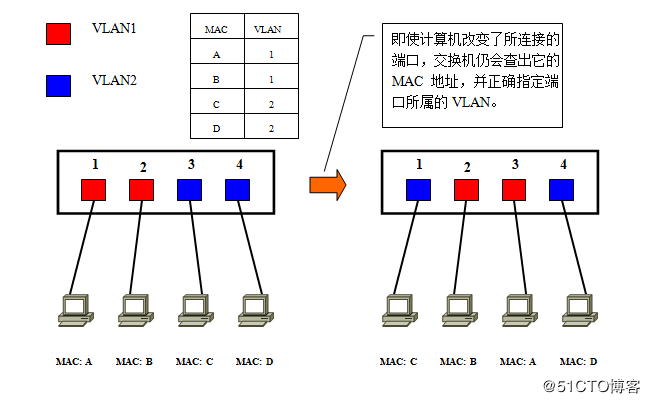

**基于子网的VLAN**, 通过所连计算机的IP地址, 来决定端口所属VLAN的. 只要计算机的IP地址不变, 就仍可以加入原先设定的VLAN. 基于子网的VLAN是一种在OSI的第三层设定访问链接的方法.

**基于用户的VLAN**, 根据交换机各端口所连的计算机上当前登录的用户, 来决定该端口属于哪个VLAN. 这些用户名信息, 属于OSI第四层以上的信息,

**决定端口所属VLAN时利用的信息在OSI中的层面越高, 就越适于构建灵活多变的网络**.

### 访问链接的总结

* 静态VLAN(基于端口的VLAN): 将交换机的各端口固定指派给`VLAN`.
* 动态VLAN
	* 基于MAC地址的VLAN: 根据各端口所连计算机的MAC地址设定.
	* 基于子网的VLAN: 根据各端口所连计算机的IP地址设定.
	* 基于用户的VLAN:  根据端口所连计算机上登录用户设定.

## VLAN的汇聚链接

### 设置跨越多态交换机的VLAN

如图: 需要将不同楼层的`A,C`和`B,D`设置为同一个`VLAN`.

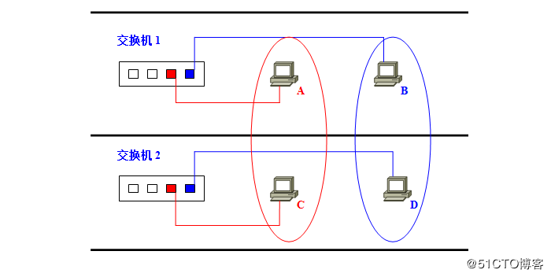

最简单方案, 在交换机1和交换机2上各设一个红, 蓝`VLAN`专用的接口并互联.

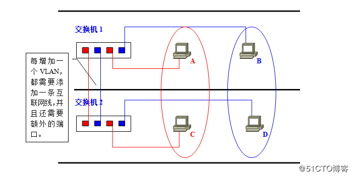

**扩展性和管理效率不好**

让交换机互联的网线集中到一根上, **汇聚链接(Trunk Link)**

### 汇聚链接

汇聚链接(Trunk Link)指的是**能够转发多个不同VLAN的通信的端口**.

汇聚链路上流通的数据帧, 都被附加了用于识别分属于哪个VLAN的特殊信息.

汇聚链接是如何实现跨越交换机间的VLAN的:

* A发送的数据帧**从交换机1经过汇聚链路到达交换机2时**, 在数据帧上**附加了表示属于红色VLAN的标记**.
* 交换机2收到数据帧后, 经过检查`VLAN`表示发现这个数据帧属于红色`VLAN`的端口.
* 去除标记后根据需要将复原的数据帧只转发给其他属于红色`VLAN`的端口.

只有当数据帧是一个广播帧、多播帧或是目标不明的帧时, 它才会被转发到所有属于红色VLAN的端口.

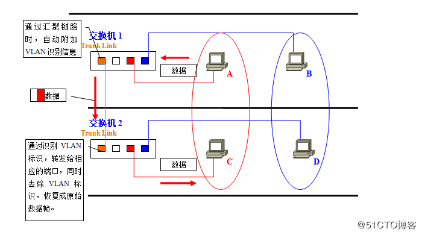

汇聚链路上流通着多个VLAN的数据, 自然负载较重. 在设定汇聚链接时, 有一个前提就是必须支持100Mbps以上的传输速度.

默认条件下, 汇聚链接会转发交换机上存在的所有VLAN的数据. 换一个角度看, 可以认为汇聚链接(端口)同时属于交换机上所有的VLAN.

**可以通过用户设定限制能够经由汇聚链路互联的VLAN**.

## VLAN的汇聚方式

### 汇聚方式

在交换机的汇聚链接上, 可以通过对数据帧附加VLAN信息, 构建跨越多台交换机的VLAN.

* IEEE802.1Q
* ISL

### IEEE802.1Q

IEEE802.1Q所附加的VLAN识别信息, 位于数据帧中"发送源MAC地址"与"类别域(Type Field)"之间. **具体内容为2字节的TPID和2字节的TCI, 共计4字节**.

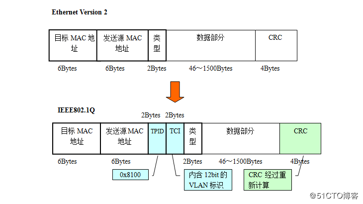

而当数据帧离开汇聚链路时, TPID和TCI会被去除, 这时还会进行一次CRC的重新计算.

TPID的值, 固定为0x8100. 交换机通过TPID, 来确定数据帧内附加了基于IEEE802.1Q的VLAN信息. 而实质上的VLAN ID, 是TCI中的12位元. 由于总共有12位, 因此最多可供识别4096个VLAN.

基于IEEE802.1Q附加的VLAN信息, 就像在传递物品时**附加的标签**. 因此, 它也被称作"标签型VLAN(Tagging VLAN)".

### ISL(Inter Switch Link) - Cisco独有

使用ISL后, 每个数据帧头部都会被附加26字节的"ISL包头(ISL Header)", 并且在帧尾带上通过对包括ISL包头在内的整个数据帧进行计算后得到的4字节CRC值. **总共增加了30字节的信息**.

在使用ISL的环境下, 当数据帧离开汇聚链路时, 只要简单地去除ISL包头和新CRC就可以了. 由于原先的数据帧及其CRC都被完整保留, 因此无需重新计算CRC.

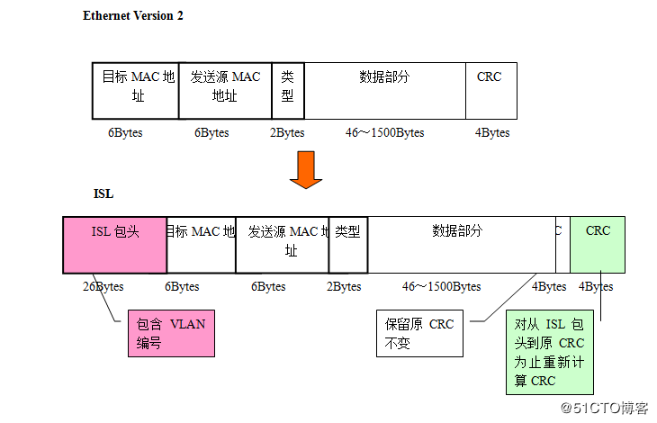

ISL有如用ISL包头和新CRC将原数据帧整个包裹起来, 也被称为**“封装型VLAN(Encapsulated VLAN)"**.

## VLAN间路由

### VLAN间路由

两台计算机即使连接在同一台交换机上, 只要所属的VLAN不同就无法直接通信.

在LAN内的通信, 必须在数据帧头中指定通信目标的MAC地址. 而为了获取MAC地址, TCP/IP协议下使用的是ARP. ARP解析MAC地址的方法, 则是通过广播. 也就是说, 如果广播报文无法到达, 那么就无从解析MAC地址, 亦即无法直接通信.

计算机分属不同的VLAN, 也就意味着分属不同的广播域, 自然收不到彼此的广播报文. 因此, **属于不同VLAN的计算机之间无法直接互相通信**. 为了能够在VLAN间通信, 需要利用网络层的信息(IP地址)来进行路由.

### 使用路由器进行VLAN间路由

路由器和交换机的接线方式:

* 将路由器与交换机上的每个VLAN分别连接
* 不论VLAN有多少个, 路由器与交换机都只用一条网线连接

#### 1

把路由器和交换机以VLAN为单位分别用网线连接.

将交换机上用于和路由器互联的每个端口设为访问链接, 然后分别用网线与路由器上的独立端口互联.

交换机上有2个VLAN, 那么就需要在交换机上预留2个端口用于与路由器互联.

路由器上同样需要有2个端口; 两者之间用2条网线分别连接.

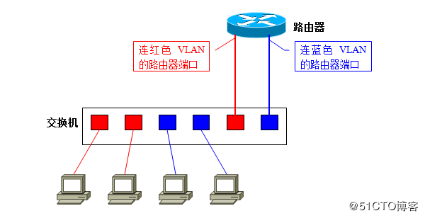

**扩展性问题**

#### 2

当使用一条网线连接路由器与交换机、进行VLAN间路由时, 需要用到汇聚链接.

* 首先将用于连接路由器的交换机端口设为汇聚链接
* 路由器上的端口也必须支持汇聚链路
* 双方用于汇聚链路的协议自然也必须相同

尽管实际与交换机连接的物理端口只有一个, 但在理论上我们可以把它分割为多个虚拟端口, 在路由器上定义对应各个VLAN的“子接口(Sub Interface)". 

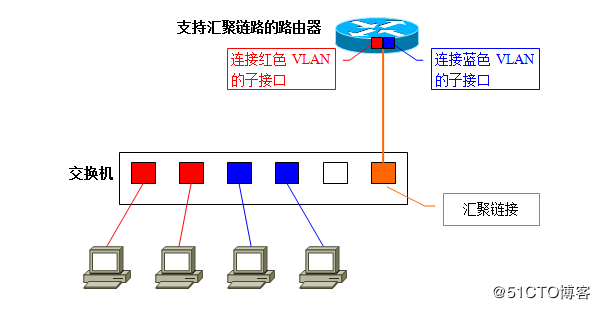

即使之后在交换机上新建VLAN, 仍只需要一条网线连接交换机和路由器. 用户只需要在路由器上新设一个对应新VLAN的子接口就可以了.

### 同一VLAN内的通信时数据的流程

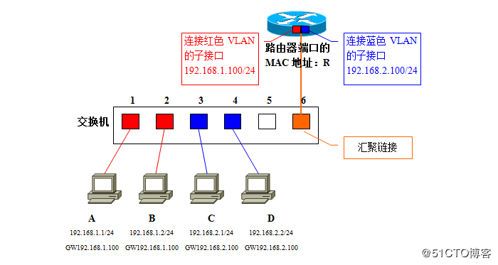

* 红色VLAN(VLAN ID=1)的网络地址为192.168.1.0/24
* 蓝色VLAN(VLAN ID=2)的网络地址为192.168.2.0/24
* 各计算机的MAC地址分别为A/B/C/D
* 路由器汇聚链接端口的MAC地址为R

端口         |     MAC地址       |   VLAN    |
------------|------------------|------------|
1			|	  A				|	  1		 |
2			|	  B				|	  1		 |
3			|	  C				|	  2		 |
4			|	  D				|	  2		 |
5			|	  -				|	  -		 |
6			|	  R				|	  汇聚	 |

计算机`A`与统一`VLAN`内的计算机`B`之间通信时的情形:

* 计算机`A`发出`ARP`请求信息, 请求解析`B`的`MAC`地址.
* **交换机**收到数据帧后, 检索`MAC`地址列表中与收信端口同属一个`VLAN`的表项.
* 结果发现, 计算机`B`连接子啊端口`2`上, 于是交换机将数据帧转发给端口`2`, 最终计算机`B`收到该帧.

**收发信双方同属一个`VLAN`之内的通信, 一切处理均在交换机内完成**.

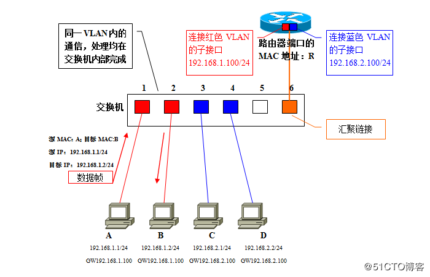

### 不同VLAN间通信时数据的流程

计算机`A`与计算机`C`之间通信时的情况.

1. 计算机A从通信目标的IP地址(192.168.2.1)得出C与本机不属于同一个网段. 因此会向设定的默认网关(Default Gateway, GW)转发数据帧. 在发送数据帧之前, 需要先用ARP获取路由器的MAC地址.
2. 得到路由器的MAC地址R后, 接下来就是按图中所示的步骤发送往C去的数据帧. ①的数据帧中, 目标MAC地址是路由器的地址R, 但内含的目标IP地址仍是最终要通信的对象C的地址.
3. 交换机在端口1上收到①的数据帧后, 检索MAC地址列表中与端口1同属一个VLAN的表项. 由于**汇聚链路会被看作属于所有的VLAN**, 因此这时交换机的端口6也属于被参照对象. 这样交换机就知道往MAC地址R发送数据帧, 需要经过端口6转发.
4. 从端口6发送数据帧时, 由于它是汇聚链接, 因此会被附加上VLAN识别信息. 由于原先是来自红色VLAN的数据帧, 因此如图中②所示, 会被加上红色VLAN的识别信息后进入汇聚链路.
5. 路由器收到②的数据帧后, 确认其VLAN识别信息, 由于它是属于红色VLAN的数据帧, 因此交由负责红色VLAN的子接口接收.
6. 根据路由器内部的路由表, 判断该向哪里中继. 由于目标网络`192.168.2.0/24`是蓝色VLAN, 且该网络通过子接口与路由器直连, 因此只要从负责蓝色VLAN的子接口转发就可以了. 这时, 数据帧的目标MAC地址被改写成计算机C的目标地址;并且由于需要经过汇聚链路转发, 因此被附加了属于蓝色VLAN的识别信息. 这就是图中③的数据帧.
7. 交换机收到③的数据帧后, 根据VLAN标识信息从MAC地址列表中检索属于蓝色VLAN的表项. 计算机C连接在端口3上、且端口3为普通的访问链接, 因此交换机会将数据帧除去VLAN识别信息后(数据帧④)转发给端口3, 最终计算机C才能成功地收到这个数据帧.

**发送方——交换机——路由器——交换机——接收方**

## 三层交换机

### 使用路由器进行VLAN间路由时的问题

随着VLAN之间流量的不断增加, 很可能导致路由器成为整个网络的瓶颈.

就VLAN间路由而言, 流量会集中到路由器和交换机互联的汇聚链路部分, 这一部分尤其特别容易成为速度瓶颈.

### 三层交换机

三层交换机, 本质上就是"带有路由功能的（二层）交换机".

**路由与交换模块是汇聚链接的**, 由于是内部连接, 可以确保相当大的带宽.

### 使用三层交换机进行VLAN间路由(VLAN内通信)

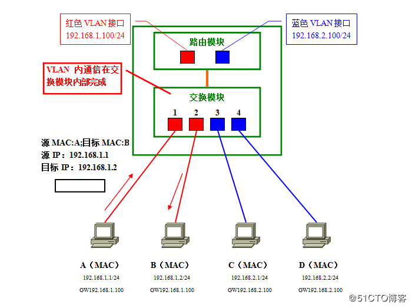

### 使用三层交换机进行VLAN间路由(VLAN间通信)

计算机A与计算机C间通信时的情形:

* 针对目标IP地址, 计算机A可以判断出通信对象不属于同一个网络, 因此向默认网关发送数据(`Frame 1`).
* 交换机通过检索MAC地址列表后, 经由内部汇聚链接, 将数据帧转发给路由模块. 在通过内部汇聚链路时, 数据帧被附加了属于红色VLAN的VLAN识别信息(`Frame 2`).
* 路由模块在收到数据帧时, 先由数据帧附加的VLAN识别信息分辨出它属于红色VLAN, 据此判断由红色VLAN接口负责接收并进行路由处理. 因为目标网络192.168.2.0/24是直连路由器的网络, 且对应蓝色VLAN.
* 接下来就会从蓝色VLAN接口经由内部汇聚链路转发回交换模块. 在通过汇聚链路时, 这次数据帧被附加上属于蓝色VLAN的识别信息(`Frame 3`).
* 交换机收到这个帧后, 检索蓝色VLAN的MAC地址列表, 确认需要将它转发给端口3. 由于端口3是通常的访问链接, 因此转发前会先将VLAN识别信息除去(`Frame 4`). 最终, 计算机C成功地收到交换机转发来的数据帧.

**发送方→交换模块→路由模块→交换模块→接收方**

## 加速VLAN间通信的手段

### 流(Flow)

**VLAN间路由, 必须经过外部的路由器或是三层交换机的内置路由模块**. 但是, 有时并不是所有的数据都需要经过路由器(或路由模块).

例如通过`FTP`上传数据时, 于MTU的限制, IP协议会将数据分割成小块后传输, 并在接收方重新组合. 
这些被分割的数据, "发送的目标"是完全相同的. 发送目标相同, 也就意味着同样的目标IP地址、目标端口号(注: 特别强调一下, 这里指的是TCP/UDP端口). 自然, 源IP地址、源端口号也应该相同. 这样一连串的数据流被称为**"流(Flow)"**.

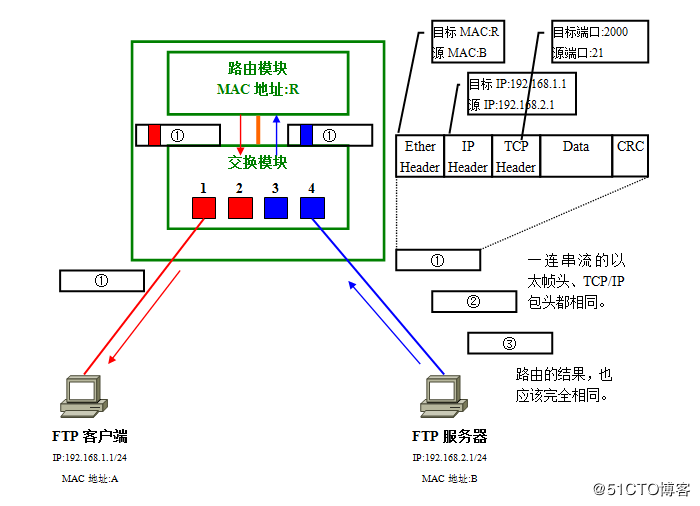

只要将流最初的数据正确地路由以后, 后继的数据理应也会被同样地路由.

后继的数据不再需要路由器进行路由处理, **通过省略反复进行的路由操作, 可以进一步提高VLAN间路由的速度**.

### 加速VLAN间路由的机制

**将第一块数据路由的结果记录到缓存里保存下来**:

* 目标IP地址
* 源IP地址
* 目标TCP/UDP端口号
* 源TCP/UDP端口号
* 接收端口号(交换机)
* 转发端口号(交换机)
* 转发目标MAC地址
* ...

**同一个流的第二块以后的数据到达交换机后, 直接通过查询先前保存在缓存中的信息查出"转发端口号"后就可以转发给目标所连端口了**.

需要再一次次经由内部路由模块中继, 而仅凭交换机内部的缓存信息就足以判断应该转发的端口.

这时, 交换机会对数据帧进行由路由器中继时相似的处理, 例如改写MAC地址(中间需要从交换机经过, 有交换机的MAC地址), IP包头中的TTL和Check Sum校验码信息等.

通过在交换机上缓存路由结果, 实现了以缆线速度(Wired Speed)接收发送方传输来数据的数据, 并且能够全速路由, 转发给接收方.

## 使用VLAN设计局域网

### 使用VLAN设计局域网的特点

通过使用VLAN构建局域网, 用户能够不受物理链路的限制而自由地分割广播域.

利用VLAN:

* 网络构成灵活多变 **优点**
* 网络构成复杂化 **缺点**

