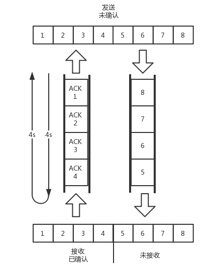

# 第12讲 | TCP协议（下）：西行必定多妖孽，恒心智慧消磨难

## 笔记

### 累计应答

为了保证顺序性, 每一个包都有一个 ID. 在建立连接的时候, 会商定起始的 ID 是什么, 然后按照 ID 一个个发送. 为了保证不丢包, 对于发送的包都要进行应答, 这个应答也不是一个一个来的, 会**应答某个之前所有的ID, 表示都收到了**.

这种模式成为 **累计确认 或者 累计应答 ( cumulative acknowledgement)**.

```
比如接收端收到了包1、2、3、4，它的应答应该是5.
```

### 发送端

按照包的ID一个个排列, 根据处理情况分成四个部分:

1. 发送了并且**已经确认**的. (交代了, 并且也做完了, 应该划掉)
2. 发送了并且**尚未确认**. (交代了, 还没做完, 需要等待做完回复, 才能划掉)
3. 没有发送, 但是已经等待发送的. (还没有交代给下属, 马上要交代的)
4. 没有发送, 并且暂时还不会发送的. (没有交代给下属, 暂时还不会交代给下属)

#### 窗口

接收端能同时处理多少事情? 在`TCP`里, **接收端会给发送端报一个窗口的大小**(是**接收端给的**), 叫`Advertised window`. 窗口大小应该等于上面的**第二部分**加上**第三部分**(已经交代了没做完的 + 马上要交代的).

超过这个窗口的, 接收端做不过来了, 就不能发送了.


* LastByteAcked: 第一部分和第二部分的分界线
* LastByteSent: 第二部分和第三部分的分界线
* LastByteAcked + AdvertisedWindow: 第三部分和第四部分的分界线

### 接收端

1. 接收并且确认过的. 也就是我领导交代给我, 并且我做完的.
2. 还没接收, 但是马上就能接收的. 也即是我自己的能够接收的最大工作量.
3. 还没接收, 也没法接收的. 也即超过工作量的部分, 实在做不完.


* MaxRcvBuffer: 最大缓存的量
* LastByteRead 之后是已经接收了, 但是还**没被应用层读取**的.
* NextByteExpected(下一个期望) 是第一部分和第二部分的分界线.

#### 第二部分的窗口有多大?

`NextByteExpected` 和 `LastByteRead` 的**差**其实是还没被应用层读取的部分占用掉的`MaxRcvBuffer`的量, 我们定义为 `A`.

`AdvertisedWindow` 其实是 `MaxRcvBuffer` 减去 `A`. (这里是发送方的`AdvertisedWindow`)

`AdvertisedWindow=MaxRcvBuffer-((NextByteExpected-1)-LastByteRead)`

### 顺序问题与丢包问题

* 发送端
	* `1,2,3`已经发送并确认
	* `4,5,6,7,8,9`发送了还没确认
	* `10,11,12`还没发出
	* `13,14,15`接收方没有空间, 不准备发的
* 接收端
	* `1,2,3,4,5`已经完成`ACK`, 但是还没读取
	* `6,7`是等待接收的
	* `89`是已经接收, 但是没有`ACK`
* 双方状态
	* `1,2,3`没问题, 已经确认
	* `4,5`接收方说`ACK`了, 但是发送方还没收到, 有可能丢了, 有可能在路上.
	* `6,7,8,9`肯定都发了, `8,9`已经到了, `6,7`没到, 出现了**乱序**, 缓存着但是没办法`ACK`

### 确认与重发机制

* 假设`4`的确认到了, `5`的`ACK`丢了, `6,7`的数据包丢了.
* 一段时间后, `5,6,7`都超时了, 就会重新发送. 
	* 接收方发现`5`原来接收过, 于是**丢弃**`5`.
	* `6`收到了, 发送`ACK`, 要求下一个是`7`.
	* `7`又丢了. 当`7`再次超时的时候, 需要重传.

#### 超时重试

对每一个发送了, 但是没有`ACK`的包, 都有设一个定时器, 超过了一定的时间, 就重新尝试.

* 时间必须大于RTT(往返时间), 否则会引起不必要的重传.
* 不宜过长, 超时时间变长, 访问就变慢了.

##### 自适应重传算法(Adaptive Retransmission Algorithm)

估计**往返时间**, 需要`TCP`通过**采样`RTT`的时间**, 然后进行加权平均, 算出一个值, 而且这个值还是要不断变化的, 因为网络状况不断的变化. 

还要**采样`RTT`的波动范围**, 计算出一个估计的**超时时间**. 

#### 重传策略

`TCP`的策略是**超时间隔加倍. 每当遇到一次超时重传的时候, 都会将下一次超时时间间隔设为先前值的两倍. 两次超时, 就说明网络环境差, 不宜频繁反复发送.

##### 解决超时时间较长的方式

**快速重传**. 当接收方收到一个序号**大于下一个所期望的报文段时**, 就检测到了数据流中的一个间格, **于是发送三个冗余的 `ACK`**, 客户端收到后, 就在定时器过期之前, 重传丢失的报文段.

```
6, 8, 9都已经收到了, 就是 7 没来, 肯定是丢了, 于是发送三个 6 的ACK, 要求下一个是 7. 客户端收到3个, 就会发现 7 的确又丢了, 不等超时, 马上重发
```

##### SACK

**Selective Acknowledgment(SACK)**. 这种方式需要在`TCP`头里加一个`SACK`的东西, 可以**将缓存的地图发送给发送方**. 例如可以发送`ACK6`, `SACK8`, `SACK9`. 有了地图, 发送方一下次就能看出来是 `7` 丢了.

### 流量控制问题

在包确认的时候, 会携带一个窗口大小.

假设窗口不变, 始终为`9`. `4`的确认来的时候, 会右移一个, 这个时候第 `13`个包可以发送了.


如果发送端发送过猛, 会将第三部分的`10, 11,12,13`全部发送完毕, 之后就停止发送了, 未发送部分为 `0`.


当对于包`5`的确认到达的时候, 在客户端相当于窗口再滑动了一格, 这个时候, 才可以有更多的包可以发送了, 例如第`14`个包才可以发送.


如果接收方实在处理的太慢, 导致缓存中没有空间了, 可以通过确认信息修改窗口的大小, 甚至可以设置为 0，则发送方将暂时停止发送.

我们假设一个极端情况，接收端的应用一直不读取缓存中的数据，当数据包`6`确认后，窗口大小就不能再是`9` 了, 就要缩小一个变为`8`.


这个新的窗口 `8` 通过 `6` 的确认消息到达发送端的时候, 会发现窗口没有平行右移, 而是仅仅左面的边右移了，窗口的大小从 `9` 改成了 `8`.


如果接收端还是一直不处理数据, 则随着确认的包越来越多, 窗口越来越小, 直到为 `0`.


当这个窗口通过包 `14` 的确认到达发送端的时候，发送端的窗口也调整为 `0`, 停止发送.


如果这样的话, 发送方会**定时发送窗口探测数据包**, 看是否有机会调整窗口大小.

当接收方比较慢的时候, 要**防止低能窗口综合征**, 别空出一个字节来就赶快告诉发送方, 然后马上又填满了, 可以当窗口太小的时候, 不更新窗口, 直到达到一定大小, 或者缓冲区一半为空, 才更新窗口.

### 拥塞控制问题

```
假设TCP每次传输都是按照MSS大小来发送数据，因此你可以认为cwnd按照数据包个数来做单位也可以理解，下面如果没有特别说明是字节，那么cwnd增加1也就是相当于字节数增加1个MSS大小
```

#### 滑动窗口 和 拥塞窗口

滑动窗口`rwnd`是怕发送方把接收方缓存塞满, 而拥塞窗口`cwnd`(发送方的滑动窗口), 是怕把网络塞满.

`LastByteSent - LastByteAcked <= min {cwnd, rwnd}`, 拥塞窗口和滑动窗口共同控制发送速度.

#### 判断网络是否不满

`TCP`不知道整个网络路径都会经历什么. `TCP`的拥塞控制就是在不堵塞, 不丢包的情况下, 尽量发挥带宽.

网络有带宽, 即每秒钟能够发送多少数据. 端到端还有时延.

网络上`通道的容量 = 带宽 x 往返延迟`.

**如果我们设置发送窗口, 使得发送但未确认的包为通道的容量, 就能够盛满整个管道**.



#### 避免`包丢失`和`超时重传`

一旦出现了这些现象就说明, 发送速度太快了, 要慢一点.

##### 慢启动

如果通过漏斗往瓶子里灌水, 要一开始慢慢倒, 然后越倒越快. **慢启动**

一条`TCP`连接开始, `cwnd`设置为一个报文段, 一次只能发送一个.

一开始为**指数性**的增长:

* 当收到一个确认的时候, `cwnd`加一, 于是**一次能够发送两个**.
* 当这两个的确认到来的时候, 每个`cwnd`加一, 两个确认`cwnd`加二, 于是**一次能够发送四个**.
* 当着四个确认到来的时候, 每个确认`cwnd`加一, 四个确认`cwdn`加四, 于是**一次能够发送八个**.

当超过`ssthresh`为`65535`个字节的时候, 就要慢下来. 转为**线性**增长.

* cwnd 增加 `1/cwnd`
	* 一次发送八个, 当八个确认来的时候, 每个确认增加`1/8`, 八个确认一共`cwnd`增加一, 于是一次能够发送`9`个.

线性增长还是增长, 还是越来越多, 直到有一天, 满了, 出现了**拥塞**, **降低倒水的速度, 等待溢出的水慢慢渗下去**.

拥塞的一种表现形式是**丢包**, 需要超时重传. 这个时候:

* 将`sshresh`(slow start threshold)设为`cwnd/2`
* 将`cwnd`设为`1`
* 重新开始慢启动(**传统算法**)

**快速恢复**

当接收端发现丢了一个中间包的时候, 发送三次前一个包的 `ACK`, 于是发送端就会快速的重传, 不必等待超时再重传. `TCP`认为这种情况不严重, 因为大部分没丢, 只丢了一小部分:

* cwnd 减半为 cwnd/2
* sshthresh = cwnd
* 当三个包返回的时候, `cwnd = sshthresh + 3`


#### TCP 的拥塞控制主要来避免的两个现象都有问题

* 丢包并不代表着通道满了, 也可能是管子本来就漏水. 例如公网上带宽不满也会丢包，这个时候就认为拥塞了，退缩了，其实是不对的.
* TCP 的拥塞控制要等到将中间设备都填充满了, 才发生丢包, 从而降低速度，这时候已经晚了。其实 TCP 只要填满管道就可以了，不应该接着填，直到连缓存也填满.

#### TCP BBR 拥塞算法

通过不断的加快发送速度，将管道填满，但是不要填满中间设备的缓存，因为这样时延会增加，在这个平衡点可以很好的达到高带宽和低时延的平衡.


## 扩展

### RTT

RTT(Round-Trip Time)往返时间. 表示从发送端发送数据开始, 到发送端收到来自接收端的确认(接收端收到数据后便立即发送确认，不包含数据传输时间)总共经历的时间.

### MTU 和 MSS

* `MTU` 是网络传输最大报文包.
* `MSS` 是网络传输数据最大值.

#### MSS

mss加包头数据就等于mtu. 简单说拿TCP包做例子. 报文传输1400字节的数据的话, 那么mss就是1400, 再加上20字节IP包头, 20字节tcp包头, 那么mtu就是1400+20+20. 当然传输的时候其他的协议还要加些包头在前面, 总之mtu就是总的最后发出去的报文大小. mss就是你需要发出去的数据大小.

MSS: Maxitum Segment Size 最大分段大小 2.MSS最大传输大小的缩写，是TCP协议里面的一个概念.

为了达到最佳的传输效能TCP协议在建立连接的时候通常要协商双方的MSS值.
