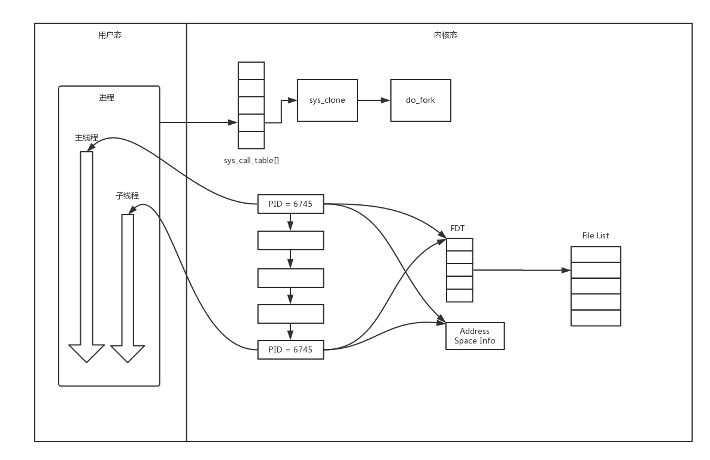
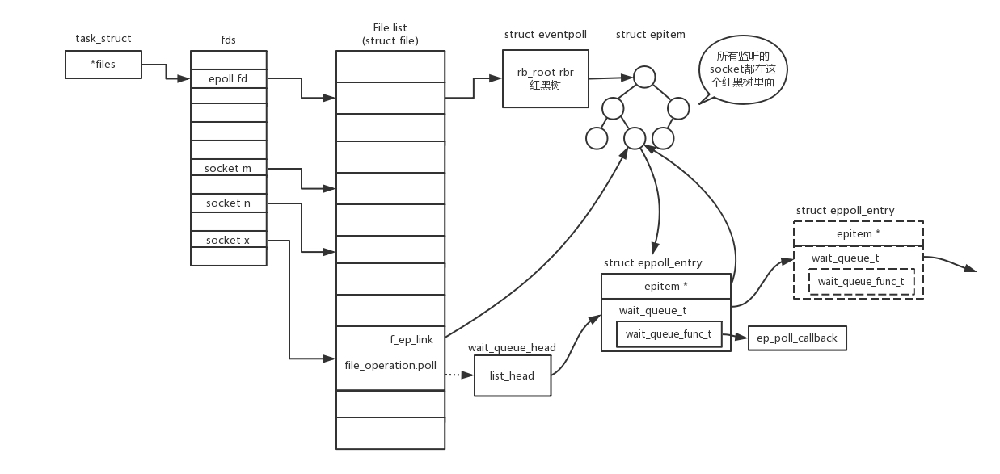

# 第13讲 | 套接字Socket：Talk is cheap, show me the code 

## 笔记

### Socket 编程

基于`TCP`和`UDP`协议.

可以理解为, 弄一根网线, 一头插在客户端, 一头插在服务端, 然后进行通信. 在通信之前, 双方都要建立一个`socket`.

### socket 参数

能够设置的参数, 也只能是端到端协议之上**网络层**和**传输层**的.

* AF_INET: IPv4
* AF_INET6: IPv6
* TCP: SOCK_STREAM(数据流)
* UDP: SOCK_DGRAM(数据报)

### 基于 TCP 协议IDE Socket 程序函数调用过程


* 服务端
	* TCP 的服务端要先监听一个端口, 调用`bind`函数, 给这个 Socket 赋予一个 IP 地址和端口.
		* 端口: 通过端口找到应用程序.
		* IP: 可能有多个网卡（只有发给这个网卡的包才会给你).
	* 调用`listen`函数进行箭筒, 即是`TCP`的状态图里面的`listen`状态.
	* 内核中, 为每个`Socket`维护**两个**队列.
		* 一个是**已经建立了连接**的队列, 这时候连接三次握手已经完毕, 处于`established`状态.
		* 一个是**还没有完全建立连接**的队列, 三次握手还没完成, 处于`syn_rcvd`状态.
	* 调用 `accept` 函数, 拿出一个已经完成的连接进行处理. 如果没有完成, 等待.
* 客户端
	* 调用 `connect` 函数发起连接(三次握手).
		* IP 地址
		* 端口号
	* 内核会给客户端分配一个**临时的**端口.
	* 握手成功, 服务端的 `accept` 就会返回**另一个** `Socket`

### 两个 Socket

监听的`Socket`和真正用来传数据的`Socket`是**两个**.

* **监听**Socket
* **已连接**Socket

### 连接成功后

双方通过 `read` 和 `write` 函数来读写数据, **就像往一个文件流里面写东西一样**

### Socket 函数调用过程


`Socket` 在 `Linux` 中就是以文件形式存在的.

在内核中,Socket 是一个文件,那对应就有文件描述符. 每一个进程都有一个数据结构 `task_struct`, 里面指向一个文件描述符数组, 来列出这个进程打开的所有文件的文件描述符. **文件描述符是一个整数, 是这个数组的下标**.

这个数组中的**内容**(下标是文件描述符)是一个指针, 指向内核中所有打开的文件的列表. `Socket` 对应的 `inode` 不像真正的文件系统一样, 保存在硬盘上的, 而是在内存中的(叫做`in-core inode`). 在这个 `inode` 中, **指向了`Socket`在内核中的 `Socket` 结构**.

#### Socket 结构

两个队列:

* 发送队列
* 接收队列

两个队列保存的是一个缓存`sk_buff`. 这个缓存里面能够看到完整的包的结构.


### 基于 UDP 协议的 Socket 程序函数调用过程

`UDP`没有连接的, 不需要调用`listen`和`connect`.

`UDP`仍然需要`IP`和`端口号`, 所以需要**`bind`**.

`UDP`是**没有维护连接状态的**, 不需要没对连接建立一组`Socket`, 而是只要有一个`Socket`, 就能够和客户端通信.

**因为没有连接状态**, 每次通信的时候, 都调用`sento` 和 `recvfrom`, 都可以传入`IP`地址和端口号.


### 服务器如何接跟多的项目

#### 最大连接数

四元组来标识一个 `TCP` 连接.

```
{本机 IP, 本机端口, 对端 IP, 对端端口}
```

只有客户端`IP`和客户端端口是可变的.

`最大 TCP 连接数 = 客户端 IP 数 x 客户端端口数`.

* `IPv4`
	* IP数最大: 2^32
	* 端口数最多: 2^16

**理论上**服务器单机最大 `TCP` 连接数为 `2^48`.

#### 限制

* 文件描述符限制: `Socket`都是文件, 首先要通过`ulimit`配置文件描述符的数目.
* 内存: 每个`TCP`链接都要占用一定内存, 操作系统是有限的.

### 解决方案

#### 1. 将项目外包给其他公司(多进程方式)

创建子进程, 将基于已链接`Socket`的交互给这个新的子进程来做.

##### 如何创建子进程

在 Linux 下,创建子进程使用 fork 函数.通过名字可以看出,这是在父进程的基础上完全拷贝一个子进程.在 Linux 内核中,会复制文件描述符的列表,也会复制内存空间,还会**复制一条记录当前执行到了哪一行程序的进程**.显然,复制的时候在调用 fork,复制完毕之后,父进程和子进程都会记录当前刚刚执行完 fork.这两个进程刚复制完的时候,几乎一模一样,只是根据 fork 的返回值来区分到底是父进程,还是子进程.如果返回值是 0,则是子进程；如果返回值是其他的整数,就是父进程.


因为复制了文件描述符列表, 文件描述符都指向整个内核统一的打开文件列表. **因而父进程刚才因为`accept`创建的已连接`Socket`也是一个文件描述符, 同样也会被子进程获得**.

* 子进程通过这个已连接`Socket`和客户端进行互通
* 通信完毕之后, 退出进程.
* 因为父进程知道子进程的`ID`(fork后父进程获取返回值), 通过 ID 查看子进程是否完成.

#### 2. 将项目转包给独立的项目组(多线程方式)

**多进程**: 每次接一个项目,都申请一个新公司,然后干完了,就注销掉这个公司,实在是太麻烦了.毕竟一个新公司要有新公司的资产,有新的办公家具,每次都买了再卖,不划算.

通过`pthread_create`创建一个线程. 在`task`列表会创建一项, 但是很多资源, 如文件描述符列表, 进程空间, 还是共享的. 只不过多了一个引用.



##### c10k

新来一个`TCP`连接, 就需要分配一个进程或者线程. **一台机器无法创建很多进程或者线程**, 

**c10k**它的意思是一台机器要维护 1 万个连接,就要创建 1 万个进程或者线程,那么操作系统是无法承受的.如果维持 1 亿用户在线需要 10 万台服务器,成本也太高了.

##### 进程和线程类比

* 创建进程: 成立新公司, 购买新办公家具.
* 创建线程, 在**同一个公司**成立项目组.

#### 3. 一个项目组支撑多个项目(IO 多路复用, 一个线程维护多个Socket)

`Socket`是文件描述符, 某个线程盯的所有`Socket`, 都放在一个文件描述符集合`fd_set`中**项目进度墙**, 调用`select`函数来监听文件描述符集合是否有变化. **一旦有变化, 就会依次查看每个文件描述符**.

发生变化的文件描述符在 `fd_set` 对应的位都设为1, 表示`Socket`可读或者可写, 从而可以进行读写操作, 然后再调用`select`, 接着盯着下一轮的变化.

#### 4. 一个项目支撑多个项目(IO 多路复用, 从"派人盯着"到"有事通知")

`select`是通过轮询的方式, `select`所能监控的数量有`FD_SETSIZE`限制.

```
如果项目进度方式变化, 不需要监控, 而是主动通知项目组, 然后项目组再根据项目进展情况做相应的操作
```

能完成这件事情的函数叫`epoll`, 是通过注册`callback`函数的方式, 当某个文件描述符发生变化的时候, 就会主动通知.



假设进程打开了 Socket m, n, x 等多个文件描述符,现在需要通过 epoll 来监听是否这些 Socket 都有事件发生.其中 epoll_create 创建一个 epoll_create 创建一个 epoll 对象,也是一个文件,也对应一个文件描述符,同样也对应着打开文件列表中的一项.在这项里面有一个红黑树,在红黑树里,要保存这个 epoll 要监听的所有 Socket.

当 epoll_ctl 添加一个 Socket 的时候,其实是加入这个红黑树,同时红黑树里面的节点指向一个结构,将这个结构挂在被监听的 Socket 的事件列表中.当一个 Socket 来了一个事件的时候,可以从这个列表中得到 epoll 对象,并调用 call back 通知它.

**epll被称为解决c10k问题的利器**

## 扩展