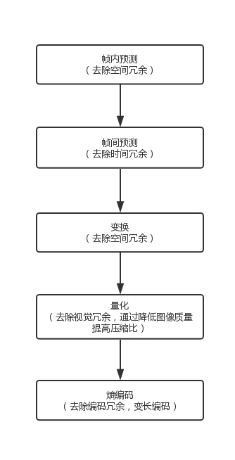
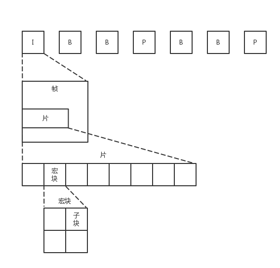
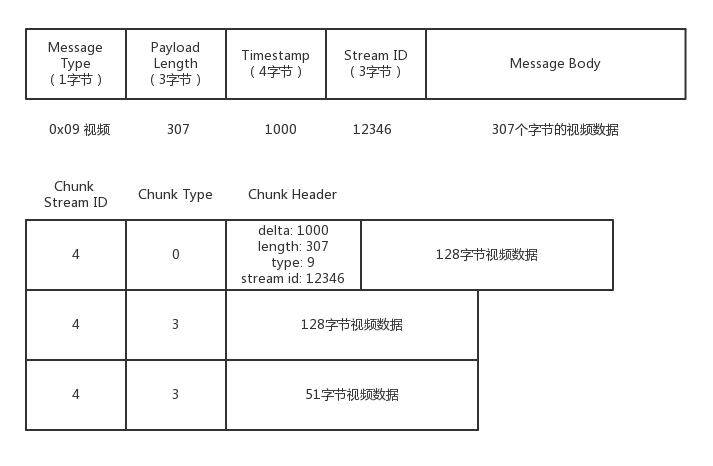
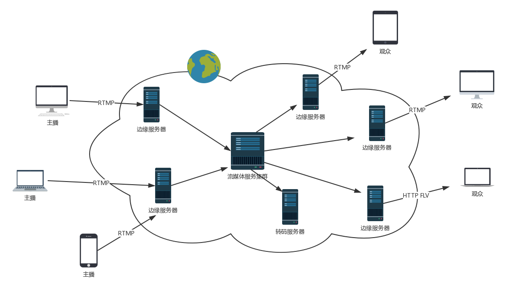
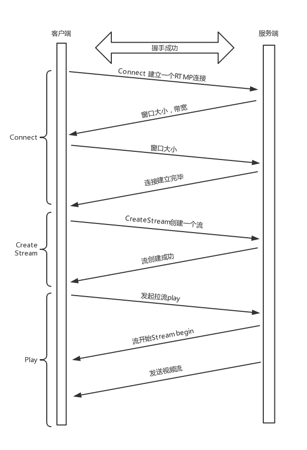

# 第16讲 | 流媒体协议：如何在直播里看到美女帅哥？

## 笔记

### 视频是什么

快速播放一连串连续的图片.

每一张图片我们称为一**帧**. 

只要每秒钟帧的数据足够多, 也即播放得足够快. 比如每秒30帧, 以人的眼镜的敏感程度, 是看不出这是一张张独立的图片的. 这就是**帧率(FPS)**.

图片都是由**像素**组成的.

解释像素为(1024*768). 每个像素由`RGB`(三原色)组成, 每个`8`位, 共`24`位.


```
每秒钟的视频有多大
30帧 x 1024 x 768 x 24 = 566,231,040Bits = 70,778,880Bytes

一分钟约为4G
```

传输过大, 所以采用**编码**. **编码就是一个压缩的过程**, 用尽量少的`Bit`数保存视频.

### 视频和图片的压缩过程特点

* 空间冗余: 图片的相邻像素之间有较强的相关性, 一张图片相邻像素往往是渐变的, 不是突变的, 没必要每个像素都完整地保存, 可以隔几个保存一个, **中间的用算法计算出来**.
* 时间冗余: 视频序列的相邻图像之间内容相似. 一个视频中连续出现的图片也不是突变的, 可以根据已有的图片进行预测和推断.
* 视觉冗余: 人的视觉系统对某些细节不敏感, 因此不会每一个细节都注意到, 可以允许丢失一些数据.
* 编码冗余: 不同像素值出现的概率不同, 概率高的用的字节少, 概率低的用的字节多.



### 视频编码两大流派

* ITU(International Telecommunication Union)的`VCEG`(Video Coding Experts Group). 国际电联下的`VCEG`. 侧重传输
	* H.261, H.262, H.263, H.264, H.265...
* ISO(International Standards Organization)的`MPEG`(Moving Picture Experts Group). 是**ISO其下的MPEG**,
	* MPEG-1、MPEG-2、MPEG-4、MPEG-7

双方联合制定了`H.264/MPEG-4 AVC`.

#### 格式

经过编码之后, 一帧一帧的图像就变成了一串串二进制. 这个二进制可以放在一个文件里面, 按照一定的格式保存起来. 

```
AVI、MPEG、RMVB、MP4、MOV、FLV、WebM、WMV、ASF、MKV.
```

格式:

* 前几个字节是什么意义
* 后几个自己是什么意义
* 然后输数据, 数据就是编码好的结果

### 直播

这些二进制可以通过某种网络协议进行封装,放在互联网上传输, 这个时候就可以进行直播了.

#### 接流

网络协议将编码好的视频流, 从主播推送到服务器. 服务器上有个运行了同样协议的服务端来接收这些网络包, 从而得到里面的视频流, 这个过程称为**接流**.

#### 转码

服务端接到视频流之后, 可以对视频流进行一定的处理. **转码**, 从一个编码格式, 转成另一种屙屎. 适应不同的客户端.

#### 拉流

通过视频的**分发**网络, 从边缘节点服务器上拉流, 降低中心服务器压力.

#### 解码

将视频流拉下来之之后, 进行解码. 将二进制转为一帧帧图片.

#### 直播过程


### 编码

图片 -> 二进制流

视频序列分成三种帧

* `|帧`, 关键帧. 完整的图片, 只需要本帧数据, 就可以完成解码.
* `P帧`, 前向预测编码帧. P帧表示的是这一帧跟**之前的一个关键帧(或P帧)的差别**. **解码时需要用之前缓存的画面, 叠加上和本帧定义的差别, 生成最终画面**
* `B帧`, 双向预测内插编码帧. B帧记录的是本帧与前后帧的差别. 要解码B帧, 需要之前的缓存画面, 还要解码之后的画面, 通过前后画面的数据与本帧的叠加, 取得最终的画面.

#### 通过时序进行编码

`I`帧最完整. `B`帧压缩率最高. 压缩后的序列, 应该是在`IBBP`的间隔出现的. 这就是通过**时序进行编码**.



二进制流式有结构的, 是一个个的**网路提取单元(NALU, Network Abstraction Layer Unit)**, 这种格式就是为了传输, 网络上的传输, 默认的就是一个个的包, 因而这里也就分成了一个个的单元.

**每个`NALU`保存的是一个`片`**.


NALU:

* 其实标识符, 识别`NALU`之间的间隔.
* `NALU`的头, 配置了`NALU`的类型.
	* `0x07`表示`SPS`, 序列参数集, 包括一个图像序列的所有信息, 图像尺寸, 视频格式.
	* `0x08`表示`PPS`, 图像参数集, 包括一个图像的所有分片的所有相关信息, 图片类型, 序列号等.
* `Payload`里面是`NALU`承载的数据.

**SPS, PPS**在传输视频流之前, 必须要传输这两类参数, 不然无法解码. 为了保证容错性, 每一个`I`帧前面, 都会传一遍这两个参数集合.

* 如果`NALU Header`里面的表示类型是`SPS`或者`PPS`, 则`Payload`中就是真正的参数集的内容.
* 如果`NALU Header`里面表示的类型是帧, 则`Payload`中才是真正视频数据.

每一个`NALU`里面保存的是**一片**. 对于每一片到底是`I帧`,`P帧`还是`B帧`, 在片结构里面也有个`Heade`, 里面有个**类型**, 然后是片的内容.

#### 总结

一个视频, 可以拆分成一系列的帧, 每一帧拆分成一系列的片, 每一帧拆分成一系列的片, 每一片都放在一个 NALU 里面, NALU 之间都是通过特殊的起始标识符分隔, 在每一个 I 帧的第一片前面, 要插入单独保存 SPS 和 PPS 的 NALU, 最终形成一个长长的 NALU 序列.

### 推流: 如何把数据打包传输到对端

将二进制的流打包成网络包进行发送, 使用`RTMP协议`. 推流.

`RTMP`是基于`TCP`的. 

* 双方建立一个`TCP`的连接.
* 在已有的`TCP`连接的基础上, 还需要建立一个`RTMP`的连接.

#### RTMP 单独连接 

单独建立连接需要商量一些事情:

* 版本号(客户端和服务端版本号保持一致).
* 时间戳, 后面数据流互通还要带上时间戳的差值. 因此一开始双方就要知道对方的时间戳.

#### RTMP 握手

沟通(**握手**)需要发送六条信息

* 客户端
	* C0, 表示自己的版本号, **不必等对方回复**.
	* C1, 表示自己的时间戳.
	* C2, 电表收到客户端`S1`的`ACK.
* 服务端
	* S0, 服务端收到`C0`, 返回`S0`, 表名自己的版本号.
	* S1, 服务端发完`S0`后, 直接发送自己的时间戳`S1`.
	* S2, 服务端收到`C1`后,发送知道了对方时间戳的ACK`S2`.


握手之后, 还要互相传递一些控制信息.

* `Chunk`大小.
* 窗口大小
* ...

创建一个流`stream`,通过这个`Stream`来推流`publih`. 推流是将`NALU`放在`Message`里面发送, 也称为**RTMP Packet包**.


`RTMP`在手法数据的时候并不是以`Message`为单位的, 而是把`Message`拆分成`Chunk`发送, **必须在一个Chunk发送完成后, 才能开始发送下一个Chunk**. 每个`Chunk`中都带有`Message ID`, 表示属于哪个`Message`, 接收端也会按照这个`ID`将`Chunk`组装成`Message`.

Chunk块大小就是指这个Chunk. 将大的消息变为小的块再发送, 可以在低带宽的情况下, 减少网络拥塞.

### RTMP 发送示例

假设一个视频的消息长度为 307, 但是 Chunk 大小约定为 128, 于是会拆分为三个 Chunk.

第一个 Chunk 的 Type＝0, 表示 Chunk 头是是完整的；头里面 Timestamp 为 1000, 总长度 Length 为 307, 类型为 9, 是个视频, Stream ID 为 12346, 正文部分承担 128 个字节的 Data.

第二个 Chunk 也要发送 128 个字节, Chunk 头由于和第一个 Chunk 一样, 因此采用 Chunk Type＝3, 表示头一样就不再发送了.

第三个 Chunk 要发送的 Data 的长度为 307-128-128=51 个字节, 还是采用 Type＝3.



### 推流示例图


### 分发网络

分为**中心**和**边缘**两层. 中心层也复制转码服务.



### 拉流: 观众的客户端如何看到视频



## 扩展