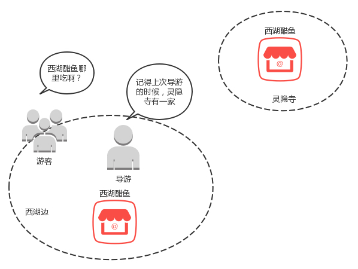
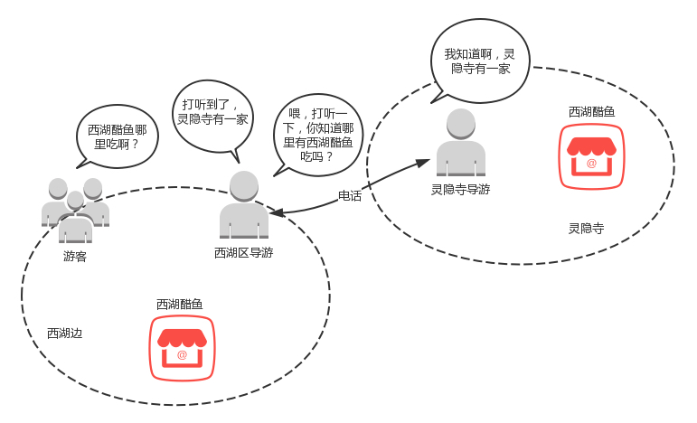
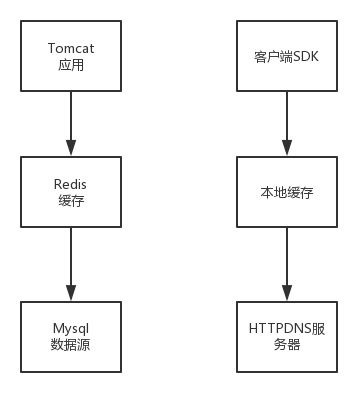
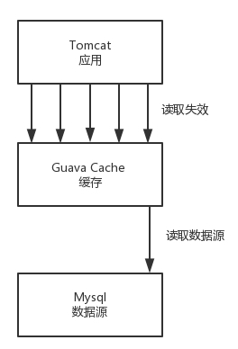
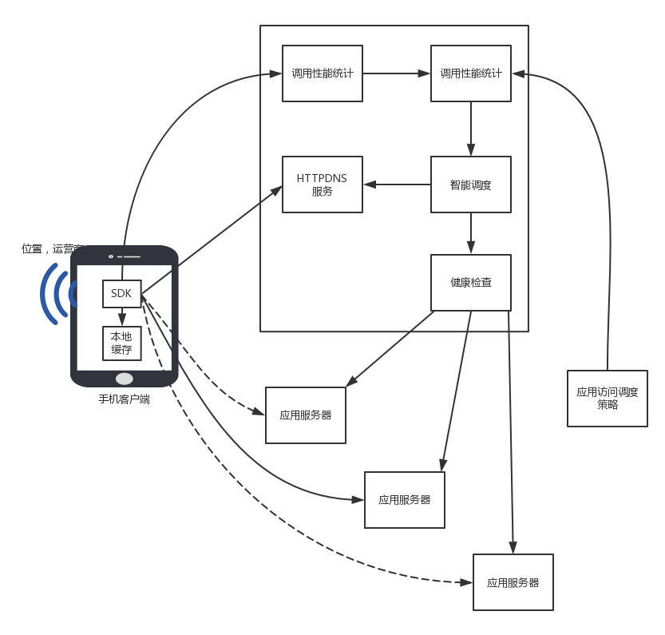

# 第19讲 | HTTPDNS：网络世界的地址簿也会指错路 

## 笔记

### 传统`DNS`存在哪些问题

#### 1. 域名缓存问题

* 缓存不会及时更新(域名的`ip`地址换了)
* 缓存的地址不一定是离用户最近的地址

上次缓存的是西湖的地址, 这次游客在灵隐寺, 结果还是返回西湖的地址.

#### 2. 域名转发问题

`A`运营商的客户, 访问自己运营商的`DNS`服务器, 如果`A`运营商去权威`DNS`服务器查询的话, 权威`DNS`服务器知道你是`A`运营商的, 就会返回一个部署在`A`运营商的网站地址.

但是`A`运营商偷懒, 将解析请求转发给`B`运营商, `B`运营商去权威`DNS`服务器查询的话, 权威服务器会误认为你是`B`运营商的, 那就返会给你一个在`B`云因上的网站地址. **结果客户每次访问都要跨运营商, 速度会变慢**

#### 3. 出口 NAT 问题

`NAT`网络地址转换

* 使这个网关出去的包, 会换成新的`IP`地址。
* 请求返回时, 再将`IP`地址转换回去

一旦做了网络地址转换, 权威的`DNS`服务器, 就没办法通过这个地址, 来判断客户到底来自哪个运营商, 极有可能因为转换过后的地址, 误判运营商.

#### 4. 域名更新问题

如双机房部署, 跨机房的负载均衡和容灾多使用`DNS`来做. 当一个机房出问题之后, 需要修改权威`DNS`，将域名指向新的`IP`地址. 但是因为本地`DNS`服务器是由不同地区, 不同运营商独立部署. 可能会忽略域名解析结果的`TTL`时间限制, 导致权威`DNS`解析变更的时候, 解析结果在全网生效的周期非常漫长.

#### 5. 解析延迟问题

`DNS`的查询过程需要递归遍历多个`DNS`服务器, 才能获得最终的解析结果, 会有一定的时延, 甚至会解析超时.

### HTTPDNS的工作模式

不走传统的`DNS`解析, 自己搭建基于`HTTP`协议的`DNS`服务器集群, 分布在多个地点和多个运营商. 当客户端需要`DNS`解析的时候, 直接通过`HTTP`协议进行请求这个服务器集群, 得到就近的地址.

需要绕过默认的`DNS`解析, 往往应用于手机应用, 需要在手机端嵌入支持`HTTPDNS`的客户端`SDK`.

* 缓存
	* 客户端的`SDK`动态请求服务端, 获取`HTTPDNS`服务器的`IP`列表, 缓存到本地. 
	* 随着不断解析域名, `SDK`也会在本地缓存`DNS`域名解析的结果.

* 工作模式, 手机应用访问一个地址
	* 是否有本地缓存, 如果有直接返回. 该缓存是手机应用自己做的(和本地`DNS`的缓存是不一样的)
	* 如果没有, 请求`HTTPDNS`服务器
		* 在本地`HTTPDNS`服务器的`IP`列表, 选择一个发出`HTTP`请求, 会返回一个要访问的网站的`IP`列表.

手机客户端知道手机在哪个运营商, 哪个地址. 因为采用`HTTP`通信, `HTTPDNS`服务器能够准确知道这些信息, 因而可以做精准的全局负载均衡.

如果都不工作, 就切换到`LocalDNS`来解析, 慢也比访问不到好.

#### 解决问题

* 解析速度和更新速度的平衡问题**HTTPDNS 的缓存设计**
* 智能调度问题**HTTPDNS 的调度设计**

#### HTTPDNS 的缓存设计

`HTTPDNS`解析速度和更新速度全部掌控在自己手中.

* 解析过程: 不需要`DNS`服务器递归的调用一大圈, 一个`HTTP`的请求直接搞定, 需要更新, 马上就能起作用.
* 解析速度, 缓存是在客户端的`SDK`维护的, 过期时间, 更新时间, 可以自己控制.

`HTTPDNS`的缓存策略:

* 客户端
* 缓存
* 数据源

* DNS缓存在内存中, 也可以持久化到存储上. APP重启后, 也能够尽快从存储中加载上次的解析结果. 类似`Redis`是基于内存的缓存, 但是同样提供持久化能力. 重启数据不会丢失.
* SDK缓存会严格按照缓存过期时间, 如果缓存没有命中, 过期, 且客户端不允许使用过期记录, 则发起一次解析, 保障记录是更新的.

##### 解析

* 同步
* 异步

**同步**

优点: 实时性好.

缺点: 如果有多个请求都发现过期, 同时会请求`HTTPDNS`多次, 资源浪费.

类似应用架构中的缓存**Cache-Aside 机制**. 读缓存, 不命中读取数据库, 同时将结果写入缓存.

**异步**

优点: 多个请求合并为一个对于`HTTPDNS`的请求任务, 只执行一次, 减少`HTTPDNS`的压力. 可以在**即将过期**时候, 就创建一个**预加载**, 防止过期之后在刷新.

缺点: 当前请求拿到过期数据, 如果客户端允许使用过期数据. 就要冒风险, 看这个请求能否成功. 如果不能请求, 则失败一次, 等下次缓存更新后, 再请求方能成功.

类似应用架构中的缓存**Refresh-Ahead 机制**, 业务仅仅访问缓存, 当过期的时候定期刷新. 在应用中也常常用**数据预热**或**预加载**的机制.

#### HTTPDNS 的调度设计

##### 客户端

客户端, 可以获取手机信息:

* 哪个国家
* 哪个运营商
* 哪个省
* 哪个市

`HTTPDNS`可以根据这些信息, 选择最佳的服务节点返回.

如果有多个节点, 还会考虑:

* 错误率
* 请求时间
* 服务器压力
* 网络状况
* ...

进行综合选择, 而非仅仅考虑地理位置. 当有一个节点宕机或者性能下降, 可以尽快切换.

客户端使用`HTTPDNS`返回的`IP`访问业务应用. 客户端的`SDK`会收集网络请求数据, 如错误率, 请求时间等网络请求质量数据, 并发送到统计后台, 进行分析. 以此**查看不同的`IP`的服务质量**.

客户端还可以根据不同的移动网络运营商的`WIFI`的`SSID`来分维度缓存. **不同的运营商或者`WIFI`解析出的结果会不同**.

##### 服务端

服务端可以配置不同服务质量的优先级, 权重. `HTTPDNS`会根据这些策略综合地理位置和线路状态算出一个排序, 优先访问时延低的`IP`.

## 扩展