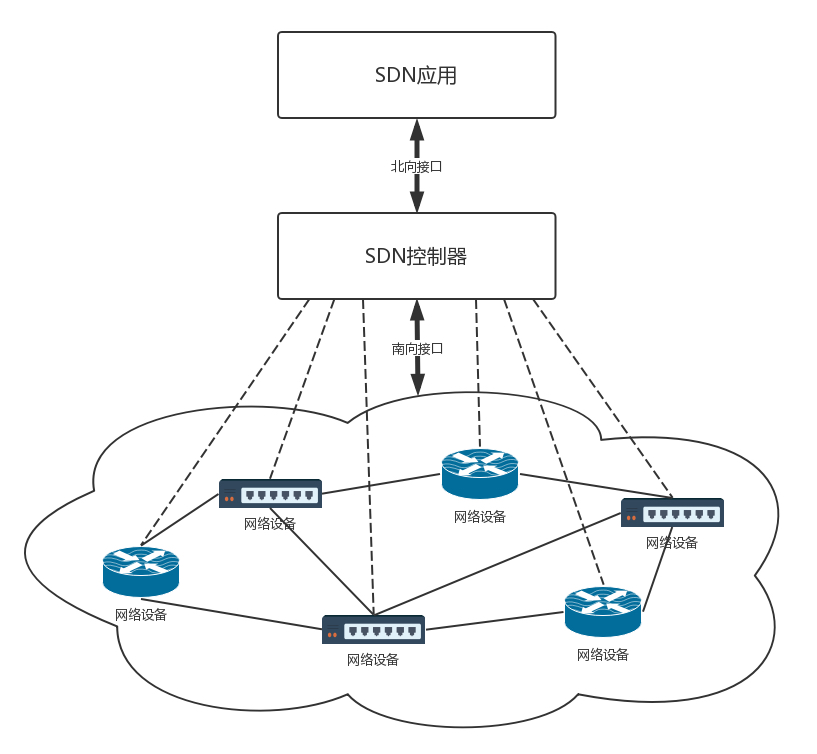
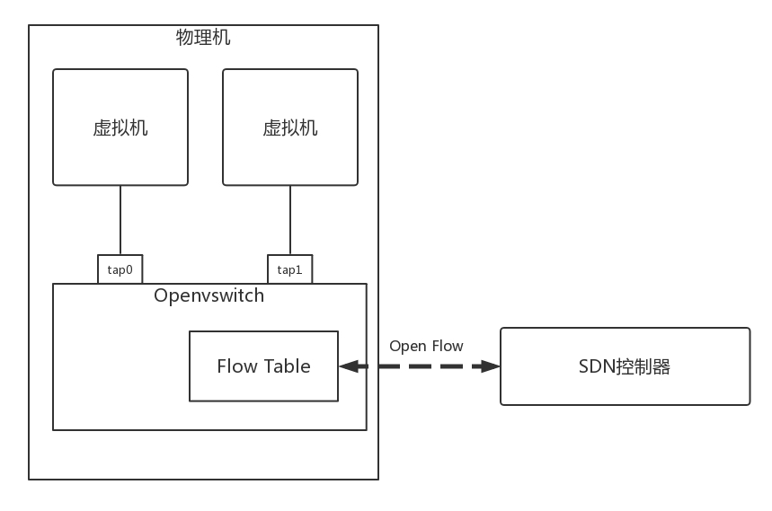
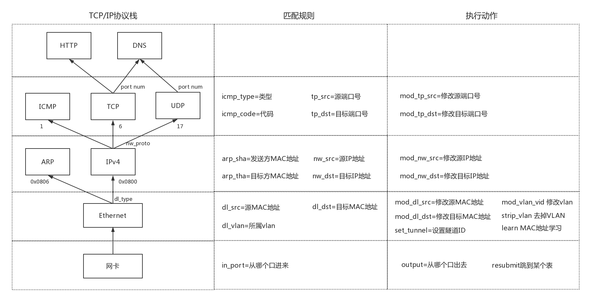
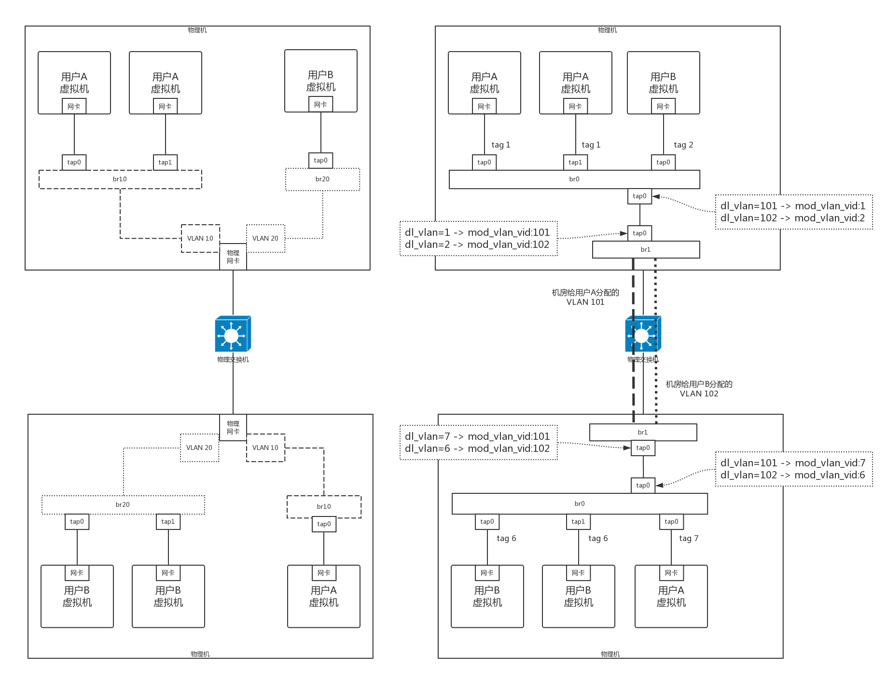

# 第25讲 | 软件定义网络：共享基础设施的小区物业管理办法

## 笔记

### 软件定义网络(SDN)

#### 1. 控制与转发分离

转发平面就是一个个虚拟或者物理的网络设备. **小区的路**

控制平面就是统一的控制中心. **原来物业管理员要从监控室出来, 到路上去管理设备, 现在是分离的: 路是人走的, 控制都在监控室**

#### 2. 控制平面与转发平面之间的开放接口

* 控制器向上提供接口, 被应用层调用 **北向接口**
* 控制器向下调用接口, 控制网络设备 **南向接口**

#### 3. 逻辑上的集中控制

可以控制多个转发面设备, 控制整个物理网络, 因而可以**获得全局的网络状态视图**, 并根据全局网络状态视图实现对网络的优化控制.

### OpenFlow 和 OpenSwitch

`OpenFlow`是`SDN`控制器和网络设备之间互通的南向接口协议. `OpenvSwitch`用于创建软件的虚拟交换机.

`OpenvSwitch`是支持`OpenFlow`协议的.

#### SDN 控制器是如何通过`OpenFlow`协议控制网络的?

在`OpenvSwitch`里面, 有一个**流表规则**, 任何通过这个交换机的包, 都会经过这些规则进行处理, 从而接收, 转发, 放弃.

**流表**其实就是一个个表格, 每个表格好多行, 每行都是一条规则. 每条规则都有优先级.

对于每一条规则:

* 是否满足匹配条件
	* 从哪个端口进来
	* 网络包头里面内容
	* ...
* 执行一个动作, 对网络包进行处理
	* 修改包头内容
	* 跳到任何一个表格
	* 转发到某个网口出去, 也可以丢弃

#### 对包的处理

可以覆盖`TCP/IP`协议栈的四层.

##### 对于**物理**层:

* 匹配规则包括由哪个口进来
* 执行动作包括从哪个口出去

##### 对于**MAC**层:

* 匹配规则:
	* 源`MAC`地址是多少?`dl_src`
	* 目标`MAC`地址是多少?`dl_dst`
	* 所属`vlan`是多少?`dl_vlan`
* 执行动作包括:
	* 修改源`MAC`(mod_dl_src)
	* 修改目标`MAC`(mod_dl_dst)
	* 修改`VLAN`(mod_vlan_vid)
	* 删除`VLAN`(strip_vlan)
	* `MAC`地址学习(learn)

##### 对于**网络**层:

* 匹配规则:
	* 源`IP`地址是多少?(nw_src)
	* 目标`IP`是多少(nw_dst)
* 执行动作包括:
	* 修改源`IP`地址(mod_nw_src)
	* 修改目标`IP`地址(mod_nw_dst)

##### 对于**传输**层

* 匹配规则:
	* 源端口是多少?(tp_src)
	* 目标端口是多少?(tp_dst)
* 执行动作包括:
	* 修改源端口(mod_tp_src)
	* 修改目标端口(mod_tp_dst)
	
	
#### `OpenvSwitch`架构图

两个重要的进程

* `OVSDB`进程. `ovs-vsctl`命令行会和这个进程通信, 去创建虚拟交换机, 创建端口, 将端口添加到虚拟交换机上, `OVSDB`会将这些拓扑信息保存在一个本地的文件中.
* `vswitchd`进程. `ovs-ofctl`命令行会和这个进程通信, 去下发流量表规则, 规则里面会规定如何对网络包进行处理, `vswitchd`会将流量表在放在用户态`FLow Table`中.

**内核态**

`OpenvSwitch`有内核模块`OpenvSwitch.ko`, 对应图中的`Datapath`部分. 在网卡上注册一个函数, 每当有网络包到达网卡的时候, 这个函数就会被调用.

在内核的这个函数里面, 会拿到网络包, 将各个层次的重要信息拿出来:

* 在**物理层**, `in_port`即包进入的网口`ID`
* 在**MAC层**, 源和目的`MAC`地址
* 在**IP层**, 源和目的`IP`地址
* 在**传输层**, 源和目的端口号.

在内核中, 有一个内核态`Flow Table`. 接下来内核模块在这个内核流表中匹配规则, 如果匹配上了,则执行操作, 修改包, 或者转发或者放弃.

如果内核没有匹配上, 则需要进入用户态, 用户态和内核态之间通过`Linux`的一个机制`Netlink`相互通信.

内核通过`upcall`, 告知用户态进程`vswitchd`在用户态`Flow Table`里面去匹配规则, 这里面的规则是全量的刘表规则, 而内核`Flow Table`里面的只是为了快速处理, 保留了部分规则, 内核里面的规则过一阵就会过期.

当在用户态匹配到了流量表规则之后, 就在用户态执行操作, 同时将这个匹配成功的流表通过`reinject`下发到内核, 从而接下来的包都能在内核找到这个规则.

#### 如何在云计算中使用`OpenvSwitch`

* `OpenvSwitch`本身支持`VLAN`
* 所有的虚拟机都可以放在一个网桥`br0`上, 通过不同的用户配置不同的`tag`, 就能够实现隔离
* 创建一个虚拟交换机`br1`, 将物理网络和虚拟网络进行隔离. 物理网络有物理网络的`VLAN`规划, 虚拟机在一台物理机上, 所有的`VLAN`都是从1开始的. 由于一台机器上的虚拟机不超过`4096`个, 所以`VLAN`在一台物理机上如果从1开始, 肯定够用.
* 需要将虚拟机的`VLAN`和物理环境的`VLAN`对应起来, 但为了灵活性, 不一定一致, 这样可以实现分别管理物理机的网络和虚拟机的网络. `OpenvSwitch`可以对包的内容进行修改. 如通过匹配`dl_valn`, 然后执行`mod_vlan_vid`来改进进出出物理机的网络包.

有了`OpenvSwitch`的映射, 将物理和续集解耦, 从而可以让物理环境使用其他技术, 而不影响虚拟机环境.