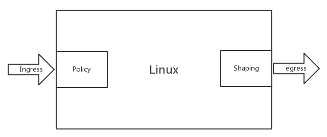
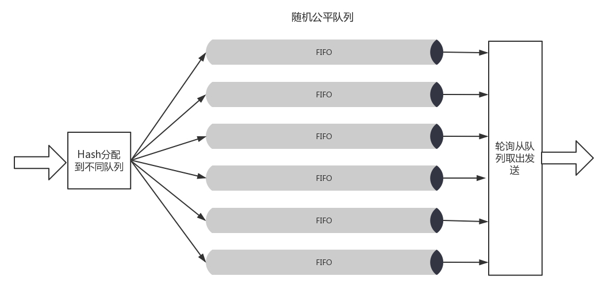
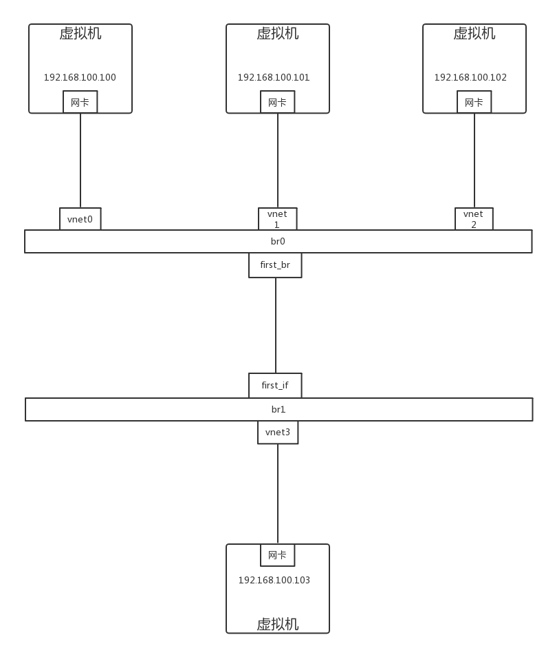
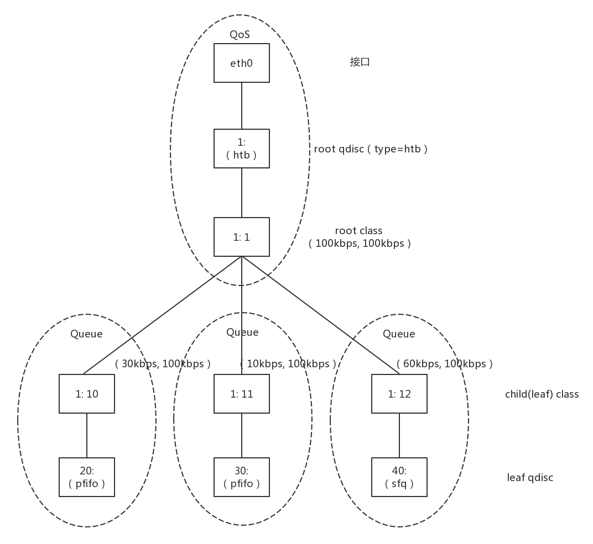

# 第27讲 | 云中的网络QoS：邻居疯狂下电影，我该怎么办?

## 笔记

### QOS

Quality of Service.

一台机器的网络的`QoS`分两个方向, 一个是入方向, 一个是出方向.



* `Shaping`**出**的方向, 将出的流量控制成自己想要的模样.
* `Policy`**进入**的方向是无法控制的, 只能通过`Policy`**丢弃**包.

### 控制网络的`QoS`有哪些方式

通过`TC`控制网络的`QoS`, 主要就是通过队列的方式.

### 无类别排队规则`Classless Queuing Disciplines`

#### `pfifo_fast`

`ip_addr`中的`pfifo_fast`是一种不把网络包分类的技术.


`pfifo_fast`分为三个先入先出的队列, 称为三个`Band`. 根据网络包里面的`TOS`, 看这个包到底应该进入哪个队列. `TOS`总共四位, 每一位表示的意思不同, 总共十六种类型.

`tc qdisc show dev eth0`, 可以输出结果`priomap`, 也是十六个数字. 在`0-2`之间, 和`TOS`的十六种类型对应起来, 表示不同的`TOS`对应的不同的队列. 其中`Band0`优先级最高, 发送完毕之后才轮到`Band1`发送, 最后才是`Band2`

```
[root@localhost ~]# tc qdisc show dev enp0s3
qdisc pfifo_fast 0: root refcnt 2 bands 3 priomap  1 2 2 2 1 2 0 0 1 1 1 1 1 1 1 1
```

#### 随机公平队列(Stochastic Fair Queuing)



建立很多`FIFO`的队列, `TCP Session`会计算`hash`值, 通过`hash`值分配到某个队列. 在队列的另一端, 网络包会通过轮询策略从各个队列中取出发送. 这样不会有一个`Session`占据所有的流量.

如果有两个`Session`的`hash`是一样的, 会共享一个队列, 也有可能互相影响. `hash`函数会经常改变, 从而`session`不会总是相互影响.

#### 令牌通规则(TBF, Token Bucket Filte)


所有的网络包排成队列进行发送, 但不是到了队头就能发送, 而是需要拿到令牌才能发送.

令牌根据设定的速度生成, 所以即便队列很长, 也是按照一定的速度进行发送的.

当没有包在队列中的时候, 令牌还是以既定的速度生成, 但不是无限积累的, 而是放满了桶为止. **设置桶的大小**为了避免下列情况: **当长时间没有网络包发送的时候, 积累了大量的令牌, 突然来了大量的网络包, 每个都能得到令牌, 造成瞬间流量大增**.

### 基于类别的队列规则`Classful Queuing Disciplines`

#### 分层令牌桶规则(HTB, Hierarchical Token Bucket)

`HTB`往往是一棵树. `TC`如何构建一棵`HTB`树.


使用`TC`为某个网卡`eth0`创建一个`HTB`的队列规则, 需要付给它一个句柄为(`1:`). 这是整棵树的根节点, 接下来会有分支. 如图中3个分支, 句柄分别为(`:10`),(`:11`),(`:12`). 最后的参数`default 12`, 表示默认发送给`1:12`, 也即发送给第三个分支.

```
tc qdisc add dev eth0 root handle 1: htb default 12
```

对于这个网卡, 需要规定发送的速度. 一般有两个速度可以配置, 一个是`rate`, 表示一般情况下的速度. 一个是`cell`, 表示最高情况下的速度. 对于根节点来讲, 这两个速度是一样的, 于是创建一个`root class`, 速度为(`rate=100kbps, ceil=100kbps`)

```
tc class add dev eth0 parent 1: classid 1:1 htb rate 100kbps ceil 100kbps
```

创建分支, 也即创建几个`class`. 每个子`class`统一有两个速度. 三个分支分别为:

* `(rate=30kbps, ceil=100kbps)`
* `(rate=10kbps, ceil=100kbps)`
* `(rate=60kbps, ceil=100kbps)`

```
tc class add dev eth0 parent 1:1 classid 1:10 htb rate 30kbps ceil 100kbps
tc class add dev eth0 parent 1:1 classid 1:11 htb rate 10kbps ceil 100kbps
tc class add dev eth0 parent 1:1 classid 1:12 htb rate 60kbps ceil 100kbps
```

`HTB`的特性: 同一个`root class`下的子类可以相互借流量, 如果不直接在队列规则下面创建一个`root class`, 而是直接创建三个`class`, 他们之间是不能相互借流量的. **借流量的策略, 可以使得当前不使用这个分支的流量的时候, 可以借给另一个分支, 从而不浪费带宽, 使带宽发挥最大的作用**.

创建叶子对类规则, 分别为`fifo`和`sfq`.

```
tc qdisc add dev eth0 parent 1:10 handle 20: pfifo limit 5
tc qdisc add dev eth0 parent 1:11 handle 30: pfifo limit 5
tc qdisc add dev eth0 parent 1:12 handle 40: sfq perturb 10
```

设定发送规则: 从`1.2.3.4`来的, 发送给`port 80`的包, 从第一个分支`1:10`走; 其他从`1.2.3.4`发送来的包从第二个分支`1:11`走; 其他的走默认分支.

```
tc filter add dev eth0 protocol ip parent 1:0 prio 1 u32 match ip src 1.2.3.4 match ip dport 80 0xffff flowid 1:10
tc filter add dev eth0 protocol ip parent 1:0 prio 1 u32 match ip src 1.2.3.4 flowid 1:11
```

#### 如何控制`QoS`

`OpenvSwitch`支持两种:

##### 1. 对于进入的流量, 可以设置策略`Ingress policy`

```
ovs-vsctl set Interface tap0 ingress_policing_rate=100000
ovs-vsctl set Interface tap0 ingress_policing_burst=10000
```

##### 2. 对于发出的流量, 可以设置`QoS`规则`Egress shaping`, 支持`HTB`

#### OpenvSwitch 的 `Qos`如何工作的拓扑图



`port`上可以创建`QoS`规则, 一个`Qos`规则可以有多个队列`Queue`.



```
ovs-vsctl set port first_br qos=@newqos -- --id=@newqos create qos type=linux-htb other-config:max-rate=10000000 queues=0=@q0,1=@q1,2=@q2 -- --id=@q0 create queue other-config:min-rate=3000000 other-config:max-rate=10000000 -- --id=@q1 create queue other-config:min-rate=1000000 other-config:max-rate=10000000 -- --id=@q2 create queue other-config:min-rate=6000000 other-config:max-rate=10000000
```

* `min-rate`就是上面的`rate`
* `max-rate`就是上面的`ceil`

通过交换机的网络包, 要通过流表规则, 匹配后进入不同的队列. 添加流表规则(`first_br`是`br0`上的`port 5`).

```
ovs-ofctl add-flow br0 "in_port=6 nw_src=192.168.100.100 actions=enqueue:5:0"
ovs-ofctl add-flow br0 "in_port=7 nw_src=192.168.100.101 actions=enqueue:5:1"
ovs-ofctl add-flow br0 "in_port=8 nw_src=192.168.100.102 actions=enqueue:5:2"
```


## 扩展

### priomap