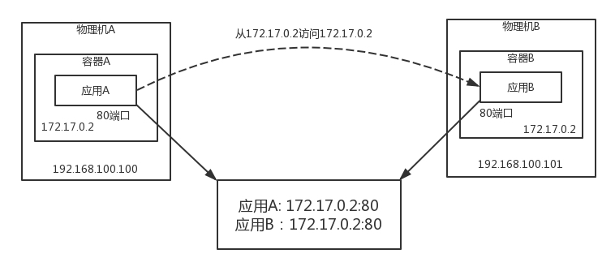
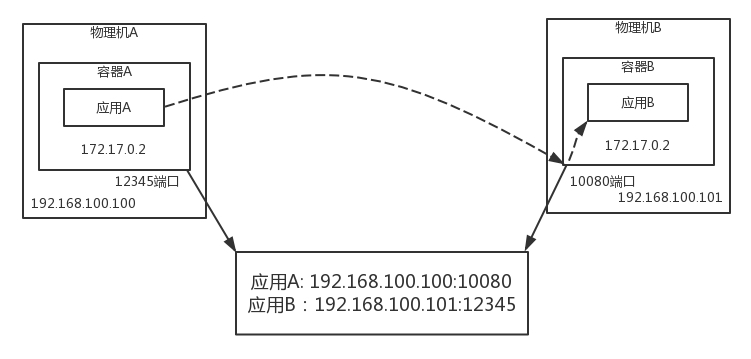
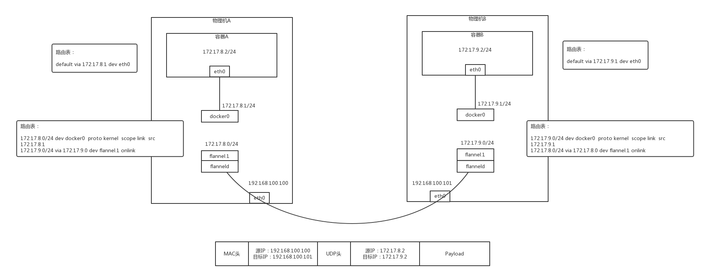
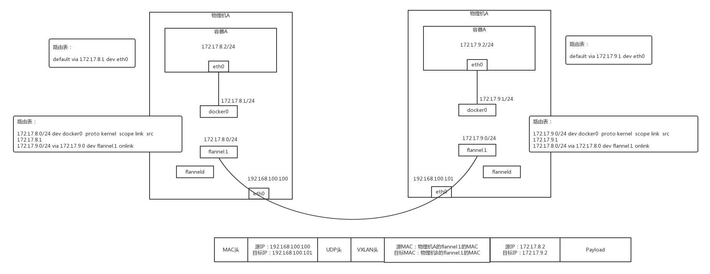

# 第30讲 | 容器网络之Flannel：每人一亩三分地

## 笔记

每一台物理机上面安装好了`Docker`以后, 都会默认分配一个`172.17.0.0/16`的网段. 一台机器上新创建的第一个容器, 一般都会给`172.17.0.2`这个地址.

容器集团军调度平台`Kubernetes`.

集团军通信:

* 集团军的`A`部队如何实时地知道`B`部队的位置变化
* 两个部队之间如何相互通信

### 位置变化

通过一个称为注册中心的地方统一管理. 是应用自己做的. 当一个应用启动的时候, 将自己所在的环境的`IP`地址和端口, 注册到注册中心指挥部, 这样其他的应用请求它的时候, 到指挥部问一下它在哪里就好了. 当某个应用发生了变化, 例如一台机器挂了, 容器要迁移到另一台机器, 这个时候`IP`改变了, 应用会重新注册, 则其他的应用请求它的时候, 还是能够从指挥部得到最新的位置.

### 相互通信

`NAT`这种模式, 多主机场景下存在问题. 在物理机 A 上的应用 A 看到的 IP 地址是容器 A 的, 是 172.17.0.2, 在物理机 B 上的应用 B 看到的 IP 地址是容器 B 的, 不巧也是 172.17.0.2, 当它们都注册到注册中心的时候, 注册中心就是这个图里的样子.

当应用 A 要访问应用 B 的时候, 应用 A 从注册中心将应用 B 的 IP 地址读出来的时候, 就困惑了.

要解决这个问题, 不去注册容器内的 IP 地址, 注册物理机的 IP 地址, 端口也要是物理机上映射的端口.

应用在容器里面的, 它怎么知道物理机上的 IP 地址和端口呢. 让容器内的应用意识到容器外的环境, 本来就是非常不好的设计.

也会导致随机分配端口(端口映射). 使用默认端口也会造成冲突.

### Flannel

对于 IP 冲突问题, 如果每一台物理机都是网段 172.17.0.0/16, 肯定会冲突. 但是**这个晚点干是在太大了**, 一台物理机上根本启动不了这么多的容器, 所以能不能每台物理机在这个大网段里面, 扣出一个小的网段, 每个物理机网段都不同, 自己看好自己的一亩三分地, 谁也不和谁冲突.

如物理机 A 是网段 172.17,8.0/24, 物理机 B 是网段 172.17.9.0/24. 这样两台机器上启动容器 IP 肯定不一样, 而且就看 IP 地址, 一下子可以识别出这个容器是本机的, 还是远程的. 如果是远程的, 也能从网段一下子识别出它归哪台物理机管.

#### 物理机 A 上的容器如何访问到物理机 B 上的容器

`Flannel`使用**UDP**实现**Overlay**网络方案

物理机 A 上的容器 A 里面, 能看到的容器的 IP 地址是 172.17.8.2/24, 里面设置了默认的路由规则 `default via 172.17.8.1 dev eth0`

如果容器 A 要访问 172.17.9.2, 就会发往这个默认的网关 172.17.8.1. 172.17.8.1 就是物理机上面`docker 0`网桥的`IP`地址, 这台物理机上的所欲容器都是连接到这个网桥的.

在物理机上面, 查看路由策略, 会有这样一条`172.17.9.0/24 via 172.17.9.0 via flannel.1`, 也就是说发往 172.17.9.2 的网络包会被转发到`flannel.1`这个网卡.

这个网卡是怎么来的, 每台物理机上, 都会跑一个`flanneld`进程, 这个进程打开一个 `/dev/net/tun`字符设备的时候, 就出现了这个网卡.

`qemu-kvm`, 打开这个字符设备的时候, 物理机上也会出现一个网卡, 所有发到这个网卡上的网络包会被`qemu-kvm`接收进来, 变成二进制串. 只不过接下来`qemu-kvm`会模拟一个虚拟机里面的网卡, 将二进制串变成网络包, 发给虚拟机里面的网卡.

`flanneld`不用这样做, 所有发到`flannel.1`这个网卡的包都会被`flanneld`进程读进去, 接下来`flanneld`要对网络包进行处理.

物理机上 A 上的**`flanneld`会将网络包封装在`UDP`包里面**, 然后在外层加上物理机 A 和物理机 B 的 IP 地址, 发送给物理机 B 上的`flanneld`.

使用`UDP`是因为不想在`flanneld`之间建立两两链接, 而`UDP`没有连接的概念, 任何一台机器都能发给另一台.

物理机 B 上的 flanneld 收到包之后, 解开 UDP 的包, 将里面的网络包拿出来, 从物理机 B 的`flannel.1`网卡发出去.

在物理机 B 上, 有路由规则`172.17.9.0/24 dev docker0 proto kenel scope link src 172.17.9.1`.

将包发给`docker 0`, `docker 0`将包转给容器 B, 通信成功.

上述过程**连通性没有问题, 但是由于全部在用户态, 所以性能差了一些**. 

**Flannel 也用 VXLAN呢?**

如果使用`VXLAN`就不需要打开一个`TUN`设备了, 而是要建立一个`VXLAN`的`VTEP`. 可以通过`netlink`通知内核建立一个`VTEP`的网卡`flannel.1`.

* 内层`MAC`
	* 源: 物理机 A 的`flannel.1`的`MAC`地址
	* 目标: 物理机 B 的`flannel.1`的`MAC`地址
	* 外面加上`VXLAN`的头
* 外层`IP`
	* 源为物理机`A`的`IP`地址.
	* 目标为物理机`B`的`IP`地址
	* 外面加上物理机的`MAC`地址

### 总结

* 基于`NAT`的容器网络模型在微服务架构下有两个问题, 一个是 `IP` 重叠, 一个是端口冲突, 需要通过`Overlay`的网络机制保持跨节点的连通性
* `Flannel`是跨节点容器网络方案之一, 它提供的`Overlay`方案主要有两种方式
	* UDP在用户态封装
	* VXLAN在内核态封装, VXLAN的性能更好一些

## 扩展

### netlink

### VXLAN