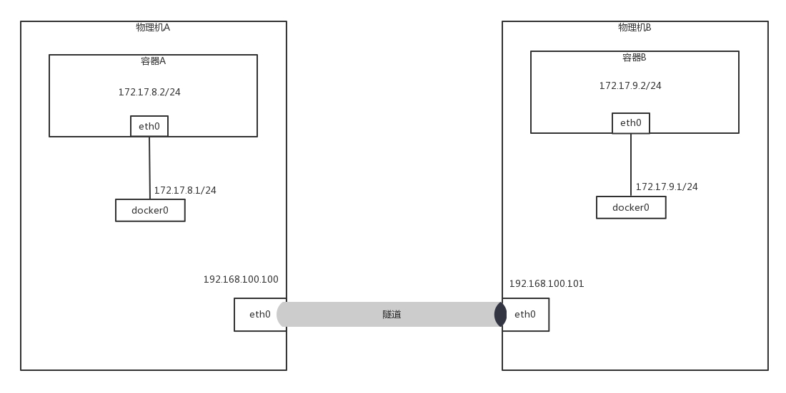
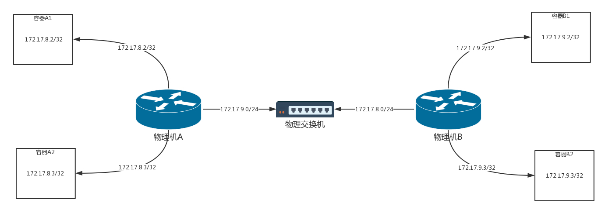
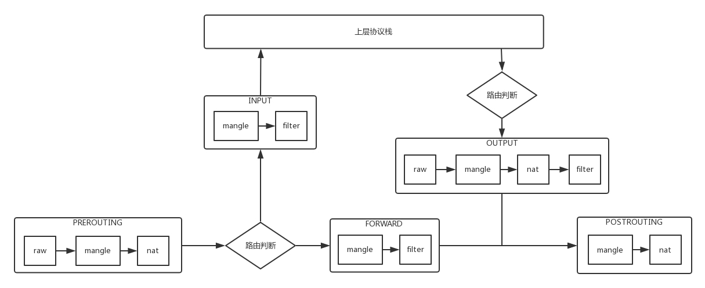
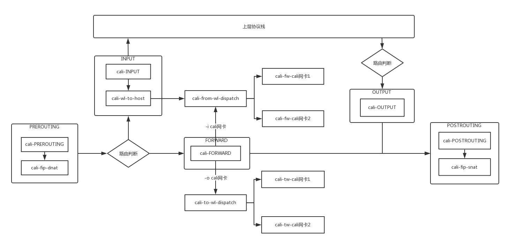
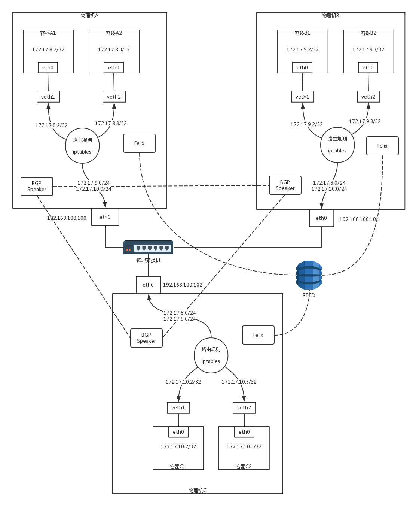
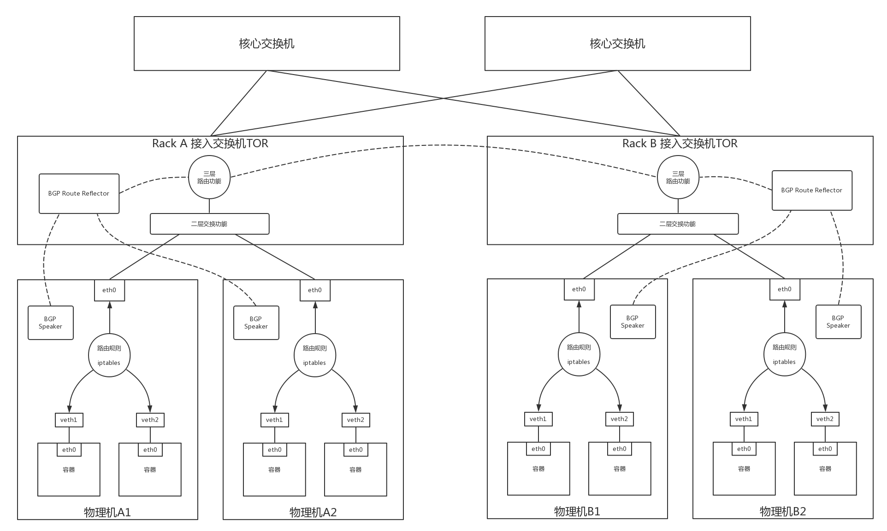
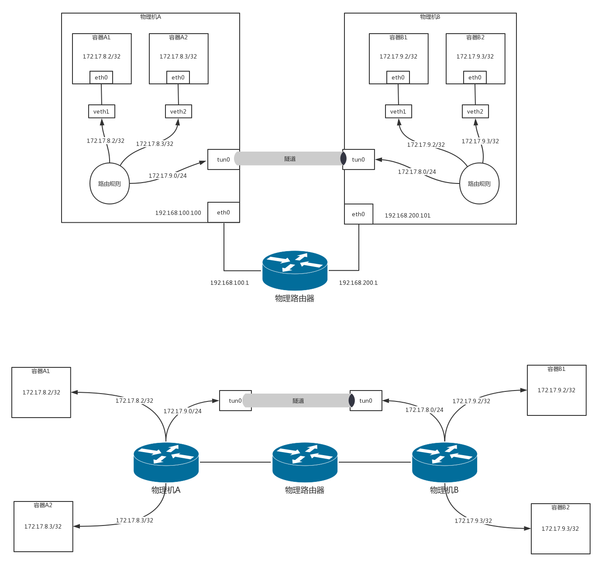

# 第31讲 | 容器网络之Calico：为高效说出善意的谎言

## 笔记

### Calico 网络模型的设计思路



可以看见图中的两台物理机. 物理网卡是同一个二层网络里面的. 由于两台物理机的容器网段不同, 可以将两台物理机配置成为路由器, 并按照容器的网段配置路由表.

设计思路:

* 容器`A`请求到容器`B`
	* **物理机A路由规则** 要想访问网段`172.17.9.0/24`, 下一跳是`192.168.100.101`(物理机B).
	* **物理机B路由规则** 要访问`172.17.9.0/24`, 从`docker0`的网卡进去
* 从容器`B`返回
	* **物理机B路由规则** 要想访问网段`172.17.8.0/24`, 下一跳是`192.168.100.100`(物理机A)
	* **物理机A路由规则** 要访问`172.17.8.0/24`, 从`docker0`的网卡进去即可.

**Calico 网络的大概思路, 不走Overlay网络(虚拟机和云中的这些技术组成的网络称为`Overlay`网络, 这是一种基于物理网络的虚拟化网络实现), 不引入另外的网络性能损耗, 而是将转发全部用三层(IP)网络的路由转发来实现**

如果全部走三层的路由规则, 没必要每台机器都用一个`docker0`, 浪费了一个`IP`地址.

* 直接用路由转发到`veth pair`在物理机这一端的网卡
* 容器内的路由规则设定: 把容器外面的`veth pair`网卡算作默认网关, 下一跳就是外面的物理机.

拓扑图变化如下:


### Calico 网络的转发细节

容器`A1`的`IP`地址为`172.17.8.2/32`, 这里是`32`. 将容器`A1`作为一个单点的局域网了.

容器`A1`内的默认路由, `Calico`配置为:

```
default via 169.254.1.1 dev eth0 
169.254.1.1 dev eth0 scope link 
```

但是没有网卡是`169.254.1.1`这个地址.

网关原理:

当一台机器要访问网关的时候, 首先会通过`ARP`获得网关的`MAC`地址, 然后将目标`MAC`变为网关的`MAC`, 而网关的`IP`地址不会在任何网络包头里面出现. **只要能找到对应的MAC, 响应ARP就可以了**

**不改变IP地址的网关是转发网关**, **改变IP地址的网关是NAT网关**.

ARP本地有缓存, 通过`ip neigh`查看

```
169.254.1.1 dev eth0 lladdr ee:ee:ee:ee:ee:ee STALE
```

这个`MAC`地址是`Calico`塞进去的, 可以响应`ARP`, 发出的包的目标`MAC`就是这个`MAC`地址.

发现`veth1`就是这个`MAC`地址, 所以容器A1里发出的网络包, 第一跳就是这个`veth1`这个网卡, 也就到达了物理机`A`这个路由器.

物理机`A`上有三条路由规则, 分别是去两个本机的容器的路由， 以及去`172.17.9.0/24`, 下一跳为物理机`B`.

```
# 物理机A的路由规则
172.17.8.2 dev veth1 scope link 
172.17.8.3 dev veth2 scope link 
172.17.9.0/24 via 192.168.100.101 dev eth0 proto bird onlink
```

同理, 物理机`B`上也有三条路由规则, 分别是去两个本机的容器的路由, 以及去`172.17.8.0/24`, 下一跳为物理机`A`.

```
172.17.9.2 dev veth1 scope link 
172.17.9.3 dev veth2 scope link 
172.17.8.0/24 via 192.168.100.100 dev eth0 proto bird onlink
```

简化拓扑图如下



**物理机化身为路由器, 通过路由器上的路由规则, 将包转发到目的地**. 在这个过程中, **没有隧道封装解封, 仅仅是单纯的路由转发, 性能会好很多**.

### Calico 的架构

#### 路由配置组件 Felix

如果容器不断地创建, 删除， 节点不断地加入, 退出. 路由情况就会变得非常复杂.


一台物理机上, 每创建一个容器, 也需要多配置一条指向这个容器的路由. 每台物理机上有一个`agent`, 当创建和删除容器的时候自动做这件事. 这个`agent`在`Calico`中称为`Felix`.

#### 路由器广播组件 BGP Speaker

当`Felix`配置了路由之后, 如何将路由信息, 也即将"如何到达我这个节点, 访问我这个节点上的容器"这些信息, 广播出去.

这个就是**路由协议**, 路由协议就是将"我能到哪里, 如何能到我”的信息广播给全网出去, 从而客户端可以一跳一跳地访问目标地址. `Calico`使用的是`BGP`协议.

在`Calico`中, 每个`Node`上运行一个软件`BIRD`, 作为`BGP`的客户端. 将"如何到达我这个Node, 访问我这个Node上的容器"的路由信息广播出去. 所有`Node`上的`BGP Speaker`都互相建立连接, 形成了全互连的情况, 这样每当路由有所变化的时候, 所有节点都能够收到了.

#### 安全策略组件

`Calico`中实现了配置网络策略`Network Policy`, 可以灵活配置两个容器通或者不通.



`Calico`也是使用`iptables`实现的. 上图里的内容是`iptables`在内核处理网络包的过程中可以其嵌入的处理点. `Calico`也是在这些点上设置相应的规则.



**当网络包进入物理机上的时候**, 进入`PREOUTING`规则, 这里面有一个规则是`cali-fip-dnat`, 这是实现浮动`IP`(`Floating IP`的场景, 主要将外网的`IP`地址`dnat`为容器内的`IP`地址.

接下来可以根据路由判断, **是到本地的, 还是转发出去的.**

如果**是本地**, 走`INPUT`规则, 里面有个规则是`calo-wl-to-host`, `wl`的意思是`workload`, 也即容器. 用来判断从容器发到物理机的网络包是否符合规则的. `cali-from-wl-dispatch`, 是匹配从容器来的包. 如果有2个容器, 则会有2个容器网卡, 这类面内嵌有详细的规则"cali-fw-cali 网卡1"和"cali-tw-cali 网卡2", `fw`就是`from workload`, 也就是匹配从容器1来的网络包和从容器2来的网络包.

如果是**转发**出去的, 走`FORWARD`规则, 里面有个规则`cali-FORWARD`. 这里面分两种情况, 一种是从容器里面发出来, 转发到外面的. 另一种是从外面发进来, 转发到容器里面的.

**从容器里面发出来, 转发到外面的**匹配规则`cali-from-wl-dispatch`, 也即`from workload`.

**从外面发进来, 转发到容器里面的**匹配规则`cali-to-wl-dispatch`, 也即`to workload`.

如果有2个容器, 则会有2个容器网卡, 这类面内嵌有详细的规则"cali-fw-cali 网卡1"和"cali-tw-cali 网卡2", `tw`就是`to workload`, 也就是匹配发往容器1的网络包和发送到容器2的网络包.

接下来是**OUPUT**规则, 里面有`cali-OUTPUT`. 

接下来是`POSTROUTING`规则, 里面有一个规则是`cali-fip-snat`, 也即发出去的时候， 将容器网络IP转换为浮动`IP`地址. **SNAT规则**



### 全连接复杂性与规模问题

**BGP**互联非常复杂, 如果节点数据在多, 全互连模式过于复杂. 使用组件`BGP Route Reflector`, 也是用`BIRD`实现的. 有了它, `BGP Speaker`就不用全互连了, 而是都直连它, 它负责将全网的路由信息广播出去. 有多个`BGP Router Reflector`, 每个`BGP Router Reflector`管一部分.

服务器和`BGP Router Reflector`之间使用的是数据中心内部的路由协议`iBGP`, `BGP Router Reflector`之间使用的是数据中心之间的路由协议`eBGP`.



上图, 一个机器上有多台机器, 每台机器上面启动多个容器, 每台机器上都有可以到达这些容器的路由. 每台机上都启动一个`BGP Speaker`, 然后将这些路由规则上报到这个`Rack`上介入交换机的`BGP Route Reflector`, 将这些路由通过`iBGP`协议告知到介入交换机的三层路由功能.

介入交换机之间也建立`BGP`连接, 相互告知路由, 因而一个`Rack`里面的路由可以告知另一个`Rack`. 有多个核心或者汇聚交换机将介入交换机连接起来.

* 如果核心和汇聚起二层互动的作用, 则接入和接入之间交换路由即可.
* 如果核心和回去交换机起三层路由的作用, 则路由需要通过核心或者回去交换机进行告知.

### 跨网段访问问题

跨网段是指物理机跨网段.

上述的前提是物理机`A`和物理机`B`是同一个网段的, 是连接在同一个交换机上的. 如果不在同一个网段.



如, 物理机A的网段是`192.168.100.100/24`, 物理机B的网段是`192.168.200.101/24`, 这样两台机器就不能通过二层交换机连接起来了, 需要在中间放一台路由器, 做一次路由转发, 才能跨网段访问.

上图, 物理机B上的容器要访问物理机A上的容器, 

* 第一跳就是物理机B, IP为`192.168.200.101`
* 第二跳是中间的物理路由器右面的网口, IP为`192.168.200.1`
* 第三跳才是物理机A,IP为`192.168.100.100`.

物理机A根本不可能知道从物理机B出来之后的下一跳是谁, 况且中间可能隔着多个路由器.

两种解决方案:

1. 让中间的所有路由器是被`Calico`, 本来它们互相告知路由只互相告知物理机的,现在还要告知容器的网段.
2. 在物理机A和物理机B之间打一个**隧道**, 在隧道的两个端点上进行封装, 将容器的`IP`作为乘客协议放在隧道里面, 而物理主机的`IP`放在外面作为承载协议. 这样**不管外层的IP通过传统的物理网络, 走多少跳到达目标物理机, 从隧道两端看起来, 物理机A的下一跳就是物理机B**

这就是`Calico`的**IPIP**模式.

在物理机A上可见如下路由表.

```
172.17.8.2 dev veth1 scope link 
172.17.8.3 dev veth2 scope link 

# 通过 tun0设备, 经由下一跳路由器入口的 192.168.200.101
172.17.9.0/24 via 192.168.200.101 dev tun0 proto bird onlink
```

容器`A`里面的`172.17.8.2`, 去`ping`容器`B1`里面的`172.17.9.2`, 首先回到物理机`A`. 在物理机`A`上根据上面的规则, 会转发给`tun0`, 并在这里对包做封装:

* 内层源`IP`为`172.17.8.2`
* 内层目标`IP`为`172.17.9.2`
* 外层源`IP`为`192.168.100.100`
* 外层目标`IP`为`192.168.200.101`


将这个包从`eth0`发出去, 在物理网络上会使用外层的`IP`进行路由, 最终到达物理机`B`在物理机`B`上, `tun0`会解封装, 将内存的源`IP`和目标`IP`拿出来, 转发给相应的容器.

## 扩展

### TUN/TAP

TUN 和 TAP 分别是虚拟的三层和二层网络设备，也就是说，我们可以从 TUN 拿到的就是 IP 层的网络数据包了，而 TAP 则是二层网络包