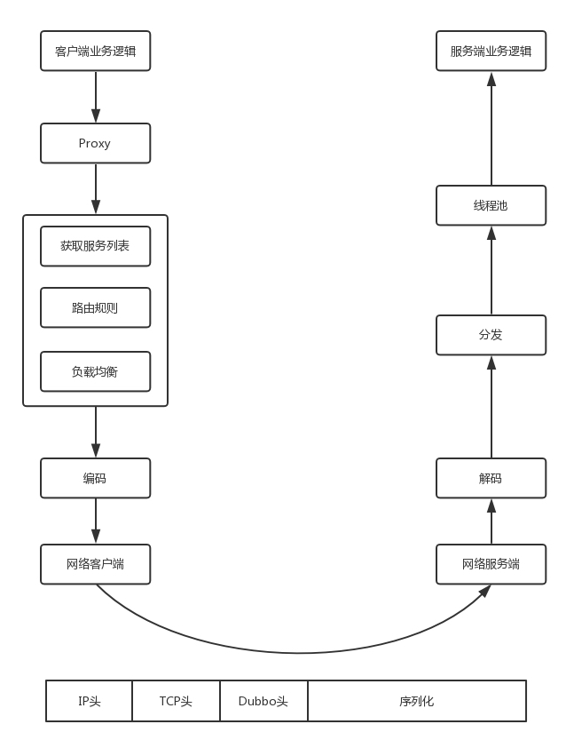
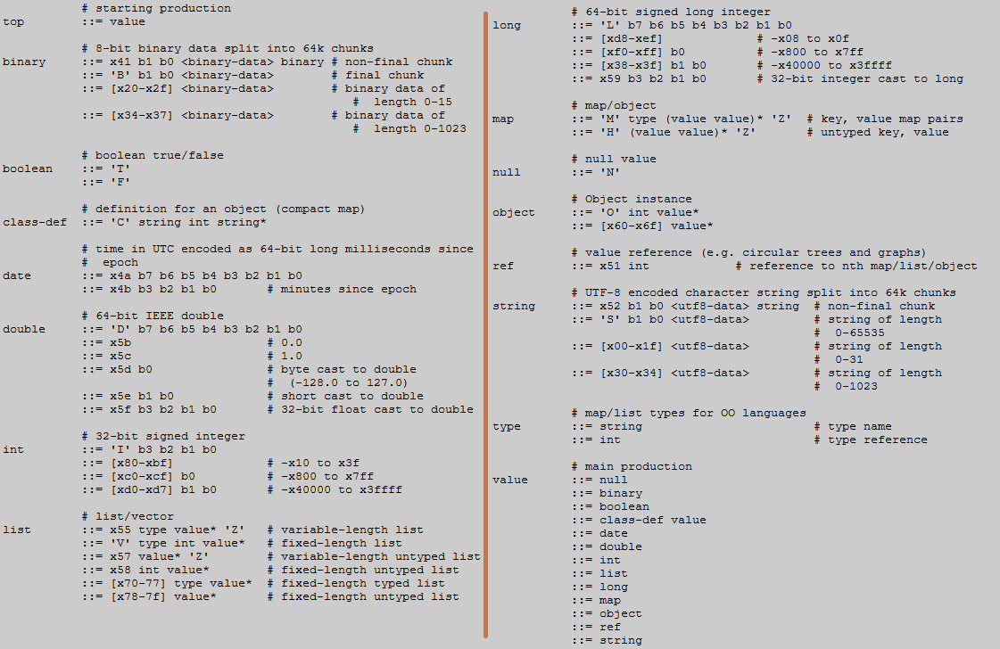

# 第35讲 | 二进制类RPC协议：还是叫NBA吧，总说全称多费劲

## 笔记

### 数据中心内部是何如相互调用的?


应该用二进制还是文本类? 其实文本的最大问题是, 占用字节数目比较多. 比如数字`123`, 其实本来二进制`8`位就够了, 但是如果变成文本, 就成了字符串`123`. 如果是`UTF-8`编码的话, 就是三个字节. 如果是`UTF-16`, 就是六个字节. **同样的信息, 要多分好多空间, 传输起来也更加占带宽, 也是也高**.

对于数据中心内部调用, 很多地方采用更加省空间和带宽的二进制的方案.

**Dubbo**



`Dubbo`会在客户端本地启动一个`Proxy`, 其实就是客户端的`Stub`, 对于远程调用都通过这个`Stub`进行封装.

接下来, `Dubbo`会从注册中心获取服务端的列表, 根据路由规则和负载均衡规则, 在多个服务端中选择一个最合适的服务端进行调用.

调用服务端的时候:

1. 首先要进行编码和序列化, 形成`Dubbo`头和序列化的方法和参数.
2. 将编码好的数据, 交给网络客户端进行发送.
3. 网络服务端收到消息后, 进行解码.
4. 然后将任务发给某个线程进行处理.
5. 在线程中会调用服务端的代码逻辑, 然后返回结果.

### 如何解决约定问题

`Dubbo`中默认的`RCP`协议是`Hessian2`. `Hessian2`和前面的二进制`RPC`有什么区别?

原来要定一个协议文件, 然后通过这个文件生成客户端和服务端的`Stub`, 才能进行互相调用, 这样使得修改会不方便. `Hessian2`不需要定义这个协议文件, 而是自描述的.

所谓的自描述就是, 关于调用哪个函数, 参数是什么, 另一方不需要拿到某个协议文件, 拿到二进制, 靠它本身根据`Hessian2`的规则, 就能解析出来.

原来的协议文件的场景, 有点像两个人事先约定好, `0`表示方法`add`, 然后后面会传两个数. 这样一方发送`012`, 量一方知道是将`1`和`2`加起来. 但是不知道协议文件的, 当它收到`012`的时候, 完全不知道代表什么意思.

字描述的场景, 像两个人说的每句话都带前因后果. 传递的是"函数:add, 第一个参数1, 第二个参数 2"". 相当于综合了`XML`和二进制共同优势的一个协议.

**Hessian2的序列化语法描述文件**



`add(2,3)`被序列化之后是什么样?

```
H x02 x00     # Hessian 2.0
C          # RPC call
 x03 add     # method "add"
 x92        # two arguments
 x92        # 2 - argument 1
 x93        # 3 - argument 2
```

* `H`开头, 表示使用的协议是`Hession`, `H`的二进制是`0x48`.
* `C`开头, 表示这是一个`RCP`调用.
* `0x03`, 表示方法名是三个字符.
* `0x92`, 表示有两个参数. 其实这里存的应该是`2`, 加上`0x90`, 是为了防止歧义, 表示这里一定是一个`int`.
* 第一个参数是`2`, 编码为`0x92`, 第二个参数是`3`, 编码为`0x93`

这个就是**自描述**.

`Hessian2`是面向对象的, 可以传输一个对象.

```
class Car {
 String color;
 String model;
}
out.writeObject(new Car("red", "corvette"));
out.writeObject(new Car("green", "civic"));
---
C            # object definition (#0)
 x0b example.Car    # type is example.Car
 x92          # two fields
 x05 color       # color field name
 x05 model       # model field name

O            # object def (long form)
 x90          # object definition #0
 x03 red        # color field value
 x08 corvette      # model field value

x60           # object def #0 (short form)
 x05 green       # color field value
 x05 civic       # model field value
```

### 如何解决 RPC 传输问题?

在`Dubbo`里面, 使用了`Netty`的网络传输框架.

`Netty`是一个非阻塞的基于事件的网络传输框架, 在服务端启动的时候, 会监听一个端口, 并注册以下的事件:

* **连接事件**, 当收到客户端的地连接事件时, 会调用`void connected(Channel channel)`方法.
* **可写事件**, 会调用`void sent(Channel channel, Object message)`, 服务端向客户端返回响应数据.
* **可读事件**, 会调用`void received(Channel channel, Object message)`, 服务端在收到客户端的请求数据.
* **发生异常**, 会调用`void caught(Channel channel, Throwable exception)`

当事件触发之后, 服务端在这些函数中的逻辑, 可以选择直接在这个函数里面进行操作, 还是将请求分发到线程池去处理. 一般异步的数据读写都需要另外的线程池参与, 在线程池中会调用真正的服务端业务代码逻辑, 返回结果.

微服务, 粒度更细, 模块之间的关系更加复杂. 在使用二进制的方式进行序列化对于接口的定义, 传的对象`DTO`, 还是需要共享`JAR`. 因为只有客户端和服务端都有这个`JAR`, 才能成功地序列化和反序列化. `JAR`的依赖会更加复杂.

* RESTful + JSON 更为简单和灵活
* RESTful 性能会降低, 需要通过横向扩展来抵消单机的性能损耗

## 扩展