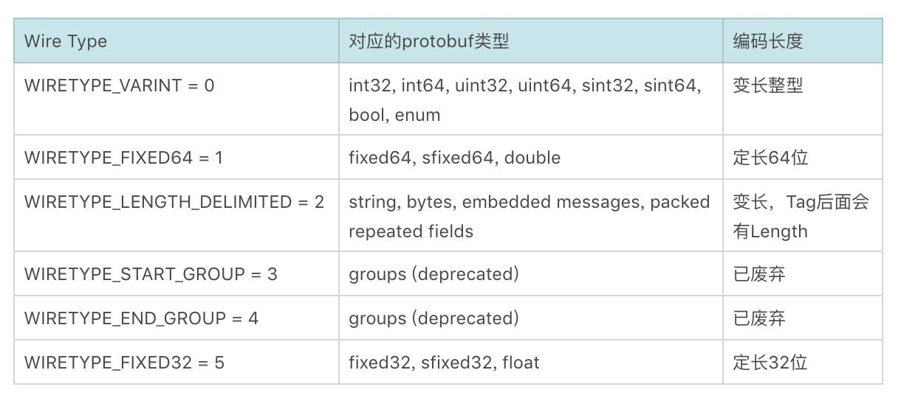

# 第36讲 | 跨语言类RPC协议：交流之前，双方先来个专业术语表

## 笔记

* 二进制的传输性能好, 文本类的传输性能差一些
* 二进制的难以跨语言, 文本类的可以跨语言
* 写协议文件的更严谨一些, 不写协议文件的灵活一些

对`RPC`框架的要求:

1. 传输性能很重要
2. 跨语言很重要
3. 即严谨又灵活, 添加个字段不用重新编译和发布程序
4. 既有服务发现, 也有服务治理

### Protocol Buffers

`GRPC`满足二进制和跨语言.

* 二进制, 压缩效率高.
* 跨语言, 更灵活.

二进制序列化协议是`Protocol Buffers`. 定义的协议文件`.proto`.

```
syntax = “proto3”;
package com.geektime.grpc
option java_package = “com.geektime.grpc”;
message Order {
  required string date = 1;
  required string classname = 2;
  required string author = 3;
  required int price = 4;
}

message OrderResponse {
  required string message = 1;
}

service PurchaseOrder {
  rpc Purchase (Order) returns (OrderResponse) {}
}
```

使用`Protocol Buffers`的语法, 定义两个消息的类型:

1. 发出去的参数
2. 返回的结果

里面的每一个字段, 如`date`, `classname`... 都有唯一的一个数字标识, 这样压缩的时候, 就不用传输字段名称了, 只传输这个数字标识就行了, 能节省很多空间.

最后定一个`Service`, 里面会有一个`RPC`调用的声明.

无论使用什么语言, 都有相应的工具生成客户端和服务端的`Stub`程序, 这样客户端就可以像调用本地一样, 调用远程的服务了.

### 协议约定问题

对于每一个字段, 使用的是`TLV(Tag, Length, Value)`的存储方法.

`Tag = (field_num << 3) | wire_type`. `field_num`就是在`proto`中, 给每个字段指定唯一的数字标识, 而`wire_type`用于标识后面的数据类型.



对于 string author = 3，在这里 field_num 为 3，string 的 wire_type 为 2，于是 (field_num << 3) | wire_type = (11000) | 10 = 11010 = 26；接下来是 Length，最后是 Value 为“liuchao”，如果使用 UTF-8 编码，长度为 7 个字符，因而 Length 为 7.

对于兼容性, 每一个字段都有修饰符.

* `required`: 这个值不能为空，一定要有这么一个字段出现.
* `optional`：可选字段，可以设置，也可以不设置，如果不设置，则使用默认值.
* `repeated`：可以重复 0 到多次.

给了客户端和服务端升级的可能性.

新增一个字段后, 可以设置为`optional`. 

* 先升级服务端, 当客户端发过来消息的时候, 是没有这个值的, 将它设置为一个默认值.
* 先升级客户端, 当客户端发来消息的时候, 是有这个值的, 那它将被服务端忽略.

### 网络传输问题

`HTTP 2.0`协议将一个`TCP`的连接, 切分成多个流, 每个流都有自己的`ID`, 而且流是有优先级的. 流可以是客户端发往服务端, 也可以是服务端发往客户端.

基于`HTTP 2.0`, `GRPC`和其他的`RPC`不同. 可定义四种服务方法.

#### 1. 单向 RPC

客户端发送一个请求给服务端, 从服务端获取一个应答, 就像一次普通的函数调用.

```
rpc SayHello(HelloRequest) returns (HelloResponse){}
```

#### 2. 服务端流式 RPC

服务端返回的不是一个结果, 而是一批. 客户端发送一个请求给服务端, 可获取一个数据流用来读取一系列信息. 客户端从返回的数据流里一直读取, 知道没有更多信息为止.

```
rpc LotsOfReplies(HelloRequest) returns (stream HelloResponse){}
```

#### 3. 客户端流式 RPC

客户端的请求不是一个, 而是一批. 客户端用提供的一个数据流写入并发送一系列信息给服务端. 一旦客户端完成小写写入, 就等待服务端读取这些信息并返回应答.

```
rpc LotsOfGreetings(stream HelloRequest) returns (HelloResponse) {}
```

#### 4. 双向流式 RPC

两遍都可以分别通过一个读写数据流来发送一系列消息. 这两个数据流操作是相互独立的, 所以客户端和服务端都能按其希望的任意顺序读写, 服务端可以在写应答前等待所有的客户端消息, 或者它可以先读一个消息再写一个消息, 或者读写相结合的其他方式. 每个数据流里消息的顺序都会被保持.

```
rpc BidiHello(stream HelloRequest) returns (stream HelloResponse){}
```

### 服务发现与治理问题

**Envovy**是一个高性能的`C++`写的`Proxy`转发器, 可以配置非常灵活的转发规则.

`Envovy`的配置:

1. `listener`, 监听的端口就称为`listener`
2. `endpoint`, 目标的`IP`地址和端口, 这个是`Proxy`最终请求转发到的地方.
3. `cluster`, 一个`cluser`具有完全形同行为的多个`endpoint`. 从`cluster`到`endpoint`的过程成为负载均衡, 可以轮询.
4. `route`, 有时候多个`cluster`具有类似的功能, 但是是不同的版本号, 可以通过`route`规则, 选择将请求路由到某一个版本号, 也即某一个`cluster`.

`Envovy`的作用:

* 配置路由策略. 两个版本, 一个占`99%`的流量, 一个占`1%`的流量.
* 负载均衡策略. 


所有这些节点的变化都会上传到注册中心, 所有这些策略都可以通过注册中心进行下发.

**注册中心可以称为注册治理中心**


**如果我们的应用能够意识不到服务治理的存在, 就是直接进行`GRPC`的调用就可以了**, 这就是未来服务治理的趋势**Service Mesh**.

也即应用之间的相互调用全部由`Envoy`进行代理, 服务之间的治理也被`Envoy`进行代理, 完全将服务治理抽象出来, 到平台层解决.


## 扩展