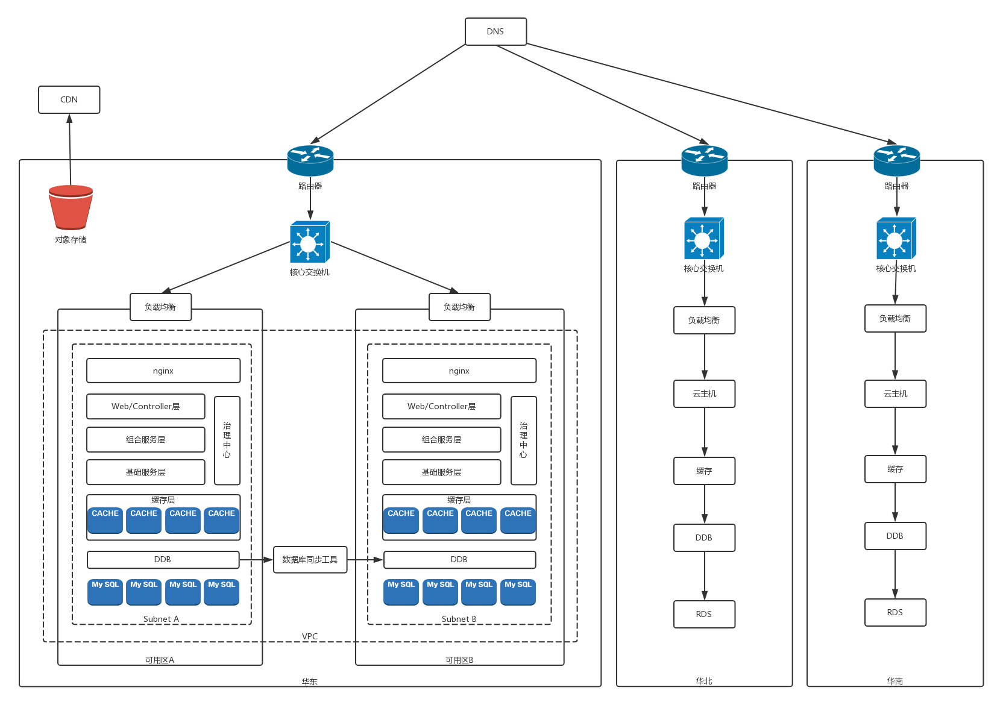
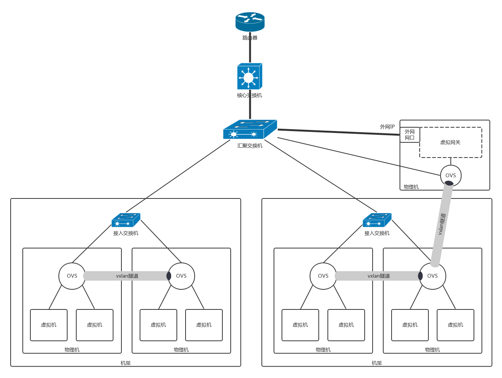
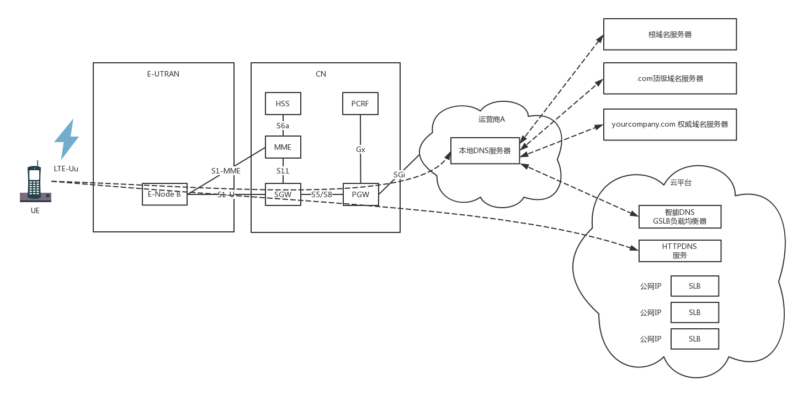

# 第37讲 | 知识串讲：用双十一的故事串起碎片的网络协议（上）

## 笔记

### 1. 部署一个高可用高并发的电商平台

为了高可用性, 没了每个点都能覆盖到(电商服务全国, 各地都要部署), **需要有多个机房, 形成多个可用区(Available Zone)**. 假如任意一个可用区挂了, 都不会受影响.

机柜里面的服务器, 每个机柜都有一个接入交换机, 有一个儿回去交换机将多个机柜连在一起.

这些服务器里面部署的都是计算节点, 每台上面都有`Open vSwitch`创建的虚拟交换机, 将来在这台机器上创建的虚拟机, 都会连到`Open vSwitch`上.

在云计算的界面**创建一个VPC(Virtual Private Cloud, 虚拟私有网络)**, 指定一个`IP`段, 这样以后你部署的所有应用都会在这个虚拟网络里, 使用你分配的这个`IP`段. 为了不同的`VPC`相互隔离, 每个`VPC`都会被分配一个`VXLAN`的`ID`. 尽管不同的用户的虚拟机有可能在同一个物理机上, 但是不同的`VPC`二层是不同的.

有两个可用区, 在`VPC`里面, **要为每一个可用区分配一个`Subnet`, 也就是在大的网段里分配两个小的网段**. 当两个可用区里面网段不同的时候, 就可以配置路由策略, 访问另外一个可用区, 走某一条路由了.

* 创建数据库
* 创建缓存集群
* 部署程序
* 负载均衡

### 2. 大声告诉全世界, 可以到我这里买东西

外网`IP`是放在虚拟网关的外网网口卡上的, 这个`IP`通过`BGP`路由让全世界知道.

* 每个可用区都有自己的汇聚交换机, 如果机器数目较多, 可以直接用核心交换机, 每个`Region`也有自己的核心交换区域.
* 核心交换外面是安全设备, 然后是边界路由器. 边界路由器会和多个运营商连接, 从而每个运营商都能访问到这个网站. 通过`BGP`将自己数据中心的外网`IP`向外广播。
* 每个运营商也有很多的路由器, 很多的点, 于是就可以将如何到达这些`IP`地址的路由信息, 广播到全国乃至全世界.

### 3. 打开手机来上网, 域名解析得地址.

* 客户的手机在附近寻找基站`eNodeB`, 发送请求, 申请上网.
* 基站将请求发给`MME`
	* `MME`对手机进行认证和鉴权.
	* 秦秋`HSS`看有没有钱, 在哪里上网.
* `MME`通过了手机认证之后, 开始建立隧道, 建设的数据通路分两段路, 其实就是两个隧道.
	* `eNodeB`到`SGW`
	* `SGW`到`PGW`
	* `PGW`之外就是互联网
* `PGW`会为手机分配一个`IP`地址, 手机上网都是带着这个`IP`地址.
* 运营商有一个本地的`DNS`, 手机会向这个`DNS`请求解析`DNS`.
	* 有缓存, 返回
	* 没缓存, 本地`DNS`需要递归地从根`DNS`服务器, 查看`.com`, 最终到权威`DNS`服务器
* 如果是智能`DNS`, 通过配置`CNAME`, 让它请求`GSLB`解析`CNAME`的域名, 这个过程`GSLB`就可以在解析这个域名的过程中, 通过自己的策略实现负载均衡.
* `GSLB`通过查看请求它的本地`DNS`服务器所在的运营商和地址, 然后将举例用户位置表较近的`Region`里面, 三个负载均衡`SLB`的公网`IP`地址, 返回给本地`DNS`服务器. 本地`DNS`解析器将结果缓存后, 返回给客户端.
* 手机`APP`可以直接绕过刚才的`DNS`解析, 通过`HTTPDNS`服务得到最终的公网`IP`地址.

## 扩展