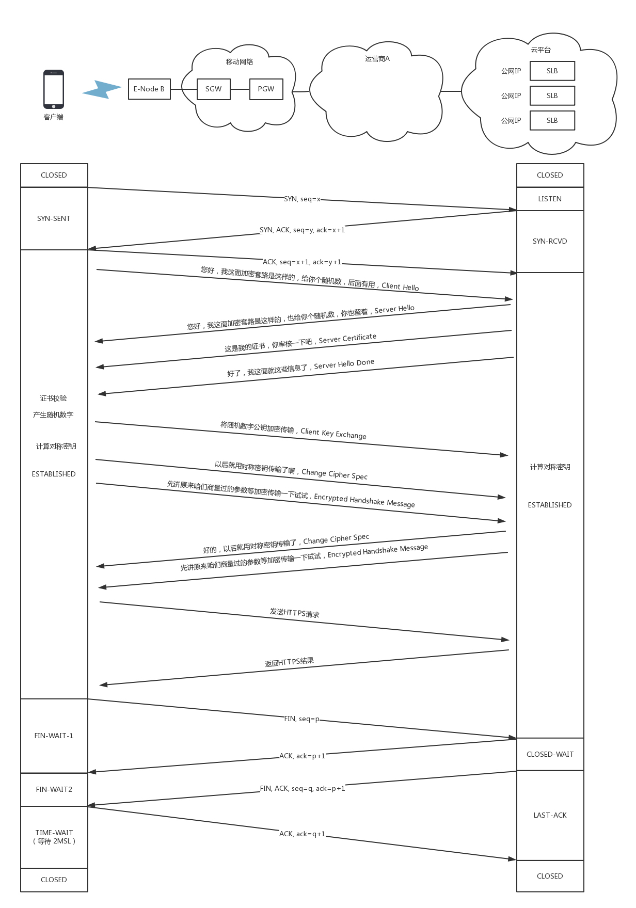
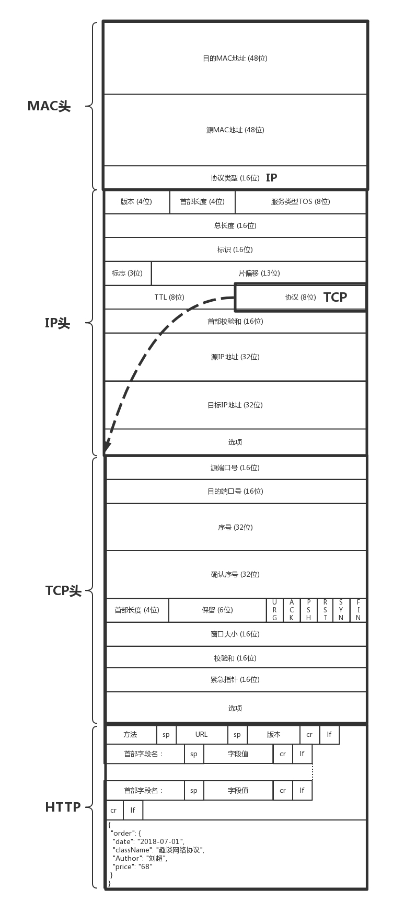

# 第38讲 | 知识串讲：用双十一的故事串起碎片的网络协议（中）

## 笔记

### 4. 购物之前看图片, 静态资源CDN


静态资源:

* 一个是接入层`nginx`后面的`varnish`缓存里面, 一般是静态页面.
* 比较大, 不经常更新的, 保存在对象存储里面.

这两个地方的静态资源都会配置`CDN`, 将资源下发到边缘节点.

* 配置了`CDN`之后, 权威`DNS`服务器上, 会为静态资源设置一个`CNAME`别名, 指向另外一个域名`cdn.com`, 返回给本地`DNS`服务器. **服务器DNS -> CDN的DNS**
* 当本地`DNS`服务器拿到这个新的域名时, 需要继续解析这个新的域名. 这个时候, 再访问的时候就是`cdn.com`的权威`DNS`服务器. **请求CDN的DNS**
* 在这个服务器, 一般会设置一个`CNAME`, 指向另外一个域名, 也即`CDN`网络的全局负载均衡器. **CDN设置CNAME->CDN的GSLB**
* 本地`DNS`请求`CDN`的全局负载均衡器解析域名, 全局负载均衡器会为用户选择一台合适的缓存服务器提供服务, 将`IP`返回给客户端, 客户端去访问这个边缘节点, 下载资源. 缓存服务器响应用户请求, 将用户所需内容传送到用户终端.
* 如果这台缓存服务器上并没有用户想要的内容, 那么这台服务器就要向它的上一级缓存服务器请求内容, 直至追溯到网站的资源服务器, 将内容拉到本地.

### 5. 看上宝贝点下单, 双方开始建立连接

做这些操作之前, 先**建立连接**.



`HTTPS`是基于`TCP`的, 要先建立`TCP`连接. 上面的例子中, `TCP`链接是从手机上的`APP`和负载均衡器`SLB`之间的.

尽管中间要经过很多的路由器和交换机, 但是`TCP`的连接是端到端的. `TCP`这一层和更上一层的`HTTPS`无法看到中间的包的过程. 在这里只看到端到端的行为.

`TCP`三次握手建立链接.

* 客户端和服务端都处于 **CLOSED**状态
* 服务端主动监听某个端口, 处于**LISTEN**状态
* 客户端主动发起连接`SYN`, 之后处于**SYN-SENT**状态.
* 服务端收到发起的连接, 返回`SYN`, 并且`ACK`, 只有处于**SYN-RCVD**状态
* 客户端收到服务端发送的`SYN`和`ACK`之后, 发送`ACK`的`ACK`, 之后处于**ESTABLISHED**状态. 因为客户端**发-收**成功了.
* 服务端收到`ACK`的`ACK`之后, 处于**ESTABLISHED**状态, 因为它的**发-收**成功了.

轮到`HTTPS`层建立连接, 在`HTTPS`的交换过程中, `TCP`层始终属于**ESTABLISHED**状态.

### 6. 发送下单请求网络包, 西行需要出网关

在用户层发送的是`HTTP`的网络包, 因为服务端提供的是`RESTful API`, 因为`HTTP`层发送的就是一个请求.

```
POST /purchaseOrder HTTP/1.1
Host: www.geektime.com
Content-Type: application/json; charset=utf-8
Content-Length: nnn
 
{
 "order": {
  "date": "2018-07-01",
  "className": "趣谈网络协议",
  "Author": "刘超",
  "price": "68"
 }
}
```

`HTTP`报文分为三大部分:

* 请求行
* 请求的首部
* 请求的正文实体

`HTTP`请求的报文格式就拼凑好了, 接下来浏览器或者移动`App`会把它交给一下层传输层.

交给传输层, 也是用`Socket`进行程序设计. `HTTP`是基于`TCP`协议的, 使用面向连接的方式发送请求, 通过`Stream`二进制流的方式传给对方. 到了服务器的, `TCP`会把二进制流编程一个报文段发送给服务器.

**IP层**

* **源地址**: `PGW`会给手机随机分配一个`IP`地址. 
* **目标地址**: 云平台的负载均衡的外网`IP`地址.

**链路层**

发送`ARP`协议, 获取网关的`MAC`地址. 然后将网关`MAC`作为目标`MAC`, 自己的`MAC`作为源`MAC`.



## 扩展