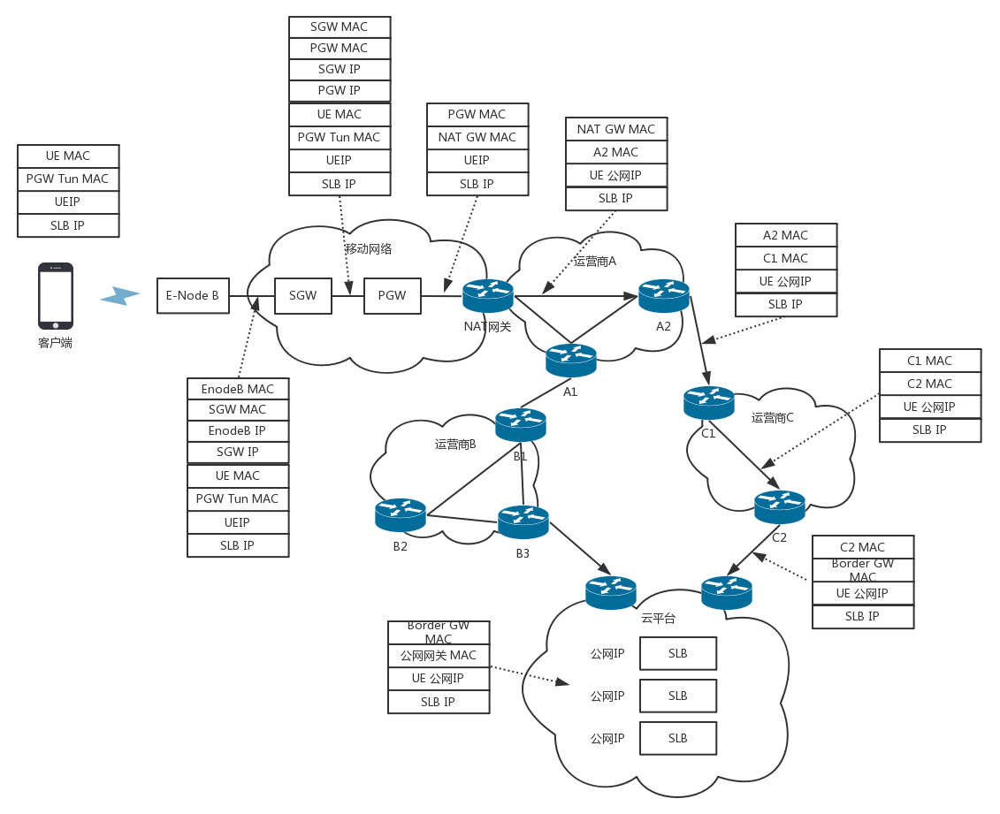
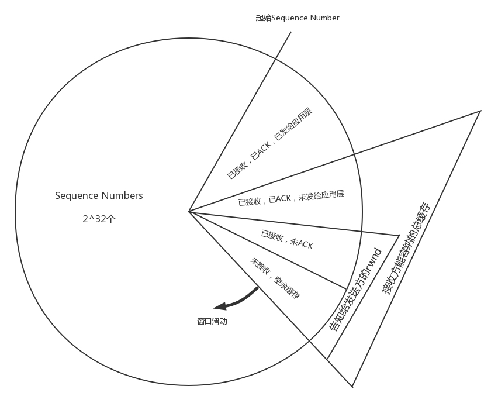
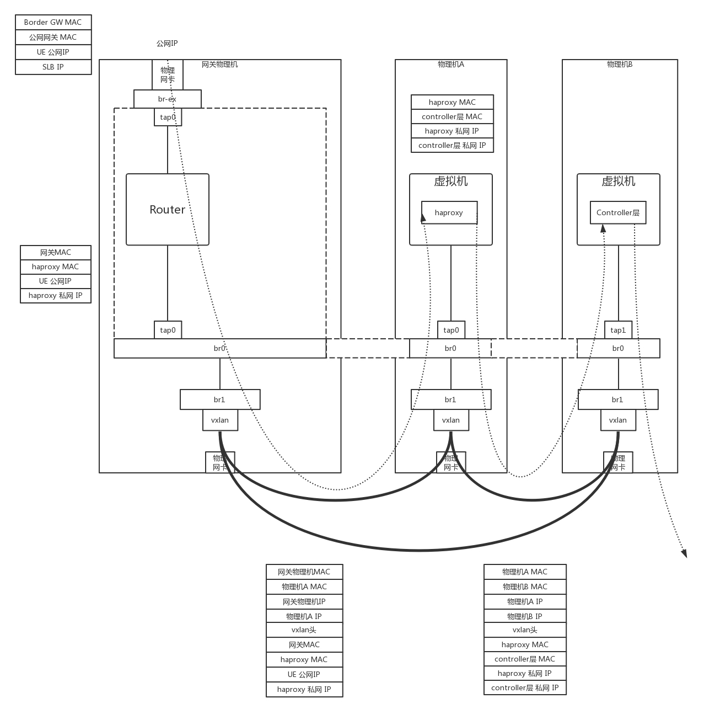

# 第39讲 | 知识串讲：用双十一的故事串起碎片的网络协议（下）

## 笔记

### 7. 一座座城池一道道关，流控拥塞与重传

对于手机来说, 默认的网关在`PGW`上. 在移动网络里面, 从手机到`SGW`, 到`PGW`是有一条隧道的. 在这条隧道里面, 会将上面的这个包作为隧道的乘客协议放在里面, 外面`SGW`和`PGW`在核心网机房的`IP`地址. 网络包直到`PGW`才将里面的包解出来, 转发到外部网络.

**从手机发出来的时候**

* 源 MAC：手机也即 UE 的 MAC；
* 目标 MAC：网关 PGW 上面的隧道端点的 MAC；
* 源 IP：UE 的 IP 地址；
* 目标 IP：SLB 的公网 IP 地址。

**进入隧道后, 要封装外层的网络地址, 网络包的格式为**

* 外层源 MAC：E-NodeB 的 MAC；
* 外层目标 MAC：SGW 的 MAC；
* 外层源 IP：E-NodeB 的 IP；
* 外层目标 IP：SGW 的 IP；
* 内层源 MAC：手机也即 UE 的 MAC；
* 内层目标 MAC：网关 PGW 上面的隧道端点的 MAC；
* 内层源 IP：UE 的 IP 地址；
* 内层目标 IP：SLB 的公网 IP 地址。

**从 SGW 到 PGW 的隧道**

* 外层源 MAC：SGW 的 MAC；
* 外层目标 MAC：PGW 的 MAC；
* 外层源 IP：SGW 的 IP；
* 外层目标 IP：PGW 的 IP；
* 内层源 MAC：手机也即 UE 的 MAC；
* 内层目标 MAC：网关 PGW 上面的隧道端点的 MAC；
* 内层源 IP：UE 的 IP 地址；
* 内层目标 IP：SLB 的公网 IP 地址。

在`PGW`的隧道端点将包解出来, 转发出去的时候, 一般在`PGW`出外部网路的路由器上, 会部署`NAT`服务, 将手机的`IP`地址转换为公网`IP`地址, 当请求在返回去的时候, 再`NAT`回来.

**从 PGW 出来之后**

* 源 MAC：PGW 出口的 MAC
* 目标 MAC：NAT 网关的 MAC
* 源 IP：UE 的 IP 地址
* 目标 IP：SLB 的公网 IP 地址

**在 NAT 网关**

* 源 MAC：NAT 网关的 MAC；
* 目标 MAC：A2 路由器的 MAC；
* 源 IP：UE 的公网 IP 地址； **这里已经NAT了**
* 目标 IP：SLB 的公网 IP 地址

出了`NAT`网关, 就从核心网到达了互联网. 每一个运营商的网络成为自治系统`AS`. 每个自治系统都有边界路由器, 通过它和外面的世界建立联系.

自治系统之间, 边界路由器之间使用`eBGP`广播路由.

通过运行`iBGP`, 使内部的路由器能够找到到达外网目的地最好的边界路由器.

**只换MAC, 不换目标IP地址. 就是所谓下一跳的概念**

手机到`SLB`的公网`IP`, 是一个端到端的连接, 如果丢包了, 需要借助`TCP`机制重新发送.

**TCP的滑动窗口协议**, 维护`Sequence Number`.

整个`TCP`的发送, 以开始会写上一个`Squence Number`, 从这个`Squence Number`开始, 每个包都有编号. 滑动窗口将接收方的网络包分成四个部分.

* 已经接收，已经 ACK，已经交给应用层的包；
* 已经接收，已经 ACK，未发送给应用层；
* 已经接收，尚未发送 ACK；
* 未接收，尚有空闲的缓存区域

当`ACK`过的包发给应用层之后, `TCP`层的缓存就空了出来, 会导致上面图中的**大三角(接收方能够容纳的总缓存), 整体顺时针滑动**.  **小三角(接收方告知发送方的窗口总大小), 也即还没有完全确认收到的缓存大小, 如果把这些填满了, 就不能再发了, 因为没确认收到, 所以一个都不能扔**.

### 8. 从数据中心进网关，公网 NAT 成私网

在虚拟网关节点的外网网口上, 会有一个`NAT`规则, **将公网IP地址转换为VPC里面的私网IP地址, 这个私网IP地址就是SLB的HAProxy所在的虚拟机的私网IP地址**.

当网络包里面的目标`IP`变成私有`IP`地址之后, 虚拟路由会查找路由规则, 将网络包从下发的私网网口发出来. 这个时候包的格式为:

* 源 MAC：网关 MAC；
* 目标 MAC：HAProxy 虚拟机的 MAC；
* 源 IP：UE 的公网 IP；
* 目标 IP：HAProxy 虚拟机的私网 IP。

### 9. 进入隧道打标签，RPC 远程调用下单

在虚拟机路由节点上, 也会有`OVS`, 将网络包封装在`VXLAN`隧道里面, `VXLAN ID`就是租户创建`VPC`的时候分配的. 包的格式为:

* 外层源 MAC：网关物理机 MAC；
* 外层目标 MAC：物理机 A 的 MAC；
* 外层源 IP：网关物理机 IP；
* 外层目标 IP：物理机 A 的 IP；
* 内层源 MAC：网关 MAC；
* 内层目标 MAC：HAProxy 虚拟机的 MAC；
* 内层源 IP：UE 的公网 IP；
* 内层目标 IP：HAProxy 虚拟机的私网 IP

在物理机A上, OVS会将包从`VXLAN`隧道里面解出来, 发给`HAProxy`所在的虚拟机. `HAProxy`是一个四层负载均衡, 会将请求转发给后端的多个`Controller`层的一个.

`HAProxy`发出去的网络包的格式为:

* 源 MAC：HAProxy 所在虚拟机的 MAC；
* 目标 MAC：Controller 层所在虚拟机的 MAC；
* 源 IP：HAProxy 所在虚拟机的私网 IP；
* 目标 IP：Controller 层所在虚拟机的私网 IP。

这个包发出去之后, 还是会被物理机上的`OVS`放入`VXLAN`隧道里面, 网络包格式为:

* 外层源 MAC：物理机 A 的 MAC；
* 外层目标 MAC：物理机 B 的 MAC；
* 外层源 IP：物理机 A 的 IP；
* 外层目标 IP：物理机 B 的 IP；
* 内层源 MAC：HAProxy 所在虚拟机的 MAC；
* 内层目标 MAC：Controller 层所在虚拟机的 MAC；
* 内层源 IP：HAProxy 所在虚拟机的私网 IP；
* 内层目标 IP：Controller 层所在虚拟机的私网 IP。

在物理机B上, OVS会将包从VXLAN隧道里面解出来, 发给`Controller`层所在的虚拟机.

**在 HAProxy 和 Controller 层之间, 维护一个TCP的连接**.

`Crontoller`层收到包之后, 它是关心`HTTP`里面是什么, 于是解开`HTTP`的包, 发现是一个`POST`请求, 内容是下单购买一个课程.

## 扩展