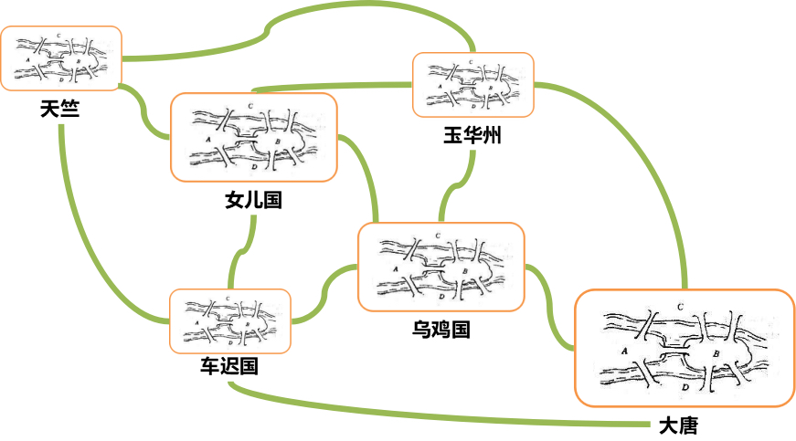

# 第9章 路由协议：西出网关无故人，敢问路在何方 

## 知识点

### 路由表

路由器是一台网络谁被, 有多张网卡. 当一个口的网络包送到路由器时，它会根据一个本地的转发信息库，来决定如何正确地转发流量。这个转发信息库通常被称为路由表。

一张路由表有多条路由规则.

一条规则至少包含这三项信息

* 目的网络: 这个包去哪?
* 出口设备: 将包从哪个口扔出去?
* 下一跳网关: 下一个路由器的地址


```
ip route add TARGET via GW dev IFACE src SOURCE_IP
```

* dev表示流出的接口
* via:经由下一跳路由器入口的`ip`


```
ip route add 10.176.48.0/20 via 10.173.32.1 dev eth0
```

要去`10.176.48.0/20`这个目标网络, 要从`eth0`这个端口出去, 经过`10.173.32.1`.

根据目的`IP`地址类配置路由.

### 配置策略路由

**策略路由**, 根据多个参数来配置路由.

配置多个路由表, 可以根据源`IP`地址, 入口设备, TOS等选择路由表, 然后在路由表中查找路由.

```
ip rule add from 192.168.1.0/24 table 10 
ip rule add from 192.168.2.0/24 table 20
```

* 从`192.168.1.0/24`这个网段来, 使用`table 10`路由表
* 从`192.168.2.0/24`这个网段来, 使用`table 20`路由表

#### 配置带权重的

```
ip route add default scope global nexthop via 100.100.100.1 weight 1 nexthop via 200.200.200.1 weight 2
```

下一跳有**两个地方**，分别是 100.100.100.1 和 2。

示例, 路由器接两个网线, 属于两个运营商. 线连到路由器上。两个用户的`IP`地址为 `192.168.1.101/24`和`192.168.1.102/24`，网关都是`192.168.1.1/24`.

路由器是一个`NAT`路由器.


* 运营商1给路由器分配的地址是`183.134.189.34/32`, 网关是`183.134.188.1/32`
* 运营商2给路由器分配的地址是`60.190.27.190/30`, 网关是`60.190.27.189/30`

可以将路由配置如下

```
$ ip route list table main 

#果有数据包要送到60.190.27.189/30这个网段, 就直接将数据包由eth3接口送出即可, 
# 来源地址是 60.190.27.190
60.190.27.189/30 dev eth3  proto kernel  scope link  src 60.190.27.190

183.134.188.1 dev eth2  proto kernel  scope link  src 183.134.189.34
192.168.1.0/24 dev eth1  proto kernel  scope link  src 192.168.1.1
127.0.0.0/8 dev lo  scope link
default via 183.134.188.1 dev eth2
```

* `proto`：此路由的路由协定，主要有
	* `redirect`
	* `kernel`直接由核心判断自动设定
	* `boot`
	* `static`
	* `ra`
	* ...
* `scope`: 路由的范围，主要是`link` ，亦即是与本裝置有关的直接连线。

配置规则如下:

1. 如果去运营商2, 走`eth3`
2. 如果去运营商1, 走`eth2`
3. 如果访问内网, 走`eth1`
4. 如果所有的规则都匹配不上, 默认走运营商

动态匹配路由:

添加一个`table`, 名为`chao`

```
# echo 200 chao >> /etc/iproute2/rt_tables
```

添加一条规则:

```
# ip rule add from 192.168.1.101 table chao
# ip rule ls
0:    from all lookup local 
32765:    from 192.168.1.101 lookup chao
32766:    from all lookup main 
32767:    from all lookup default

```

设定规则, 从`192.168.1.101`来的包都经过这个`chao`这个新的路由表.

添加规则:

```
# ip route add default via 60.190.27.189 dev eth3 table chao
# ip route flush cache
```

租户A, 只会访问到慢速网络.

### 动态路由算法

可以根据路由协议算法生成动态路由表。



我们可以将复杂的路径，抽象为一种叫作图的数据结构。走的路越少越好, 道路越短越好. 转换为**如何在途中找到最短路径**的问题.

* Bellman-Ford算法
* Dijkstra算法

#### 距离矢量路由算法

距离矢量路由（distance vector routing）。它是基于 Bellman-Ford 算法。

基本思路是:

* 每个路由器都保存一个路由表，包含多行
* 每行对应网络中的一个路由器
* 每一行包含两部分信息
	* 一个是要到目标路由器，**从那条线出去**
	* 另一个是到目标路由器的**距离**

每个路由器都是知道全局信息的。

**如何更新**每个路由器都知道自己和邻居之间的距离, 每过几秒, 每个路由器都将自己所知的到达所有的路由器的距离告知邻居, 每个路由器也能从邻居那里得到相似的信息。

每个路由器根据新收集的信息，计算和其他路由器的距离，比如自己的一个邻居距离目标路由器的距离是 M，而自己距离邻居是 x，则自己距离目标路由器是 x+M。

##### 缺点

**好消息传得快，坏消息传得慢。**

* 新的路由器加入网络, 它的邻居就能很快发现它，然后将消息广播出去。要不了多久，整个网络就都知道了。
* 一个路由器挂了, 挂的消息是没有广播的。当每个路由器发现原来的道路到不了这个路由器的时候，感觉不到它已经挂了，而是试图通过其他的路径访问，直到试过了所有的路径，才发现这个路由器是真的挂了。


B 和 C 互相询问, 数越来越大，直到超过一个阈值，我们才能判定 A 真的挂了。

所以判断一个路由是否挂了:

* 要问一圈
* **或者**超过一定时间

**每次发送的时候，要发送整个全局路由表。**

##### 总结

当网络规模小的时候可以, 网络规模大, 不适用。小于`15`跳。

#### 链路状态路由算法

链路状态路由（link state routing），基于`Dijkstra`算法。

* 路由器启动的时候, 首先发现邻居, 向邻居`say hello`, 邻居都回复.
* 计算和邻居的举例, 发送一个`echo`, 要求马上返回, 除以二就是距离.
* 将自己和邻居之间的链路状态包广播出去, 发送到整个网络的每个路由器.
* 每个路由器都能够收到它和邻居之间的关系的信息.
* 每个路由器都能在自己本地构建一个完整的图，然后针对这个图使用Dijkstra 算法，找到两点之间的最短路径。

##### 区别

* 距离矢量路由协议: 更新时发送整个路由表.
* 链路状态路由协议：广播更新的或改变的网络拓扑.
	* 更新细腻小, 节省了带宽和CPU利用率
	* 路由器挂了, 邻居都会广播这个消息, 可以使得坏消息迅速收敛

### 动态路由协议

#### 基于链路状态路由算法的 OSPF

**内网使用**

OSPF（Open Shortest Path First，开放式最短路径优先）

主要应用在数据中心内部, 用于路由决策, 因而成为**内部网关协议(Interior Gateway Protocol, IGP)**

有时候`OSPF`可以发现多个最短的路径, 可以在这多个路径中进行负载均衡, 被称为**等价路由**.


有了等价路由, 到一个地方可以有相同的两个路线, 可以分摊流量, 还可以当一条路不通的时候，走另外一条路。

#### 基于距离矢量路由算法的 BGP

**外网使用**

外网路由协议（Border Gateway Protocol，简称BGP）。

内部可以选近的走, 外部需要`Policy`。

对于网络包同样，每个数据中心都设置自己的 Policy。这就好比，虽然从我家里到目的地最近，但是不能谁都能从我家走啊！

在网络世界，这一个个国家成为自治系统AS（Autonomous System）。

自治系统分几种类型:

* `Stub AS`: 对外只有一个连接。这类`AS`不会传输其他`AS`的包。例如, 个人或者小公司的网络。
* `Multihomed AS`: 可能有多个连接连到其他的`AS`, 但是大多拒绝帮其他的 AS 传输包。例如一些大公司的网络。
* `Transit AS`: 有多个连接连到其他的 AS，并且可以帮助其他的 AS 传输包。例如主干网。

每个自治系统都有边界路由器，通过它和外面的世界建立联系。


##### BGP 分为 eBGP 和 iBGP

自治系统间，**边界路由器**之间使用 eBGP 广播路由。

内部网络也需要访问其他的自治系统。边界路由器如何将 BGP 学习到的路由导入到内部网络呢？就是通过运行 iBGP，使得内部的路由器能够找到到达外网目的地的最好的边界路由器。

BGP 协议使用的算法是路径矢量路由协议（path-vector protocol）。它是距离矢量路由协议的升级版。

收敛慢: 在 BGP 里面，除了下一跳 hop 之外，还**包括了自治系统 AS 的路径**，从而可以避免坏消息传的慢的问题，也即上面所描述的，B 知道 C 原来能够到达 A，是因为通过自己，一旦自己都到达不了 A 了，就不用假设 C 还能到达 A 了。

在路径中将一个自治系统看成一个整体，不区分自治系统内部的路由器，这样自治系统的数目是非常有限的。就像大家都能记住出去玩，从中国出发先到韩国然后到日本，只要不计算细到具体哪一站，就算是发送**全局信息**，也是没有问题的。

### 小结

* 路由
	* 静态路由: 配置复杂的策略路由, 控制转发策略.
	* 动态路由
* 动态路由算法
	* 距离矢量算法**BGP**
	* 链路状态算法**OSPF**

## 知识点扩展

### rt_tables

```
cat /etc/iproute2/rt_tables

255    local
254    main
253    default
0    unspec
```

Linux最多可以支持255张路由表, 其中有3张表是内置的:

* `255`本地路由表（Local table） 本地接口地址，广播地址，已及NAT地址都放在这个表。该路由表由系统自动维护，管理员不能直接修改。
* 表`254` 主路由表（Main table） 如果没有指明路由所属的表，所有的路由都默认都放在这个表里，一般来说，旧的路由工具（如route）所添加的路由都会加到这个表。一般是普通的路由。
* 表`253` 默认路由表 （Default table） 一般来说默认的路由都放在这张表，但是如果特别指明放的也可以是所有的网关路由。
* 表`0`保留


**数值越小优先级别越高**

### ip rule

```
  Usage: ip rule [ list | add | del ] SELECTOR ACTION
        SELECTOR := [ from PREFIX ] [ to PREFIX ] [ tos TOS ][ dev STRING ] [ pref NUMBER ]
        ACTION := [ table TABLE_ID ] [ nat ADDRESS ][ prohibit | reject | unreachable ]
                  [ flowid CLASSID ]
        TABLE_ID := [ local | main | default | new | NUMBER ]

```

参数解析如下:

* From -- 源地址
* To -- 目的地址（这里是选择规则时使用，查找路由表时也使用）
* Tos -- IP包头的TOS（type of sevice）域Linux高级路由-
* Dev -- 物理接口
* Fwmark -- iptables标签

采取的动作除了指定路由表外，还可以指定下面的动作：

* Table 指明所使用的表
* Nat 透明网关
* Prohibit 丢弃该包，并发送 COMM.ADM.PROHIITED的ICMP信息 
* Reject 单纯丢弃该包
* Unreachable丢弃该包， 并发送 NET UNREACHABLE的ICMP信息

#### 使用TOS示例

```
#增加一条规则，规则匹配的对象是所有的数据包，动作是选用路由表1的路由，这条规则的优先级是32800
ip rule add [from 0/0] table 1 pref 32800  

#增加一条规则，规则匹配的对象是IP为192.168.3.112, tos等于0x10的包，使用路由表2，这条规则的优先级是1500，动作是丢弃。
ip rule add from 192.168.3.112/32 [tos 0x10] table 2 pref 1500 prohibit 
```